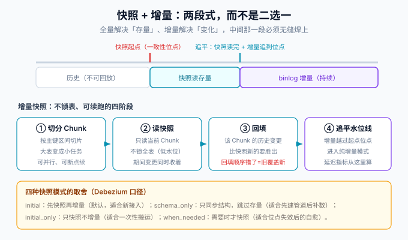

# Debezium

Debezium 是 CDC 生态里**连接器矩阵最全、事件语义最规范**的一条路线：它以 Kafka Connect 插件的形式运行，把源库变更转成结构化事件写入 Kafka；也提供不依赖 Kafka 的 Debezium Server 形态。本页讲它的架构、快照模式、事件信封、增量快照与运维要点。



## 一、两种运行形态

| 形态 | 依赖 | 适合 | 说明 |
| --- | --- | --- | --- |
| Kafka Connect | Kafka 集群 + Connect 集群 | 多下游、要回放与削峰 | 主流形态；事件进 Kafka 后由任意消费者接走 |
| Debezium Server | 仅一个 JVM 进程 | 不想引入 Kafka | 直推 Kinesis / RabbitMQ / Pulsar / Redis 等目标；3.7 起支持 Quarkus 原生编译 |

**判据**：已经在用 Kafka、或预期会有第二个下游 ⇒ Kafka Connect；只是想把变更送到一个消息中间件、又不想装 Connect ⇒ Debezium Server。

版本事实（2026-10 口径，按官方发布公告核对）：Debezium **3.7.0.Final（2026-09-29）** 为当前主线，按 Kafka Connect 4.3.1 构建并测试；连接器要求 **JDK 17+**，Debezium Server / Operator / Outbox / Quarkus 扩展要求 **JDK 21+**。3.6 系列在维护（3.6.3，2026-09-18）。Debezium 每季度一个 minor，仅最近若干个 minor 收补丁，**升级前逐条读迁移说明**。

## 二、快照模式：接入的第一个决策

增量订阅只能看到「接入之后」的变更，存量数据靠**快照（snapshot）**补齐。`snapshot.mode` 的常用取值与取舍：

| 模式 | 行为 | 适合 | 注意 |
| --- | --- | --- | --- |
| `initial`（默认） | 首次快照存量，随后转增量 | 新接入 | 快照读的是一致性位点，期间变更由增量补齐 |
| `initial_only` | 只做快照，不做增量 | 一次性搬运 | 跑完任务即结束 |
| `schema_only` | 只同步结构，跳过存量 | 先建管道、后台补数 | 存量靠后续全量重灌 |
| `when_needed` | 位点/结构缺失时自动快照 | 运维自愈 | 可能触发意外的大快照，需评估 |

::: danger 快照期间源库的压力要提前评估
`initial` 快照默认按主键分块读取全表。表很大的情况下，要么调低快照并行块大小并错峰执行，要么用 `snapshot.include.collection.list` 把接入拆成几批。**不要在业务高峰对一个 3 亿行的表做首次快照**——慢查询队列会把业务查询一起拖住。
:::

## 三、事件信封与路由

Debezium 的事件信封（`op` / `before` / `after` / `source` / `ts_ms`）见 [binlog 原理](../Binlog/index.md)页。这里补两个工程上必须会的 SMT（单条消息转换）：

1. **ExtractNewRecordState**：把 `after` 平铺为消息体（默认的事件套了两层信封），多数消费者要的是平铺结构；配 `add.fields` 可带操作类型与时间戳。
2. **Outbox Event Router**：把「业务库 outbox 表的插入」转成「面向聚合的业务事件」，是 [本地消息表](../../../Backend/Microservices/DistributedTransaction/MessageTable/index.md) 用 CDC 代替轮询时的标准配置。

topic 命名默认 `server.schema.table`，可用 RegexRouter 重写；**topic 名一旦定下就不要再改**——下游按它做幂等与位点管理。

## 四、增量快照：不锁表的可续跑方案

增量快照（incremental snapshot）用信号表驱动：向 `debezium_signal` 表插一行 `execute-snapshot` 信号，连接器就把指定集合加入快照队列，按 Chunk 分块、低水位读取，与增量流无缝衔接（四个阶段的示意见本页顶部「快照 + 增量」图）。三个工程要点：

1. **可以中途重启**：快照进度记在 offset 里，重启后继续，不用重来。
2. **可以只快照部分表**：信号里指定集合，适合「先接核心表、再补长尾表」的灰度接入。
3. **不要手工清理信号表历史**：信号消费记录参与位点一致性，清理交给保留策略。

## 五、schema 演进

Debezium 把 DDL 写进 **schema history topic**，重启时回放以恢复表结构。这带来两条纪律：

1. **schema history topic 不能删**——删了等于连接器失忆，重启即失败。
2. **DDL 仍要走变更流程**：加列、改类型前先确认下游映射兼容（尤其改类型与改字符集）。Debezium 对「缩窄类型」这类破坏性变更不会自动兜底，事件会按新类型发出，下游需要兼容逻辑。

## 六、运维要点

| 事项 | 判据 / 做法 |
| --- | --- |
| 位点存储 | Connect 的 offset storage topic；**不要手工改它**，重置位点用「删连接器 → 清 offset → 按 `snapshot.mode` 重来」的完整流程 |
| 任务重平衡 | 一个连接器默认单 task（MySQL 连接器），扩并行靠拆表多连接器，而不是调 task 数 |
| 心跳 | 跨库低频写入场景开 `heartbeat.interval.ms`，否则「源库没变更」与「管道停了」无法区分 |
| 监控 | JMX / Connect REST 暴露 `MilliSecondsBehindSource`（同步延迟）、`NumberOfErroneousEvents`、快照进度；阈值与告警见 [生产运维](../Ops/index.md) |
| 版本升级 | 先停连接器 → 换插件 → 再启动；升级前跑一遍迁移说明核对配置项改名 |

## 七、最小可用配置示例

```json
{
  "name": "blog-connector",
  "config": {
    "connector.class": "io.debezium.connector.mysql.MySqlConnector",
    "database.hostname": "mysql",
    "database.port": "3306",
    "database.user": "cdc_user",
    "database.password": "${secrets:db/cdc_user}",
    "database.server.id": "184001",
    "topic.prefix": "blog",
    "database.include.list": "blog",
    "table.include.list": "blog.posts,blog.comments",
    "snapshot.mode": "initial",
    "schema.history.internal.kafka.topic": "schema-history.blog",
    "heartbeat.interval.ms": "10000"
  }
}
```

**验证**：创建连接器后，先确认快照把存量行以 `op=r` 写进 `blog.blog.posts`，再对源库做一次 UPDATE，确认出现 `op=u` 事件——两步都在，链路才算通。

## 参考资料

- Debezium · MySQL connector：https://debezium.io/documentation/reference/stable/connectors/mysql.html
- Debezium · 增量快照：https://debezium.io/documentation/reference/stable/connectors/mysql.html#mysql-incremental-snapshots
- Debezium · Outbox Event Router：https://debezium.io/documentation/reference/stable/transformations/outbox-event-router.html
- Debezium 发布总览：https://www.debezium.io/releases
- 下一页：[Canal 与 Maxwell](../Canal/index.md)
