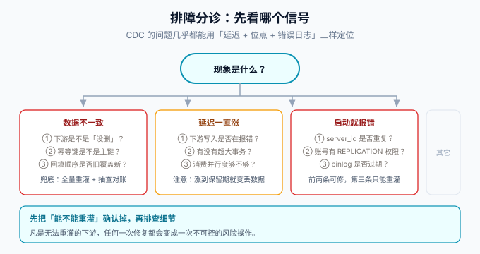

# 常见问题与最佳实践

## 一、按现象分诊

排障只需要三个信号：**同步延迟、位点、错误日志**。按下表从现象反推原因：

| 现象 | 最可能的原因 | 第一动作 |
| --- | --- | --- |
| 数据不一致（偶发） | 重复消费未被幂等吸收 / 顺序错乱 | 查该行的分区策略与幂等写法 |
| 数据不一致（大面积） | 快照与增量衔接错误，或下游被旁路写入 | 检查是否有脚本直写下游 |
| 已删数据仍在下游 | DELETE 事件未被处理 | 核对消费分支是否覆盖 `op=d` |
| 延迟持续上涨 | 下游写失败反压 / 大事务 / 并行度不足 | 看错误计数，再看源库大事务 |
| 延迟为 0 但数据旧 | 「没变更」被算成低延迟 | 用「最近成功处理时间」判活 |
| 启动即失败 | `server_id` 冲突 / 权限缺失 / binlog 过期 | 三项逐一核对（见下文） |
| 管道「悄悄停住」 | 位点丢失、磁盘满、账号权限被回收 | 延迟指标 + 位点老化告警 |

## 二、高频问答

**Q1：双写和 CDC 能不能都用？**
能，但没必要。双写 + CDC 两条管道意味着两套时序 bug，不一致时无法判断信谁。判据：**同一份数据只允许一条同步链路**，另一条要么删掉、要么降级为对账参考。

**Q2：为什么我的 UPDATE 事件里 `before` 只有主键？**
`binlog_row_image` 不是 `FULL`（见 [binlog 原理](../Binlog/index.md)）。`MINIMAL` 模式下 UPDATE 的 before 镜像只含主键与被改列，下游做不了字段级 diff。

**Q3：主从切换后管道挂了怎么办？**
用 GTID 记位点通常能自动接上；用 `file+pos` 记位点则对不上新主库的文件名。**长期方案是开 GTID**，短期方案是按新主的 GTID 对齐或重新快照。

**Q4：延迟多少算正常？**
先测基线：空载延迟 + 一次典型写入的端到端延迟。常规阈值是基线的 3~5 倍报警，超过 binlog 保留期的 50% 就要按事故对待——那时还是「能追平的延迟」，过了就是「必须重灌的丢失」。

**Q5：快照会不会锁表？**
取决于工具与算法：Debezium/Flink CDC 的增量快照是分块无锁读；Canal 传统快照要停 instance。即便无锁，快照的长查询也会占用资源，**错峰执行 + 分批接入**仍是必须的。

**Q6：下游要不要用事务？**
单条事件自洽即可。把「消费 N 条事件」包成一个事务会把顺序与吞吐搅在一起；幂等 UPSERT + 版本比较已经保证单行正确性，跨行一致性由「对账 + 修复」兜底，这是管道的标准姿势。

**Q7：一条消息消费失败重试几次后丢弃，行不行？**
不行。丢弃 = 静默丢失。正确做法：失败进死信队列（或失败表）+ 告警，人工/自动修复后**幂等写回**。管道宁可积压，不可丢弃。

**Q8：能不能用 CDC 做「两个业务库之间」的同步？**
技术上可行，但要先问「为什么是双库」。多数情况下这是服务拆分边界的问题，用 CDC 双向同步会形成隐式耦合；确要同步时按[微服务](../../../Backend/Microservices/index.md)的上下文划分思路先收口写入口径。

**Q9：ES 里要不要存正文全文？**
存「可检索的投影」而非全量副本：字段按搜索需求裁剪，正文存渲染后的纯文本（去掉代码块可减少噪声，与项目[搜索页](/project/Complete/BlogPlatform/Search/index.md)的口径一致）。全量数据永远以业务库为准。

**Q10：CDC 能不能保证「读了 binlog 就不用管对账」？**
不能。位点过期、下游故障、旁路写入都会造成不一致。对账不是可选项，是管道的一部分（见[一致性](../Consistency/index.md)）。

**Q11：表太多、一张一张接入太慢怎么办？**
用 Flink CDC 的 YAML 整库同步（[FlinkCDC](../FlinkCDC/index.md)），或 Debezium 的 `table.include.list` 一次配多表。但**接入范围与下游容量要匹配**：整库同步之前先确认目标端装得下。

**Q12：升级 CDC 工具版本有什么纪律？**
先读迁移说明（配置项改名、行为变化）→ 影子环境跑通断言清单 → 低峰停连接器、换插件、重启 → 核对位点与延迟。**Debezium 每季度一个 minor，只维护最近若干个 minor，升级不要攒太多版本一起跨。**

## 三、上线自查表

| # | 检查项 | 对应 |
| --- | --- | --- |
| 1 | `binlog_format=ROW`、`binlog_row_image=FULL`、GTID 开启 | [binlog](../Binlog/index.md) |
| 2 | CDC 账号最小权限，非 root | [binlog](../Binlog/index.md) |
| 3 | `server_id` 唯一，不与从库冲突 | [binlog](../Binlog/index.md) |
| 4 | binlog 保留期 ≥ 7 天，位点老化告警已配 | [运维](../Ops/index.md) |
| 5 | 分区按主键，行级顺序有保障 | [一致性](../Consistency/index.md) |
| 6 | 下游写法幂等（UPSERT / 版本比较） | [一致性](../Consistency/index.md) |
| 7 | 先写下游后提交位点 | [一致性](../Consistency/index.md) |
| 8 | 快照与增量走同一写路径 | [实战](../Practice/index.md) |
| 9 | DELETE 事件有处理且有断言 | [实战](../Practice/index.md) |
| 10 | 延迟/吞吐/失败/位点四个指标上面板 | [运维](../Ops/index.md) |
| 11 | 对账任务（行数 + 抽样）已上线 | [一致性](../Consistency/index.md) |
| 12 | 全量重灌步骤文档化并演练过 | [运维](../Ops/index.md) |
| 13 | 管道故障时读路径可降级 | [实战](../Practice/index.md) |
| 14 | DDL 变更流程里有 CDC 检查项 | [运维](../Ops/index.md) |

## 四、最佳实践清单

**设计期**：

1. 先确认「下游可清空重建」与「秒级延迟可接受」，再决定上 CDC。
2. 同一份数据只允许一条同步链路；拒绝「双写 + CDC + 对账」三管齐下。
3. 白名单接入（`table.include.list`），不要整实例订阅。

**实现期**：

4. 幂等实现在目标侧，管道侧不承诺「不重复」。
5. 快照与增量共用同一个写入函数。
6. 消费失败进死信 + 告警，绝不静默丢弃。
7. 修数据走幂等写回，禁止旁路 UPDATE。

**运维期**：

8. 延迟判活用「最近成功处理时间」，不用延迟数值。
9. 位点操作前先确认幂等已验证。
10. DDL 走变更流程，管道作为检查项之一。
11. 影子期 ≥ 3 天再切读，回滚 = 切回读路径，不停管道。
12. 工具版本升级不跨大步，逐 minor 走影子环境。

## 五、术语表

| 术语 | 含义 |
| --- | --- |
| CDC | Change Data Capture，变更数据捕获 |
| binlog | MySQL 二进制日志，ROW 格式记录行级前后镜像 |
| WAL / oplog | PostgreSQL / MongoDB 中与 binlog 同位的变更日志 |
| 位点（offset） | 订阅端记录的「读到哪了」，GTID 或 file+pos |
| 快照 | 存量数据的全量读取，与增量衔接 |
| 高/低水位 | 快照前后记录的 binlog 位点，用于快照与增量的衔接 |
| 幂等 | 同一事件处理多次，结果与处理一次相同 |
| at-least-once | 至少一次投递语义，重试必然带来重复 |
| 对账 | 源库与下游的数据一致性校验 |
| 全量重灌 | 清空下游并重新快照的最终兜底手段 |

## 参考资料

- Debezium 官方文档：https://debezium.io/documentation/
- Flink CDC 文档：https://nightlies.apache.org/flink/flink-cdc-docs-stable/
- Canal Wiki：https://github.com/alibaba/canal
- Maxwell 官网：https://maxwells-daemon.io/
- 返回专题目录：[数据同步与 CDC](../index.md)
