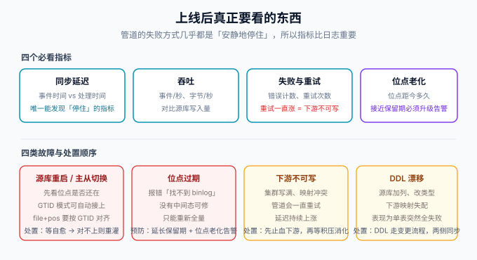

# 生产运维

CDC 管道上线后的失败方式几乎都是「安静地停住」：进程在跑、没有报错、下游数据慢慢过期。所以运维的重心不是「看日志」而是**指标、位点、预案**三件事。本页给出必看指标、四类故障的处置顺序、灰度与回滚的纪律。



## 一、四个必看指标

| 指标 | 口径 | 告警阈值（起点值，按基线修正） | 为什么必看 |
| --- | --- | --- | --- |
| **同步延迟** | 处理时间 − 事件 `ts_ms` | P95 > 10s 警告；> 60s 严重 | 唯一能区分「没变更」与「停了」的指标 |
| 吞吐 | 事件数/秒、字节数/秒 | 长时间为 0 即严重 | 与源库写入量对照，发现消费不动 |
| 失败与重试 | 错误计数、重试次数 | 重试持续增长即警告 | 重试一直涨 = 下游不可写，会反压成延迟 |
| **位点老化** | 当前位点距最新 binlog 的时间 | 超过保留期 50% 警告 | 老化过保留期 = 只能全量重灌，是最贵的一种失败 |

::: danger 「延迟为 0」不一定是好事
没有变更时 `ts_ms` 不更新，有的实现会把延迟算成 0 或 NaN。**判断管道活着要用「最近一次成功处理的时间」**，而不是只看延迟数字——把这一条写进值班手册，能省掉半夜的误报。
:::

## 二、位点管理：谁持有、怎么恢复

位点的三种存放位置与恢复口径：

| 存放位置 | 典型工具 | 恢复动作 | 风险 |
| --- | --- | --- | --- |
| 工具自管（Kafka offset topic / ZK / checkpoint） | Debezium / Canal / Flink CDC | 重启自动续读 | 存储被误删 ⇒ 全量重灌 |
| 消费者自管（手动提交位点） | 自研消费者 | 从 checkpoint/DB 里记录的位点续读 | 「先提交后写库」会丢数据（见[一致性](../Consistency/index.md)） |
| 无位点（每次全量） | 定时任务 | —— | 不适用 CDC 语义 |

**位点重置的纪律**：位点回拨意味着重放，重放必须依赖下游幂等（见[一致性](../Consistency/index.md)）。**任何位点操作前先确认幂等写已验证**，否则回拨就是一次数据破坏。

## 三、四类故障与处置顺序

| 故障 | 现象 | 处置顺序 |
| --- | --- | --- |
| 源库重启 / 主从切换 | 订阅断开、重连失败 | ① 等待自愈（GTID 模式通常能接上）② `file+pos` 位点对不上新主 ⇒ 按 GTID 对齐或重灌 ③ 检查 CDC 账号权限没被回收 |
| 位点过期 | 报「找不到 binlog 文件」 | 无中间态可修：按 `snapshot.mode` 重新快照；事后把保留期延长 + 加位点老化告警 |
| 下游不可写 | 延迟持续上涨、重试增长 | ① 先止血下游（扩容 / 清理 / 放开配额）② 积压会自动消化，不要在积压期做位点操作 |
| DDL 漂移 | 单表突然全失败 | ① 定位变更 SQL ② 下游补齐结构 ③ 确认工具的表结构缓存刷新 ④ 把 DDL 检查项加进变更流程 |

## 四、权限与安全

1. **最小权限账号**：`SELECT`（业务库）+ `REPLICATION SLAVE` + `REPLICATION CLIENT`，禁用 root（见 [binlog 原理](../Binlog/index.md)的权限清单）。
2. **网络收口**：binlog 订阅是长连接，网络层按「CDC 组件 → 源库」单向放行；Canal Admin / Debezium Connect UI **不暴露公网**。
3. **口令管理**：连接口令走密钥管理（环境变量注入或密钥服务），不进配置仓库；Canal 1.1.8 发布后仍有 Admin 安全修复，**上线前核对所用版本是否包含已知漏洞修复**。
4. **审计**：CDC 账号在源库的表现是「持续 SELECT + dump」，出现写入行为即告警——正常管道永远不该写源库。

## 五、灰度上线与回滚

上线管道的高风险动作是「切换读路径」，风险控制靠**影子期**：

1. **影子期**：管道先跑，下游照常更新，但业务读路径不变；用[对账](../Consistency/index.md)验证一段时间（建议 ≥ 3 天，覆盖一个完整的批处理/高峰周期）。
2. **切读**：读路径按比例切到新下游（网关或双读比对），观察错误率与延迟。
3. **回滚**：任何一步出问题，回滚 = 「读路径切回源库」——**管道本身不停**，它继续追平，等修好再切。这条是影子期的真正价值：回滚不需要重建数据。

::: tip 管道停止 ≠ 服务停止
影子期的设计让「同步链路故障」与「业务故障」解耦：管道挂了，读路径还在源库上，业务无损。**凡是做不到「管道挂了业务无损」的切读方案，都说明灰度不充分。**
:::

## 六、验证方式

上线前的最后检查，逐项执行：

```shell
# ① 指标可见：延迟/吞吐/失败/位点老化四项都能在监控面板看到
# 期望：面板有数，且人为制造一次停写后延迟曲线有反应

# ② 位点恢复演练：停掉 CDC 组件 5 分钟再启动
# 期望：自动续读，积压在几分钟内消化，期间无数据丢失（对账通过）

# ③ 全量重灌演练（预演，不真灌）：确认命令、耗时估计与下游清空步骤都已文档化
# 期望：文档里的重灌步骤在影子库完整走过一遍
```

三项演练都做过，才算「敢把它挂到生产」。

## 参考资料

- Debezium · Monitoring：https://debezium.io/documentation/reference/stable/operations/monitoring.html
- Canal · Prometheus QuickStart：https://github.com/alibaba/canal/wiki/PrometheusQuickStart
- Flink · Checkpoint 与容错：https://nightlies.apache.org/flink/flink-docs-stable/docs/ops/state/checkpoints/
- 本专题：[一致性保障](../Consistency/index.md)、[常见问题](../FAQ/index.md)
