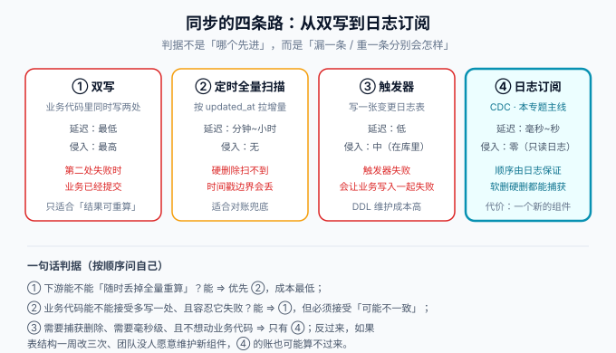

# 同步全景与选型

「数据同步」这个需求几乎出现在每一个多存储的系统里：业务库是唯一事实来源，而搜索要 Elasticsearch、缓存要 Redis、分析要 ClickHouse、图查询要 Neo4j——每一处都需要业务库的数据「跟着变」。本页先讲清四条同步路线的取舍，再给出「什么时候该上 CDC、什么时候不该」的判断依据。



## 一、四条路线与各自的失败方式

选型不是比先进性，而是**把「哪条路会怎么失败」摆在一起看**——同步管道的可靠性由它的失败方式决定。

| 路线 | 做法 | 延迟 | 业务侵入 | 典型失败方式 |
| --- | --- | --- | --- | --- |
| 双写 | 业务代码里先后写主库与下游 | 最低 | 最高 | **第二处写失败时业务已提交**，两处从此不一致；事务里写下游还会拖长事务 |
| 定时全量/增量扫描 | 按 `updated_at` 或自增 id 拉增量 | 分钟~小时 | 无 | **硬删除永远扫不到**；时间戳边界并发写入会丢；扫描压力随数据量上涨 |
| 触发器 | 库内触发器写一张变更日志表 | 低 | 中（侵入在库里） | 触发器失败**会让业务写入一起失败**；每张表都要维护；DDL 成本高 |
| 日志订阅（CDC） | 订阅 binlog / WAL / oplog | 毫秒~秒 | 零 | 需要维护一个新组件；位点失效要全量重灌；延迟需要监控 |

四条路线不是简单的优劣排序，而是**覆盖面递进**：双写只能保证「愿意写的时机」，扫描只能看见「还存在的行」，触发器能看见全部变更但要付费在库内，日志订阅用最小的业务代价换来最完整的变更流。

::: danger 双写的失败最隐蔽
双写出问题时**没有任何报错**——第二处写失败通常被 try-catch 吞掉，业务接口照常返回成功。下游缺一条数据的后果往往在几天后以「搜索搜不到」的形式被用户发现，而那时已经无法还原当时是哪次写入失败了。**如果下游允许「全量重算」，请把重算任务也准备好，而不是假设双写永远成功。**
:::

## 二、CDC 到底解决了什么

CDC（Change Data Capture，变更数据捕获）的核心动作只有一个：**把数据库的变更日志变成一条可消费的事件流**。它带来四个业务代码买不到的性质：

1. **零侵入**：业务代码不感知同步的存在，加一张表、加一个下游都不用改业务。
2. **完整的变更语义**：INSERT / UPDATE / DELETE 全都能捕获，包括**硬删除**——这是时间戳扫描方案永远补不上的洞。
3. **顺序由日志保证**：binlog 内部对同一行的修改是有序的，下游按序消费就能得到正确结果。
4. **可回放**：日志在保留期内可以重放，位点重置就能重新消费一段历史。

代价也很明确：**你要多维护一个组件**，并且为它负责位点、监控、幂等、对账这四件运维事。CDC 不是免费的，它只是把同步成本从「散落在业务代码里」变成「集中在一个组件里」。

## 三、三种消费形态

拿到事件流之后，下游有三种典型接法：

| 形态 | 链路 | 适合 | 代价 |
| --- | --- | --- | --- |
| 直写目标库 | 源库 → CDC 工具 → 目标库 | 单一下游、数据量不大 | 每加一个下游都要重跑一遍管道；目标库故障会反压源库读取 |
| 经消息队列 | 源库 → CDC → Kafka → N 个消费者 | 多下游、需要削峰与回放 | 要维护 MQ 集群；顺序依赖分区策略 |
| 流计算 | 源库 → CDC → Flink → 目标库 | 需要顺路做清洗、聚合、多表关联 | 要维护 Flink 作业与 checkpoint 体系 |

**判据一句话**：下游只有一个且能直连 ⇒ 直写；下游会有第二个 ⇒ 一开始就上 MQ，后补的迁移成本远高于起步成本；消费逻辑要「算」而不只是「搬」 ⇒ 流计算。

## 四、什么时候不该上 CDC

CDC 是一把好锤子，但不是所有问题都是钉子。以下场景建议换方案：

1. **下游可以随时全量重算，且分钟级延迟可接受**——定时任务的成本几乎是零，别为它养一个管道。
2. **只有一处下游、且业务愿意承担双写**——例如写库顺带发一条 MQ 消息（配合本地消息表保证可靠投递），比引入完整 CDC 链路更简单。
3. **表结构一周改三次、没人愿意认领这个组件**——CDC 管道需要明确的主人，DDL 漂移、位点、告警都需要人管。无人认领的管道会在第一次 schema 变更后安静地坏掉。
4. **源库是托管服务且不开放复制权限**——部分云产品的只读实例或无服务器形态不允许 `REPLICATION SLAVE` 权限，先确认权限再选型。
5. **数据量小到每天一条 cron 就能搬完**——组件的存在感要和数据量成正比。

::: tip 先问三个问题再动手
① 下游能被**清空重建**吗？（决定出了事有没有退路）② 能接受**秒级延迟**吗？（决定 CDC 的收益是否成立）③ 这个组件**谁来值班**？（决定管道能不能活过第一次故障。）三个都是「是」再上 CDC。
:::

## 五、选型决策树

按顺序问，命中即停：

1. **需要整库/多表同步，或同步时要做转换** → Flink CDC（YAML Pipeline 一段配置完成整库同步，内置 schema 演进）。
2. **下游是 Kafka，且未来可能多路分发** → Debezium（Kafka Connect 生态、快照模式最全、事件信封最规范）。
3. **团队以 MySQL 为圆心、想要白屏运维与直写 ES 的 Adapter** → Canal（国内落地最多，但要看清其维护节奏与安全基线）。
4. **只想要一个最小可用的 MySQL → Kafka JSON 流** → Maxwell（单进程、装完就跑，复杂逻辑自己写消费端）。
5. **以上都不满足（源库是 MongoDB / PostgreSQL / Oracle）** → 回到第 1、2 条：Flink CDC 的 Pipeline Source 与 Debezium 的连接器矩阵分别覆盖 PG / Mongo / Oracle 等。

四条路线的详细对照见 [Debezium](../Debezium/index.md)、[Canal 与 Maxwell](../Canal/index.md)、[Flink CDC](../FlinkCDC/index.md) 三页。

## 六、验证方式

选型结论落地前，用一条最小链路验证「事件真的能流到下游」：

```shell
# ① 源库确认 binlog 开启且为 ROW 格式（没有这一步一切免谈）
mysql -uroot -p -e "SHOW VARIABLES LIKE 'log_bin'; SHOW VARIABLES LIKE 'binlog_format';"
# 期望：log_bin = ON；binlog_format = ROW

# ② 源库造一条变更
mysql -uroot -p blog -e "UPDATE posts SET title = 'cdc-probe' WHERE id = 1;"

# ③ 在 CDC 工具的日志或下游消费者里确认这条变更被捕获
#    （Debezium 看 Kafka topic；Canal 看 client 收到的 Entry；Maxwell 看 Kafka 的 JSON）
```

**期望**：步骤 ③ 能看到一条包含表名、主键、操作类型的变更事件。这就是整个专题要建的东西的最小形态。

## 参考资料

- Debezium 官方文档 · 架构：https://debezium.io/documentation/reference/stable/architecture.html
- Martin Fowler · Eventual Consistency：https://martinfowler.com/bliki/EventualConsistency.html
- MySQL 8.4 · 复制与 binlog：https://dev.mysql.com/doc/refman/8.4/en/replication.html
- 本专题后续页面：[binlog 与 CDC 原理](../Binlog/index.md)、[一致性保障](../Consistency/index.md)
