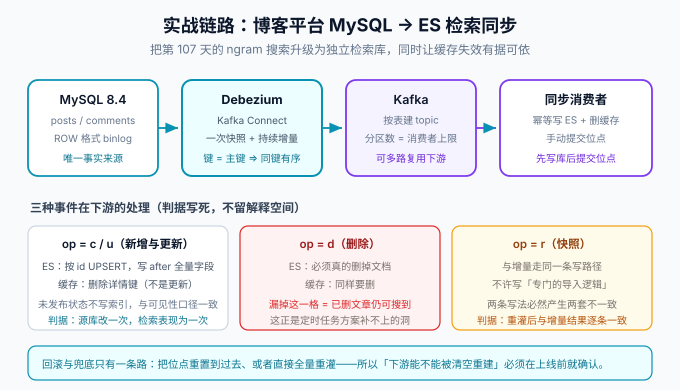

# 实战：博客平台 MySQL → ES 检索同步

这一章把前面所有内容串成一条真实链路：给博客平台把检索从「MySQL ngram FULLTEXT」升级为「独立 Elasticsearch 检索库」。它与项目侧的[全文搜索章节](/project/Complete/BlogPlatform/Search/index.md)是同一件事的两面——那一边讲**项目里怎么落**，这一边讲**同步管道本身怎么建**。



## 一、目标与边界

**目标**：文章的创建、更新、删除、发布、下线在秒级反映到 ES；删除事件不遗漏；缓存同步失效有据可依。

**边界（刻意不做）**：

1. **不追求强一致**——ES 承载的是搜索与列表，详情页仍读主库；「搜到已删文章」的兜底是详情页 404，不是把管道做成同步事务。
2. **不引入 Flink**——单库单下游，Debezium + 一个消费者足够；等需要多下游或整库同步时再演进。
3. **不做双写**——业务代码保持零侵入，这正是选 CDC 的原因。

## 二、链路与判据

链路五段：`MySQL(ROW binlog) → Debezium(Kafka Connect) → Kafka(按主键分区) → 同步消费者 → ES + Redis`。每一段一条硬判据：

| 段 | 判据 | 为什么 |
| --- | --- | --- |
| 源库 | `binlog_format=ROW`、`binlog_row_image=FULL`、GTID 开启 | 事件完整性（见 [binlog 原理](../Binlog/index.md)） |
| Debezium | `snapshot.mode=initial`，表白名单只有 `posts`、`comments` | 白名单外的表不进管道，出问题范围可控 |
| Kafka | topic 按**主键**哈希分区 | 行级顺序（见[一致性](../Consistency/index.md)） |
| 消费者 | 手动提交位点，**先写 ES 后提交** | 宁可重复不丢失 |
| ES | `_id = 源表主键`，UPSERT | 幂等的第一道保险 |

## 三、事件处理规则（判据写死，不留解释空间）

消费端对三种事件的处理必须**只有一条路径**——快照事件（`op=r`）与增量事件（`op=c/u/d`）走完全相同的写逻辑，这是实战里最容易被违反、也最容易被漏测的纪律：

1. **新增 / 更新**：从 `after` 取全量字段；**只有 `status='PUBLISHED'` 的文章写索引**（与项目[可见性收敛](/project/Complete/BlogPlatform/Visibility/index.md)的口径一致——未发布内容在读者端必须不可见，搜索端是同一张网）；写完 ES 后**删除**详情缓存键（删缓存而非更新缓存，理由见[缓存设计](../../NoRelational/Redis/Advanced/CacheDesign/index.md)）。
2. **删除**：ES 删除文档（按 `_id`），缓存同样删除。**漏掉这一格的后果是「已删文章仍可搜到」**——这正是[定时任务方案补不上的洞](../Overview/index.md)。
3. **快照读**：与增量同一函数、同一幂等写法；重灌之后结果必须与增量结果逐条一致。
4. **幂等兜底**：消费者对同一 `_id` 重复写入天然无害（UPSERT）；`updated_at` 版本比较做第二道保险，旧事件晚到不覆盖。

## 四、断言清单（验收判据）

管道的验收不是「看起来能跑」，而是以下断言全部通过：

| 编号 | 断言 | 验证方式 |
| --- | --- | --- |
| S1 | 新建并发布文章，3 秒内 ES 可搜到 | 源库插入 → 轮询 ES `_search` |
| S2 | 更新已发布文章，3 秒内搜索结果更新 | 源库 UPDATE → 轮询 |
| S3 | 删除文章，3 秒内 ES 中消失 | 源库 DELETE → 确认 `_count` 减少 |
| S4 | 下线文章（`unpublish`），ES 中消失或不可见 | 复用状态机口径，验证可见性一致 |
| S5 | 重新发布，ES 恢复可搜到 | 覆盖「下线→发布」往返 |
| S6 | 未发布草稿**从不**出现在 ES | 全库快照后抽查 |
| S7 | 消费者重启后无重复、无丢失 | 位点回拨 5 分钟 → 对账 |
| S8 | 源库加列，管道不断流，新字段同步 | `ALTER TABLE` 演练 |
| S9 | 延迟指标有数且 P95 < 3s（影子期基线） | 监控面板 |
| S10 | 全量重灌后与源库一致 | 重置快照 → 行数/抽样对账 |

::: danger S3 与 S6 是这条管道的存在理由
「删除可被捕获」（S3）与「快照与增量同路径」（S6/S10）是 binlog 方案相对定时任务方案的两个根本差异。**如果这两条断言没有自动化，管道就退化成了一个更贵的定时任务。**
:::

## 五、缓存失效的联动

ES 之外，同一条事件流顺带解决了缓存失效的收口问题：业务里原来「到处删缓存」的代码收敛为**消费者统一删**。收益是「新增一个写入口径时不用再找齐所有删缓存的位置」；代价是删缓存从同步变为异步（事件到达前的一小段窗口内可能读到旧值）。判据：**详情页永远读主库的缓存失效窗口由 TTL 兜底（如 60s），搜索页的短暂过期由产品口径接受**——把这两个值写进需求，而不是留给实现临场决定。

## 六、回滚与兜底

1. **回滚 = 读路径切回**：检索接口保持「ES 优先、失败降级 MySQL ngram 查询」的双读结构，ES 故障时自动降级——**降级查询不需要满足性能要求，只需要可用**。
2. **数据修复 = 全量重灌**：清空 ES 索引（或写入新索引后别名切换）→ 重置 Debezium 快照 → S10 对账。**因为下游可清空重建，这条最重的兜底才是安全的**（选型时就确认过的前提）。
3. **禁止旁路写入**：修数据只能走「从源库读 → 幂等写回」，不允许脚本直写 ES——与[一致性](../Consistency/index.md)的对账纪律同源。

## 七、验证方式

```shell
# ① 起管道
curl -s -X POST http://connect:8083/connectors -H 'Content-Type: application/json' \
  -d @blog-connector.json
# 期望：HTTP 201；快照完成后 Kafka topic 有 op=r 事件

# ② 跑断言 S1~S10（逐条执行并记录实测输出）
# 期望：10 条全部通过；任何一条失败先看 [常见问题](../FAQ/index.md) 的分诊树

# ③ 影子期观察 3 天
# 期望：S9 延迟 P95 < 3s 持续成立；对账脚本无不一致
```

## 参考资料

- Debezium · MySQL connector 配置：https://debezium.io/documentation/reference/stable/connectors/mysql.html
- 项目侧衔接：[全文搜索：MySQL ngram 先行](/project/Complete/BlogPlatform/Search/index.md)、[一键部署](/project/Complete/BlogPlatform/Deployment/index.md)
- 下一页：[常见问题](../FAQ/index.md)
