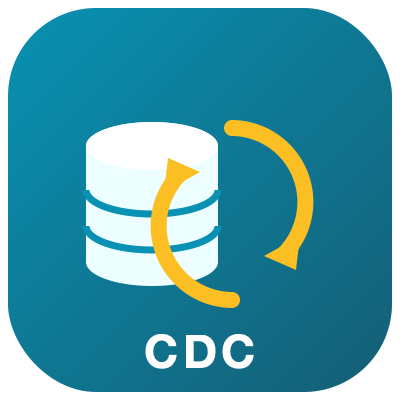
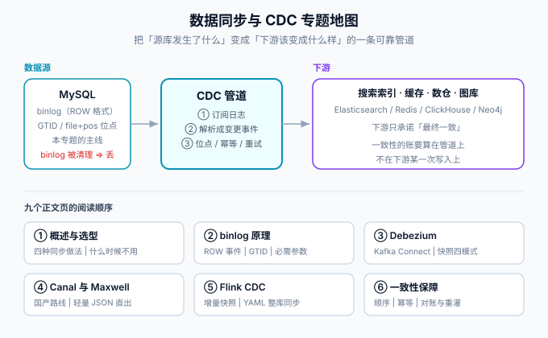

# 数据同步与 CDC

数据同步与 CDC（Change Data Capture，变更数据捕获）解决的是同一个问题：**业务库是唯一事实来源，而搜索、缓存、数仓、图库都需要「跟着变」**。本专题讲清楚一条可靠同步管道的全部要件——为什么 binlog 订阅是主流方案、Debezium / Canal / Maxwell / Flink CDC 四条路线怎么选、顺序与重复怎么处理、位点丢了怎么办，并用「博客平台 MySQL → Elasticsearch 检索同步」做一次完整实战。

::: tip 一句话理解
双写是把「同步」埋进业务代码里，每次多写一处且失败无解；CDC 是把「同步」抽出来变成一个独立的订阅者——业务代码一行不改，数据库把每次变更写进日志，订阅者从日志里读出「刚刚发生了什么」。**同步的正确性从此不再依赖业务代码写得对不对。**
:::

## 与相邻专题的分工

| 专题 | 讲什么 | 与本专题的关系 |
| --- | --- | --- |
| 本专题 | 数据同步的**方法论与工具链**：binlog 原理、四条路线、一致性、生产运维 | —— |
| [MySQL 复制](../Relational/Sharding/Migration/index.md) | 数据库**自身**的主从复制与迁移 | 主从复制与 CDC 用同一套日志，但目的不同：复制是「再造一个库」，CDC 是「把变更送出去」 |
| [本地消息表](../../Backend/Microservices/DistributedTransaction/MessageTable/index.md) | 分布式事务里用消息表 + 轮询发事件 | 那里已经写了「用 CDC 代替轮询」的进阶方向，本专题展开完整做法 |
| [Elasticsearch 实战](../NoRelational/Elasticsearch/Practice/index.md) | MySQL → ES 的两条同步路径 | 本专题实战一章就是那条链路的「完整版」：判据、断言、回滚都补齐 |
| [缓存设计](../NoRelational/Redis/Advanced/CacheDesign/index.md) | 缓存一致性的策略选型 | 「订阅 binlog 异步删缓存」在本专题里给出落地方案 |
| [分布式缓存深入 · 一致性方案](../../Backend/DistributedCache/Consistency/index.md) | 缓存与数据源之间的一致性问题与方案 | **分工边界**：本专题讲同步管道本身（binlog 解析、工具选型、位点与幂等），那边讲「缓存该在什么时机失效、选哪种一致性模型」；本页的「订阅 binlog 异步删缓存」正是两边的交汇点 |
| [数据仓库 ClickHouse](../ClickHouse/index.md) | 分析型存储的引擎与建模 | ClickHouse 是 CDC 的常见下游之一，本专题只讲「怎么送过去」 |
| [项目实战 · 全文搜索](/project/Complete/BlogPlatform/Search/index.md) | 博客平台 ngram 搜索的落地记录 | 实战一章与之衔接：什么时候值得从 ngram 升级到 ES |

## 专题地图

| 页面 | 内容 | 适合谁读 |
| --- | --- | --- |
| [概述与选型](./Overview/index.md) | 四条同步路线的取舍、什么时候不该上 CDC | 所有人，先读 |
| [binlog 与 CDC 原理](./Binlog/index.md) | ROW 事件、GTID、位点、CDC 必需参数 | 写配置与排障的人，**重点读** |
| [Debezium](./Debezium/index.md) | Kafka Connect 架构、快照模式、增量快照、事件信封 | 做管道的人 |
| [Canal 与 Maxwell](./Canal/index.md) | 国产路线与轻量路线、MQ 投递、安全注意 | 做管道的人 |
| [Flink CDC](./FlinkCDC/index.md) | 增量快照算法、YAML 整库同步、schema 演进 | 做整库同步的人 |
| [一致性保障](./Consistency/index.md) | 顺序、重复、丢失三种问题的对策 | 所有人，**重点读** |
| [生产运维](./Ops/index.md) | 位点管理、监控指标、四类故障处置、灰度回滚 | 运维与值班的人 |
| [实战](./Practice/index.md) | 博客平台 MySQL → ES 同步全链路 | 想看完整过程的人 |
| [常见问题](./FAQ/index.md) | 分诊决策树、高频问答、上线自查表 | 所有人 |

## 版本状态速览

按 **2026-10** 核对各官方发布页：

| 工具 | 当前版本 | 说明 |
| --- | --- | --- |
| Debezium | **3.7.0.Final**（2026-09-29） | 3.x 主线；按 Kafka Connect 4.3.1 构建测试；连接器要求 JDK 17+，Debezium Server / Operator / Quarkus 扩展要求 JDK 21+ |
| Canal | **1.1.8**（2026-01-16） | 适配 MySQL 8.4 / MariaDB 11 / Percona 8.0 / PolarDB-X 2.0；发布后仓库里仍有安全修复（如 Canal Admin 认证绕过），生产环境不要把 Admin 暴露到公网 |
| Maxwell | **1.45.0**（2026-07-04） | 单进程轻量路线；1.42.0 起支持 MySQL 8.4 |
| Flink CDC | **3.6.0**（2026-03-30） | 支持 Flink 1.20.x 与 2.2.x，最低 JDK 11；新增 Oracle Source 与 Hudi Sink；Pipeline Source 目前为 MySQL / PostgreSQL / Oracle |
| Apache Flink | 2.3.0（2026-06-23）主线，**1.20 为 LTS**（1.20.5） | Flink 2.x 要求 JDK 17；2.0 与 1.19 已于 2026 年中 EOL |
| MySQL | 8.0 / 8.4 LTS | binlog 默认 ROW 格式；8.4 移除 `expire_logs_days`，用 `binlog_expire_logs_seconds` |

::: info 版本核对说明
以上版本按 Debezium 官方发布公告、GitHub Releases（Canal / Maxwell）、Apache Flink 官网下载页与 endoflife.date 核对（2026-10 口径）。Debezium 每季度一个 minor，仅最近几个 minor 收补丁；Canal 的 1.1.8 是 2025 年初以来唯一正式版，选型时按「维护活跃度」打折看待。
:::

## 学习路径

1. **先读 [概述](./Overview/index.md)**：确认你真的需要 CDC——很多场景定时任务就够，这比学会工具更重要。
2. **读 [binlog 原理](./Binlog/index.md)**：位点与 ROW 事件是后面所有工具的公共地基，绕不开。
3. **选一条路线精读**：下游有 Kafka 选 [Debezium](./Debezium/index.md)；要整库同步选 [Flink CDC](./FlinkCDC/index.md)；国内团队偏好白屏运维选 [Canal](./Canal/index.md)。
4. **精读 [一致性保障](./Consistency/index.md)**：顺序、幂等、对账，这三件事决定管道可不可信。
5. **走一遍 [实战](./Practice/index.md)**，再对照项目侧的 [搜索章节](/project/Complete/BlogPlatform/Search/index.md) 看「什么时候值得升级到独立检索库」。

## 参考资料

- Debezium 官方文档：https://debezium.io/documentation/
- Debezium 发布总览：https://www.debezium.io/releases
- Canal 仓库与 Wiki：https://github.com/alibaba/canal
- Maxwell 官网：https://maxwells-daemon.io/
- Flink CDC 文档：https://nightlies.apache.org/flink/flink-cdc-docs-stable/
- Flink CDC 3.6.0 发布公告：https://flink.apache.org/news/2026/03/30/release-cdc-3.6.0.html
- MySQL 8.4 Reference Manual · Replication：https://dev.mysql.com/doc/refman/8.4/en/replication.html
