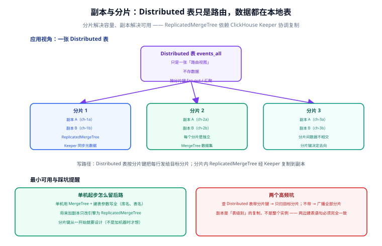

# 副本与分片

单机 MergeTree 撑到容量或写入瓶颈后，沿两个正交方向扩展：**副本（Replication）解决可用性与读吞吐**，**分片（Sharding）解决容量与写吞吐**。本页讲清两者的协作机制、Keeper 的角色，以及单机起步时怎么给将来留后路。



## 副本：ReplicatedMergeTree + Keeper

副本以**表**为单位复制（不是整个实例）：两个节点上建**完全一致**的 `ReplicatedMergeTree` 表，通过 ClickHouse Keeper（ZooKeeper 的 C++ 轻量实现）协调——每个 part 复制时先在 Keeper 里登记，其他副本拉取。

```sql [replicated.sql]
-- 节点 A、节点 B 都执行（完全一致）
CREATE TABLE analytics.events ON CLUSTER ch_cluster
(
    user_id    UInt64,
    event_type LowCardinality(String),
    ts         DateTime64(3)
)
ENGINE = ReplicatedMergeTree('/clickhouse/tables/{shard}/analytics/events', '{replica}')
PARTITION BY toYYYYMM(ts)
ORDER BY (user_id, ts);
```

三个要素：

| 要素 | 说明 |
| --- | --- |
| `ON CLUSTER ch_cluster` | 在集群所有节点上执行同一 DDL，保证建表一致 |
| zoo_path `/clickhouse/tables/{shard}/...` | 该表在 Keeper 里的元数据路径，`{shard}` 宏区分分片 |
| `{replica}` 宏 | 每个节点在 `config.xml` 的 `<macros>` 里配置自己的副本名 |

- 写入任一副本，数据自动复制到其他副本（异步，Keeper 保证顺序与去重）；
- 读可分散到各副本（负载均衡由 Distributed 表或驱动层做）；
- **副本是最终一致**：某副本短暂宕机，恢复后自动追平。

## 分片：Distributed 表只是路由

`Distributed` 引擎表**不存数据**，它是一张「路由视图」：

```sql
-- 路由表（所有节点都建）
CREATE TABLE analytics.events_all ON CLUSTER ch_cluster
AS analytics.events
ENGINE = Distributed(ch_cluster, analytics, events, rand());

-- 写入与查询都打路由表
INSERT INTO analytics.events_all VALUES (...);
SELECT ... FROM analytics.events_all WHERE ...;
```

- **写路径**：按分片键把每一行发给目标分片（示例 `rand()` 随机均匀写；常用还有 `cityHash64(user_id)` 按用户哈希）；
- **读路径**：把查询广播到各分片并行执行，再汇聚合并结果；
- **带分片键查询只扫目标分片**：`WHERE user_id = 1001` + `cityHash64(user_id)` 分片键 → 只访问一个分片。不带走分片键的条件就是全分片广播。

## 单机起步怎么留后路

绝大多数项目不需要一开始就上集群，但**建表参数要按集群形态写**：

1. 引擎先用 `MergeTree`，但 zoo_path 里的库表名先想好——将来加副本时只把引擎改成 `ReplicatedMergeTree(path, replica)`，数据目录无需迁移；
2. 分片键从第一天就设计进表（哪怕单机用不上）：它决定「同一主体的数据落在哪」，事后改分片键等于重写全表；
3. Keeper 单独部署（3 节点奇数个），**不要**与数据节点混部。

::: info 托管形态
ClickHouse Cloud（官方托管，存算分离）与 Altinity.Cloud 自管集群都能免掉本页大部分运维；自建集群则推荐用 [clickhouse-operator](https://github.com/Altinity/clickhouse-operator) 在 Kubernetes 上编排。
:::

## 验证方式

```shell
# ① 集群拓扑
clickhouse-client --query "SELECT cluster, shard_num, replica_num, host_name
                           FROM system.clusters WHERE cluster='ch_cluster';"
# 期望：列出每个分片与副本

# ② 副本追平（两个节点分别执行）
clickhouse-client --query "
  SELECT hostName() AS host, count() FROM analytics.events;"
# 期望：副本间行数一致

# ③ 分片路由验证：带分片键的查询只命中一个分片
clickhouse-client --query "
  EXPLAIN SELECT count() FROM analytics.events_all WHERE user_id = 1001;"
# 期望：执行计划中只出现目标分片（rand() 分片键除外，rand 无路由语义）
```

## 参考资料

- [ReplicatedMergeTree](https://clickhouse.com/docs/engines/table-engines/mergetree-family/replication)
- [Distributed 引擎](https://clickhouse.com/docs/engines/table-engines/special/distributed)
- [ClickHouse Keeper](https://clickhouse.com/docs/guides/sre/keeper/clickhouse-keeper)
