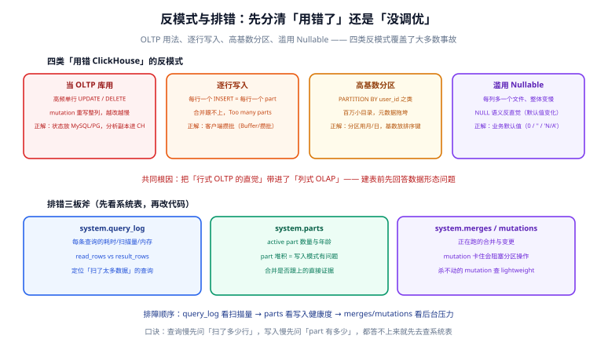

# 常见问题与最佳实践

ClickHouse 的事故大多不是「没调优」，而是「用错了」。本页先给四类反模式（覆盖大多数事故），再给排错三板斧，最后收一份最佳实践清单与版本升级策略。

## 四类反模式：先排除「用错」再谈「调优」



| 反模式 | 症状 | 正解 |
| --- | --- | --- |
| 当 OLTP 库用 | 高频单行 UPDATE/DELETE，mutation 积压越跑越慢 | 状态类数据放 MySQL/PG；分析副本进 ClickHouse |
| 逐行写入 | `Too many parts`，合并永远追不上 | 客户端攒批（1 万~10 万行/批）；或 Kafka/Buffer 引擎兜底 |
| 高基数分区 | 启动慢、INSERT 变慢、元数据爆炸 | 分区只用月/日；高基数维度放排序键或跳数索引 |
| 滥用 Nullable | 全表查询变慢、压缩率下降 | 业务默认值（0 / `''`）替代 NULL |

## 排错三板斧

三张系统表按顺序看，覆盖绝大多数问题：

```shell
# ① 查询慢：看这条查询扫了多少行、读了多少字节
SELECT query, read_rows, read_bytes, query_duration_ms, memory_usage
FROM system.query_log
WHERE type = 'QueryFinish' AND event_date = today()
ORDER BY query_duration_ms DESC LIMIT 10;
# 判据：read_rows 巨大而结果行很少 → 物理裁剪没生效，回查分区/排序键设计

# ② 写入慢 / Too many parts：看 part 堆积
SELECT table, count() AS parts, min(modification_time) AS oldest
FROM system.parts WHERE active AND database='analytics'
GROUP BY table ORDER BY parts DESC;
# 判据：part 数持续上涨不回落 → 合并追不上写入，先减写入批次频率

# ③ 后台压力：正在跑的合并与 mutation
SELECT database, table, is_mutation, progress FROM system.merges;
SELECT database, table, command, is_done FROM system.mutations WHERE NOT is_done;
# 判据：mutation 长期 is_done=0 → 它会阻塞同分区的操作，评估是否 KILL
```

## 高频问答

**Q：UPDATE 特别慢，是 bug 吗？**
不是。mutation 的语义就是「重写整列」。少量修正确认要跑，就接受异步等待并用 `system.mutations` 盯进度；高频更新是选型错误，回到 [概述页的判断三问](Overview/index.md)。

**Q：`Too many parts` 怎么根治？**
提高批量、降低写入频率（服务端还有 `parts_to_delay_insert`/`parts_to_throw_insert` 两个阈值做缓冲）。根治手段是**改写入模式**，不是调这两个阈值。

**Q：ReplacingMergeTree 查询结果有重复，去重不生效？**
合并是异步的，去重只在合并时发生。查询侧用 `FINAL`（小表）或 `argMax(col, ver)`（大表），见 [MergeTree 引擎页](MergeTree/index.md)。

**Q：内存超限 `Memory limit exceeded`？**
单条查询默认限额 10 GB 左右（`max_memory_usage`）。先看 `query_log` 里是不是全表扫描没裁剪；确实要扫大范围时用 `max_bytes_to_read` 保护性限额 + `SAMPLE` 采样，而不是无脑调大限额。

**Q：什么时候不该用 ClickHouse？**
数据量小（百万行以下）、更新频繁、强事务、点查为主——四种情况任何一种成立就换库。参考 [MySQL](../../Relational/MySQL/index.md)（事务业务）与 [Redis](../../NoRelational/Redis/index.md)（点查热点）的分工。

**Q：与 ES、时序库怎么分工？**
全文检索与倒排是 [Elasticsearch](../../NoRelational/Elasticsearch/index.md) 的强项；指标场景 [InfluxDB/TDengine](../../TimeSeries/index.md) 更专精；多维聚合与存储成本 ClickHouse 胜。三者常在同一个平台共存（日志：ES 或 CH；指标：TSDB；行为分析：CH）。

## 最佳实践清单

- [ ] 建表三件套齐备：`PARTITION BY`（月/日）+ `ORDER BY`（等值列在前）+ `TTL`
- [ ] 枚举列一律 `LowCardinality`，金额一律 `Decimal`，慎用 `Nullable`
- [ ] 写入攒批：1 万~10 万行/批、每秒不超过个位数批次
- [ ] 查询必须带分区列范围条件，且**不要**对分区列套函数
- [ ] 高频看板走物化视图/projection，明细表只做兜底与 ad-hoc
- [ ] 单机建表按集群形态写参数（zoo_path、分片键），留扩展后路
- [ ] 慢查询排查第一步永远是 `EXPLAIN indexes=1`，看 granules 裁剪比例
- [ ] 生产版本跟随 LTS（每年 3 月 / 8 月），不使用已到期的版本线

## 版本升级策略

1. **只从 LTS 到 LTS**：每年两次窗口（3 月、8 月发布线），不要追最新 minor；
2. 升级前读官方 [Changelog 的 backward incompatible 部分](https://clickhouse.com/docs/whats-new/changelog)，重点看默认值变更与 SQL 兼容项；
3. 用「新版本双跑 + `query_log` 回放」验证兼容性：把生产 TOP 查询在新版本上重放比对结果与耗时；
4. 滚动升级顺序：Keeper → 每分片内的副本逐个升级（异步复制天然支持滚动）。

::: info 版本口径
本专题版本状态按 2026-09 核对：生产落点 **26.8 LTS**（至 2027-08-27），25.8 LTS 已于 2026-08-29 结束支持。状态表与升级判据见[首页](index.md)。
:::

## 参考资料

- [system.query_log](https://clickhouse.com/docs/operations/system-tables/query_log)
- [Parts 与写入阈值](https://clickhouse.com/docs/operations/settings/merge-tree-settings)
- [Changelog](https://clickhouse.com/docs/whats-new/changelog)
