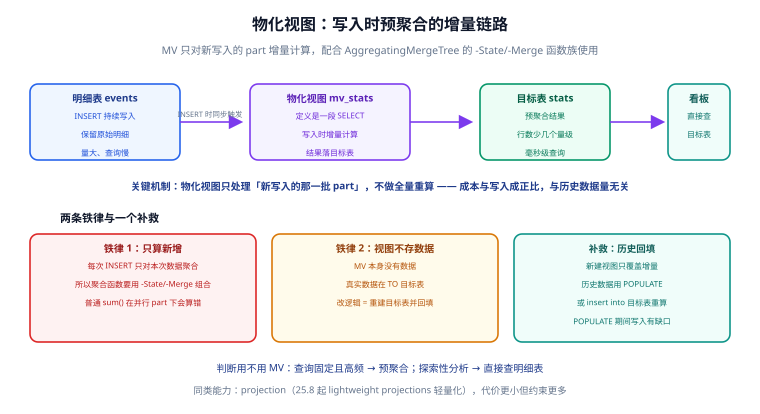

# 物化视图与预聚合

看板类查询「模式固定、频率极高」，每次都去扫十亿行明细是浪费。物化视图（Materialized View，MV）让聚合**在写入时增量完成**：查询时只碰小几个量级的结果表。本页讲清 MV 的工作机制、`-State/-Merge` 函数族的正确用法与历史回填。



## 机制：只算新增，不全量重算

ClickHouse 的 MV 与传统数据库不同，它更像**写入路径上的触发器 + 增量聚合器**：

1. 每次向源表 INSERT 新 part 时，MV 对**这一批新数据**执行定义中的 SELECT；
2. 聚合结果写入 `TO` 指定的目标表（通常是 `AggregatingMergeTree`）；
3. 查询直接读目标表——成本与写入量成正比，与历史数据量无关。

两条铁律：

::: danger 注意
**铁律 1：聚合函数必须用 `-State/-Merge` 组合。** MV 每次只看到「这一批」数据，不能用 `sum()` 直接汇总（并行的多个 part 会各自算出局部和、无法正确合并）。正确写法是写入时 `sumState` 存中间态、查询时 `sumMerge` 出结果。

**铁律 2：MV 本身不存数据。** 真实数据在 `TO` 目标表里；改聚合逻辑 = 新建目标表 + 重建 MV + 回填历史，删 MV 不会删数据，但也不再更新。
:::

## 完整示例：小时级统计

```sql [mv_hourly.sql]
-- ① 目标表：存聚合中间态
CREATE TABLE analytics.events_hourly
(
    hour        DateTime,
    event_type  LowCardinality(String),
    pv          AggregateFunction(count, UInt64),
    uv          AggregateFunction(uniq, UInt64),
    amount_sum  AggregateFunction(sum, Decimal64(2))
)
ENGINE = AggregatingMergeTree
PARTITION BY toYYYYMM(hour)
ORDER BY (event_type, hour);

-- ② 物化视图：写入时增量计算
CREATE MATERIALIZED VIEW analytics.mv_events_hourly
TO analytics.events_hourly
AS
SELECT
    toStartOfHour(ts)              AS hour,
    event_type,
    countState()                   AS pv,
    uniqState(user_id)             AS uv,
    sumState(amount)               AS amount_sum
FROM analytics.events
GROUP BY hour, event_type;

-- ③ 查询目标表：*-Merge 出结果
SELECT
    hour,
    event_type,
    countMerge(pv)     AS pv,
    uniqMerge(uv)      AS uv,
    sumMerge(amount_sum) AS amount
FROM analytics.events_hourly
WHERE hour >= now() - INTERVAL 24 HOUR
GROUP BY hour, event_type
ORDER BY hour DESC;
```

三段各自的角色：目标表只存「中间态」（体积小几个量级）；MV 定义增量聚合；查询永远用 `*Merge` 读。

## 历史回填

MV 建好后只覆盖**之后**的写入。历史数据两条路：

```sql
-- 方式 A：建 MV 时带 POPULATE（简单，但回填期间的并发写入有缺口，仅小表用）
CREATE MATERIALIZED VIEW analytics.mv_x
TO analytics.events_hourly
AS SELECT ... ;
-- 新版推荐用 POPULATE 关键字见官方文档；大表不要用

-- 方式 B（推荐）：直接向目标表 INSERT 一段全量聚合
INSERT INTO analytics.events_hourly
SELECT toStartOfHour(ts), event_type,
       countState(), uniqState(user_id), sumState(amount)
FROM analytics.events
WHERE ts < '回填截止时间'
GROUP BY hour, event_type;
```

::: warning 切割点要写死
方式 B 的回填与 MV 增量之间有一条「切割线」：回填 SQL 的 `WHERE ts < 截止时间` 与 MV 生效时间必须**无缝衔接**，否则重复或漏算。回填前把源表写入暂停或记录好水位，是实操中必做的一步。
:::

## MV vs projection

25.8 起 lightweight projections 成熟：同表内建「按另一排序键组织的副本」，查询自动路由。

| | 物化视图 | projection |
| --- | --- | --- |
| 数据位置 | 独立目标表 | 同表内部 |
| 聚合函数 | 需要 `-State/-Merge` | 直接用普通聚合 |
| 跨表/复杂逻辑 | 支持任意 SELECT | 只限本表 |
| 存储控制 | 目标表独立 TTL/引擎 | 跟随源表 |
| 适用 | 看板宽表、跨层加工 | 单表的第二排序维度 |

简单说：**单表换个排序键/轻聚合 → projection；跨表、复杂加工、要独立 TTL → MV**。

## 验证方式

```shell
# ① 写入 1 万行后，目标表行数应远小于源表
clickhouse-client --query "
  SELECT (SELECT count() FROM analytics.events)      AS src,
         (SELECT count() FROM analytics.events_hourly) AS dst;"
# 期望：dst 是 src 的 1/n（按小时 × 事件类型折叠）

# ② 增量一致性：源表与目标表算出的总 PV 应相等
clickhouse-client --query "
  SELECT (SELECT count() FROM analytics.events)          AS src_pv,
         (SELECT countMerge(pv) FROM analytics.events_hourly) AS mv_pv;"
# 期望：两者相等（不等 = 回填切割线有缺口）
```

## 参考资料

- [Materialized views 官方文档](https://clickhouse.com/docs/guides/developer/cascading-materialized-views)
- [AggregateFunction 类型与 -State/-Merge](https://clickhouse.com/docs/sql-reference/data-types/aggregatefunction)
- [Projections](https://clickhouse.com/docs/engines/table-engines/mergetree-family/mergetree#projections)
