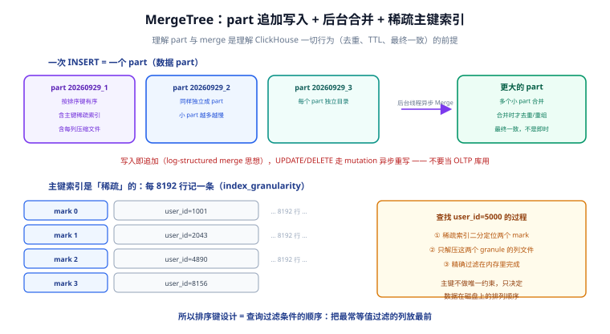

# MergeTree 引擎

MergeTree 是 ClickHouse 的**核心表引擎家族**：数据按「part」追加写入、由后台线程异步合并（merge），主键只是稀疏索引、决定数据在磁盘上的排列顺序。理解 part 与 merge，是理解 ClickHouse 一切行为（写入模式、去重语义、TTL、最终一致）的前提。



## part：写入的最小物理单位

一次 INSERT（一个 block）落盘就是一个 **part**，它是磁盘上的一个目录，包含：

- `primary.idx`：主键稀疏索引（每 `index_granularity` 行记一条，默认 8192）；
- 每列一个（或按 granule 切分的一组）压缩文件：`[column].bin` + `[column].mrk2`（标记文件，定位每条索引记录在压缩块中的偏移）；
- 分区目录内的 `minmax` 等辅助信息。

三条关键行为：

1. **写入即追加**。INSERT 不修改已有数据，只创建新 part——这是写入吞吐高的根本原因。
2. **后台异步合并**。后台线程不断把小 part 合并成大 part；合并时才做去重、TTL 清理、排序重组。
3. **小 part 是大敌**。`Too many parts` 异常就是写入批量太小、合并追不上。**攒批写入是铁律**（见 [实战](../Practice/index.md)）。

::: danger 注意
**不要把 MergeTree 当 OLTP 表用**。高频 `UPDATE/DELETE` 会触发 mutation——把该列在所有 part 里重写一遍，代价与表总大小成正比。状态类数据放 MySQL/PostgreSQL，分析副本再进 ClickHouse。
:::

## 稀疏主键索引：不点查、为跳读而生

MergeTree 的主键（`PRIMARY KEY`）**不做唯一性约束**，也**不是 B+ 树点查索引**：

- 数据按 `ORDER BY`（排序键）在磁盘上物理有序；
- 稀疏索引每 8192 行记录一条排序键的值（一个 mark）；
- 查询先用索引二分定位「可能命中哪些 mark 区间」，只解压这些区间的列文件，再内存精筛。

推论：**排序键 = 查询过滤条件的顺序**。把最常做等值过滤的列放在排序键最前，扫描量能直接砍掉几个数量级（设计方法见 [分区与索引](../PartitionIndex/index.md)）。

## 引擎族选型

MergeTree 不是一款引擎，是一个家族。按「合并时怎么处理数据」选择：

| 引擎 | 合并时的行为 | 典型场景 |
| --- | --- | --- |
| `MergeTree` | 只做合并与 TTL | 明细事实表，**默认首选** |
| `ReplacingMergeTree(ver)` | 同排序键保留 ver 最大（或最后一条） | 上游会重放/更新的数据，最终去重 |
| `SummingMergeTree` | 数值列按排序键**求和合并** | 简单累加指标（配合明细表兜底） |
| `AggregatingMergeTree` | 合并 `*State` 聚合中间态 | 物化视图的目标表（见 [物化视图](../MaterializedView/index.md)） |
| `CollapsingMergeTree(sign)` | sign=+1/-1 成对抵消 | 需要变更语义的事件流 |
| `VersionedCollapsingMergeTree` | 同上，但乱序也能正确抵消 | 多线程写入的变更流 |
| `Replicated*` | 上述任意引擎 + 副本复制 | 集群部署（见 [副本与分片](../Cluster/index.md)） |

::: warning ReplacingMergeTree 的「去重」是查询时语义
引擎只在**合并时**删重，而合并时机不受你控制——所以查询必须显式处理：

```sql
-- 方式一：FINAL（读时合并，简单但慢，会阻止部分并行优化）
SELECT * FROM user_profile FINAL WHERE user_id = 1001;

-- 方式二：按 ver 取最大（推荐：先聚合再过滤，可利用排序键跳读）
SELECT user_id, argMax(status, ver) AS status
FROM user_profile
WHERE user_id = 1001
GROUP BY user_id;
```

`SELECT ... FINAL` 不保证「立即唯一」只保证「查询结果唯一」，两者别混。小表用 FINAL，大表用 `argMax`。
:::

## 建表模板与 TTL

一张生产可用的明细表长这样：

```sql [events.sql]
CREATE TABLE events
(
    user_id    UInt64,
    event_type LowCardinality(String),
    ts         DateTime64(3),
    props      Map(String, String),
    amount     Decimal64(2) DEFAULT 0
)
ENGINE = MergeTree
PARTITION BY toYYYYMM(ts)                          -- 按月分区（分区设计见下一页）
ORDER BY (user_id, ts)                             -- 排序键：等值列在前，时间在后
TTL ts + INTERVAL 13 MONTH DELETE                  -- 13 个月后自动删除
SETTINGS index_granularity = 8192;
```

三个参数的意义：

| 参数 | 作用 | 什么时候调 |
| --- | --- | --- |
| `PARTITION BY` | 物理分区，查询裁剪 + TTL 单位 | 必须；按月/按日，禁止高基数 |
| `ORDER BY` | 数据排列顺序，决定稀疏索引 | 必须；跟查询过滤条件对齐 |
| `TTL expr DELETE` | 自动过期 | 日志/行为类数据建议必配 |

`index_granularity` 保持默认 8192 即可，绝大多数场景不需要动。

## 变更与删除的正确姿势

```sql
-- 修正少量数据：mutation（异步、重写整列，谨慎使用）
ALTER TABLE events DELETE WHERE user_id = 1001 AND ts < '2026-01-01';
ALTER TABLE events UPDATE amount = amount * 2 WHERE event_type = 'refund';

-- 查看 mutation 进度
SELECT * FROM system.mutations WHERE is_done = 0;

-- 25.8+ 轻量更新（beta）：只写 patch part，不重写整列
ALTER TABLE events UPDATE amount = 0 WHERE event_type = 'void' AND ts > now() - 3600;
```

::: tip 选型口诀
明细表 MergeTree；会重放就 Replacing；物化视图目标表 Aggregating；要「撤销」语义用 Collapsing；上了集群套 Replicated。**先想查询形态，再挑引擎**。
:::

## 验证方式

```shell
# ① 建表无报错后，观察 part 生命周期
clickhouse-client --query "
  INSERT INTO events VALUES (1,'pv',now(),'{}',0);
  SELECT count() FROM system.parts
  WHERE database='default' AND table='events' AND active;"
# 期望：1（刚写入 1 个 part）

# ② 稀疏索引与排序验证：查询排序键前导列，看扫描行数
clickhouse-client --query "
  EXPLAIN indexes=1
  SELECT count() FROM events WHERE user_id = 1;"
# 期望：输出中出现 primary key 条件 user_id IN (1,) 且 granules 数小于总 granules
```

## 参考资料

- [MergeTree 官方文档](https://clickhouse.com/docs/engines/table-engines/mergetree-family/mergetree)
- [ReplacingMergeTree](https://clickhouse.com/docs/engines/table-engines/mergetree-family/replacingmergetree)
- [轻量更新（25.8 beta）](https://clickhouse.com/docs/sql-reference/statements/alter/update)
