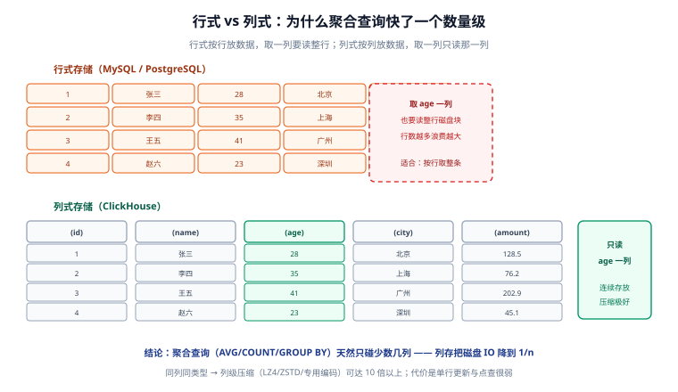

# 列式存储与 ClickHouse 概述

ClickHouse 是 Yandex 开源（2016 年）的**列式 OLAP 数据库**：数据按列组织、压缩后落盘，聚合查询只读需要的列，配合多核并行与向量化执行，十亿行级的 `GROUP BY` 可以亚秒返回。本页先讲清楚「为什么列式快」，再划定它「能做什么、不能做什么」的边界。

## 行式 vs 列式：磁盘 IO 的差距

同样的表，两种存储把数据放在磁盘上的方式完全不同：



三条推论：

1. **聚合查询只碰少数几列**。`SELECT avg(age) FROM t` 在列存下只读 age 一个列文件，行存下要读完整行——列数越多、查询列越少，收益越大。
2. **同列同类型，压缩率极高**。一列连续存放、取值相近，LZ4/ZSTD 通用压缩之外还能用专用编码（Delta、DoubleDelta、Gorilla），实测 10 倍以上压缩很常见——这也意味着 ClickHouse 的「扫描」常常不是在解压后的数据上进行的。
3. **代价：单行操作弱**。取一行要打开所有列文件再拼装；UPDATE/DELETE 不能原地改，只能异步重写（mutation）。所以它做不了 OLTP。

## ClickHouse 是什么、不是什么

| 维度 | ClickHouse 的回答 |
| --- | --- |
| 事务 | **没有**跨行事务，不提供 ACID 保证；写入是原子的最小单位是「一批 INSERT 的一个 block」 |
| 单行更新 | `UPDATE/DELETE` 走 **mutation**（异步重写整列），25.8 起 `UPDATE ... SET ... WHERE`（轻量更新，patch parts）进入 beta，但都不适合高频小更新 |
| 实时性 | 数据写入后**可查**（毫秒级可见），但重复合并、TTL 生效是异步的——「最终一致」 |
| 查询类型 | 聚合、扫描、多维统计极快；深度点查、随机单行取回不是强项 |
| SQL | 方言接近标准 SQL，`JOIN` 语法与 MySQL 有差异（见 [数据类型与 SQL 基础](../SqlBasic/index.md)） |

## 适用与不适用

| 适合 ✅ | 不适合 ❌ |
| --- | --- |
| 用户行为 / 埋点事件分析 | 订单状态流转等高频行级更新 |
| 监控指标、APM、日志长期存储 | 高并发单行点查（用 KV/Redis） |
| 报表与看板（多维 GROUP BY） | 强事务业务（支付扣款、库存扣减） |
| 广告、风控的画像宽表 | 小表（几百行）—— 任何库都够，不值得引入 |

::: tip 判断方法
三个问题同时答「是」才选 ClickHouse：**写入吞吐大吗？数据会频繁更新吗？查询以聚合为主吗？** 第二个答「是」就别选。
:::

## 与同类产品的边界

| 产品 | 定位 | 与 ClickHouse 的关系 |
| --- | --- | --- |
| MySQL / PostgreSQL | 行式 OLTP | 业务主库，分析负载下沉到 ClickHouse（binlog/双写同步） |
| InfluxDB / TDengine | 时序数据库 | 指标场景更专精；事件明细 + 任意维度聚合选 ClickHouse（见 [时序数据库](../../TimeSeries/index.md)） |
| Elasticsearch | 检索引擎 | 全文检索与倒排是 ES 强项；多维统计与存储成本是 ClickHouse 强项（见 [Elasticsearch](../../NoRelational/Elasticsearch/index.md)） |
| Hive / Spark | 离线数仓 | 批处理生态更全；ClickHouse 主打**交互式实时**查询 |

## 架构速览

单机形态下 ClickHouse 就是一个 `clickhouse-server` 进程：

1. **SQL 层**：解析、优化、向量化执行（按列分批处理，充分利用 SIMD 与多核）；
2. **存储层**：MergeTree 引擎族，数据以 part 为单位追加、后台合并（细节见 [MergeTree 引擎](../MergeTree/index.md)）；
3. **集成层**：Kafka 引擎、MySQL/PostgreSQL 引擎、S3/URL 引擎，可以把外部数据源当本地表查；
4. **客户端**：`clickhouse-client`（原生 TCP）、HTTP 接口（8123 端口）、各类驱动（JDBC/Python/Go）。

::: info 部署形态
开源版自管（单机或集群 + Keeper），另有 ClickHouse Cloud（官方托管）。本专题以开源版为准，版本按 2026-09 口径：生产落点 **26.8 LTS**，详见 [首页版本速览](../index.md)。
:::

## 安装与验证

::: details Docker 单机起一个（推荐学习用）

```shell
# 启动（数据落在本机目录，便于重启保留）
docker run -d --name ch-learn \
  -p 8123:8123 -p 9000:9000 \
  -v "$PWD/ch-data:/var/lib/clickhouse" \
  clickhouse/clickhouse-server:26.8

# 进入客户端
docker exec -it ch-learn clickhouse-client
```

:::

验证三连，全部通过即环境可用：

```shell
# ① 版本
clickhouse-client --version
# 期望：ClickHouse local version 26.8.x.x

# ② 执行一条查询
clickhouse-client --query "SELECT version()"
# 期望：26.8.x.x

# ③ HTTP 接口
curl "http://localhost:8123/?query=SELECT%201"
# 期望：1
```

## 参考资料

- [ClickHouse 官方文档 · What is ClickHouse](https://clickhouse.com/docs/intro)
- [列式存储的优势](https://clickhouse.com/docs/about-us/distinctives)
- [Why is ClickHouse so fast](https://clickhouse.com/docs/concepts/why-clickhouse-is-so-fast)
