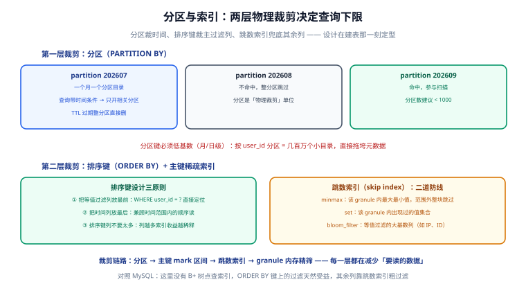

# 分区与索引

ClickHouse 查询快的下限，在建表那一刻就被 `PARTITION BY` 和 `ORDER BY` 定死了：分区裁掉无关时间段、排序键裁掉无关主键区间、跳数索引兜底其余列的过滤。本页讲清这三层物理裁剪怎么设计、怎么验证。



## 第一层裁剪：分区

`PARTITION BY` 把数据按目录物理切分，查询带上分区列条件时，优化器直接跳过整个不相关的分区目录（partition prune）。

```sql
CREATE TABLE events
(
    ts DateTime64(3),
    user_id UInt64,
    event_type LowCardinality(String)
)
ENGINE = MergeTree
PARTITION BY toYYYYMM(ts)        -- 按月分区
ORDER BY (user_id, ts);
```

分区设计的四条规则：

| 规则 | 原因 |
| --- | --- |
| 分区键用时间列，按**月或日** | 查询几乎总是带时间范围；TTL 也以分区为单位回收 |
| **禁止高基数分区**（如 user_id） | 几百万个分区目录会拖垮元数据与合并，启动都慢 |
| 单表分区总数控制在 **1000 以内** | 官方经验值；超过后 INSERT 与 merge 的开销显著上升 |
| 分区表达式要能被查询**直接命中** | 写 `toYYYYMM(ts)`，查询也要写 `ts >= X AND ts < Y`（见下） |

::: danger 注意
分区裁剪匹配的是**原始列上的范围条件**。查询里写 `WHERE toYYYYMM(ts) = 202609` 会**阻止分区裁剪**（对列套了函数），正确写法是 `WHERE ts >= '2026-09-01' AND ts < '2026-10-01'`。这是 ClickHouse 最常见的「建了分区但没吃到」误区。
:::

## 第二层裁剪：排序键

`ORDER BY` 决定数据在每个分区内、磁盘上的物理排列，主键稀疏索引（默认等于排序键）按 8192 行一格做跳读定位。

设计三原则：

1. **等值过滤列放最前**：`WHERE user_id = ?` 是最高频条件，就把它放第一列——同一个 user 的数据在磁盘上连续存放，扫描范围立即缩小；
2. **时间列放最后**：兼顾时间范围查询的顺序读；
3. **排序键列不宜多**：3~4 列以内。列越多，每个 mark 代表的区间越长，前导列的裁剪收益被稀释。

```sql
-- 高频查询：某用户近 7 天的行为
SELECT event_type, count() FROM events
WHERE user_id = 1001 AND ts >= now() - INTERVAL 7 DAY
GROUP BY event_type;
-- 排序键 (user_id, ts) 正好覆盖：user_id 等值定位 + ts 范围顺扫
```

::: info 主键与排序键可以不同
`PRIMARY KEY` 可以只是 `ORDER BY` 的前缀（如排序键 `(user_id, ts, event_type)`、主键 `(user_id, ts)`），作用是给主键索引留更长的区间。绝大多数场景让两者一致即可。
:::

## 第三层兜底：跳数索引（skip index）

不在排序键上的过滤列，靠**跳数索引**做粗过滤：它不定位数据，只回答「这 8192 行里**肯定没有**你要的值」——把整块 granule 跳过。

| 类型 | 原理 | 适用 |
| --- | --- | --- |
| `minmax` | 记录每块的最大最小值 | 数值/时间列的范围过滤 |
| `set(max_rows)` | 记录每块出现过的值集合 | 低~中基数列的等值过滤 |
| `bloom_filter([fp])` | 布隆过滤器 | 高基数列（IP、订单号）的等值过滤 |
| `ngrambf_v1` / `tokenbf_v1` | n-gram / 分词布隆 | String 的 LIKE、`hasToken` 过滤 |

```sql
ALTER TABLE events
  ADD INDEX idx_evt event_type TYPE set(100) GRANULARITY 4;
ALTER TABLE events
  ADD INDEX idx_ip props['ip'] TYPE bloom_filter GRANULARITY 4;
-- 两者都要 MATERIALIZE 后对存量数据生效
ALTER TABLE events MATERIALIZE INDEX idx_evt;
```

::: warning 跳数索引不是免费的
每个索引都要在写入时维护、在合并时重建。只给「确实频繁过滤、又不在排序键里」的列建，宁缺毋滥。
:::

## EXPLAIN 验证：设计有没有生效

```shell
clickhouse-client --query "
  EXPLAIN indexes=1
  SELECT count() FROM events
  WHERE user_id = 1001 AND ts >= '2026-09-01' AND ts < '2026-10-01';"
```

期望输出里能看到三级裁剪逐层生效：

- `Partitions: picked = 1`（分区裁剪命中 1 个分区）；
- `PrimaryKey: condition: (user_id IN (1001), ts in [...]），granules: 12/2860`（主键区间只留下一小撮 granule）；
- 建了跳数索引的列会出现 `SkipIndex` 行。

::: tip 验收判据
把上面 `granules: a/b` 的比例记下来——**生产上任何慢查询的排查第一步就是跑 `EXPLAIN indexes=1` 看 a/b**：a/b 接近 1 说明索引根本没起作用，回头检查分区条件写法与排序键设计，而不是先加机器。
:::

## 与 MySQL 索引的对照

| | MySQL B+ 树 | ClickHouse 物理裁剪 |
| --- | --- | --- |
| 服务对象 | 等值/范围点查，逐行定位 | 大范围扫描前的批量裁剪 |
| 结构 | 平衡树，逐条查找 | 排序 + 稀疏索引跳读 |
| 二级索引 | 回表取整行 | 跳数索引只做「跳过」，不回表 |
| 设计时机 | 可事后补建 | **建表时定型**，事后改要 `MATERIALIZE` 全量重排 |

更多索引原理上的对照见 [MySQL 索引深入](../../Relational/MySQL/IndexDeepDive/index.md)。

## 验证方式

```shell
# ① 分区数检查（应远小于 1000）
clickhouse-client --query "
  SELECT count() FROM system.parts
  WHERE database='default' AND table='events' AND active;"
# 期望：active part 数合理（分区数 × 每分区 part 数）

# ② 反例验证：函数包列会失去分区裁剪
clickhouse-client --query "
  EXPLAIN indexes=1 SELECT count() FROM events WHERE toYYYYMM(ts) = 202609;"
# 期望：Partitions picked 接近全部分区 —— 证明函数包列破坏了裁剪
```

## 参考资料

- [MergeTree · Table partitions](https://clickhouse.com/docs/engines/table-engines/mergetree-family/custom-partitioning-key)
- [Skip indexes](https://clickhouse.com/docs/engines/table-engines/mergetree-family/mergetree#table_engine-mergetree-data_skipping-indexes)
- [EXPLAIN](https://clickhouse.com/docs/sql-reference/statements/explain)
