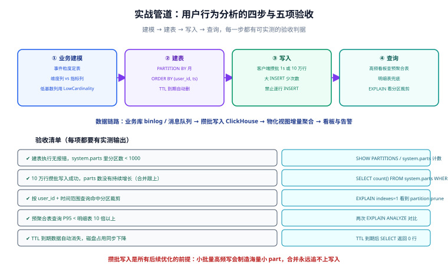

# 实战：用户行为分析

把前面六页的知识拼成一条真实链路：业务库埋点事件持续流入 ClickHouse，明细表保底、物化视图出小时级看板。四步——建模、建表、写入、查询——每一步都有可实测的验收判据。



## 场景与数据形态

- 数据源：Web/App 埋点事件（`pv`、`click`、`order` 等），日均 1 亿行、列数 20 左右、**只追加不更新**；
- 查询形态：运营看板（小时级 PV/UV/转化）、分析师 ad-hoc（任意维度组合）、数据保留 13 个月；
- 结论先行：三个判据（写入吞吐大 / 更新少 / 聚合为主）全部命中，选 ClickHouse 成立。

## 第 1 步：建模

| 决策 | 结论 | 依据 |
| --- | --- | --- |
| 表粒度 | 一行一个事件（明细表保底） | ad-hoc 查询要任意维度 |
| 维度列 vs 指标列 | `user_id/event_type/channel/os` 维度；`amount/duration` 指标 | 维度列进排序键或跳数索引 |
| 低基数优化 | `event_type/channel/os` 用 `LowCardinality` | 基数 < 1 万，字典编码提速 2~5 倍 |
| 属性扩展 | 动态属性放 `Map(String, String)` | 埋点属性经常加，不改表结构 |

## 第 2 步：建表

```sql [analytics_events.sql]
-- 明细事实表（保底，全部原始事件）
CREATE TABLE analytics.events
(
    user_id    UInt64,
    event_type LowCardinality(String),
    channel    LowCardinality(String) DEFAULT 'direct',
    os         LowCardinality(String) DEFAULT 'other',
    amount     Decimal64(2) DEFAULT 0,
    props      Map(String, String),
    ts         DateTime64(3)
)
ENGINE = MergeTree
PARTITION BY toYYYYMM(ts)
ORDER BY (user_id, ts)
TTL ts + INTERVAL 13 MONTH DELETE
SETTINGS index_granularity = 8192;

-- 小时级看板目标表 + 物化视图（机制见「物化视图」页）
CREATE TABLE analytics.events_hourly
(
    hour   DateTime,
    event_type LowCardinality(String),
    pv     AggregateFunction(count, UInt64),
    uv     AggregateFunction(uniq, UInt64),
    gmv    AggregateFunction(sum, Decimal64(2))
)
ENGINE = AggregatingMergeTree
PARTITION BY toYYYYMM(hour)
ORDER BY (event_type, hour);

CREATE MATERIALIZED VIEW analytics.mv_events_hourly
TO analytics.events_hourly AS
SELECT toStartOfHour(ts) AS hour, event_type,
       countState(), uniqState(user_id), sumState(amount)
FROM analytics.events
GROUP BY hour, event_type;
```

设计核对：分区按月（13 个月 ≈ 14 个分区，远小于 1000）；排序键 `(user_id, ts)` 覆盖「某用户行为轨迹」这一最高频明细查询；看板查询全部走 `events_hourly`。

## 第 3 步：攒批写入

生产链路一般是「业务库 binlog / Kafka → 同步程序 → 攒批 INSERT」。用 Python 演示攒批的最小实现：

```python [ingest.py]
# pip install clickhouse-connect（以官方驱动为准，本地验证后再用于生产）
import time, random, datetime
import clickhouse_connect

client = clickhouse_connect.get_client(host="localhost", port=8123)

buf = []
def on_event(e):
    buf.append(e)
    if len(buf) >= 10000:              # 批次上限
        flush()

def flush():
    if buf:
        client.insert("analytics.events", buf,
                      column_names=["user_id","event_type","channel","os",
                                    "amount","props","ts"])
        buf.clear()

# 模拟持续流入
while True:
    for _ in range(random.randint(500, 2000)):
        on_event([random.randint(1, 10**7), "pv", "search", "ios",
                  0, {}, datetime.datetime.now()])
    time.sleep(1)                        # 每秒 flush 一次余量
    flush()
```

要点：**每秒最多一个批次、每批最多 10 万行**，其余交给时间积累——与「逐行 INSERT」的反模式对照着理解。

## 第 4 步：查询

```sql
-- 看板（走预聚合表，毫秒级）
SELECT hour, event_type, countMerge(pv) AS pv, uniqMerge(uv) AS uv
FROM analytics.events_hourly
WHERE hour >= now() - INTERVAL 24 HOUR
GROUP BY hour, event_type ORDER BY hour;

-- 分析师 ad-hoc（走明细表，靠物理裁剪）
SELECT channel, count(), uniq(user_id), quantile(0.95)(amount)
FROM analytics.events
WHERE ts >= now() - INTERVAL 7 DAY AND event_type = 'order'
GROUP BY channel;

-- 执行计划验证：分区裁剪 + 主键区间裁剪都生效
EXPLAIN indexes=1
SELECT count() FROM analytics.events
WHERE user_id = 1001 AND ts >= '2026-09-01';
```

## 验收清单

| # | 验收项 | 验证命令 | 期望 |
| --- | --- | --- | --- |
| 1 | 建表成功、分区数受控 | `SELECT count() FROM system.parts WHERE table='events' AND active` | part 数稳定、分区 < 20 |
| 2 | 攒批写入健康 | 持续写入 10 分钟后再看 `system.parts` | active part 数没有持续增长（合并跟得上） |
| 3 | 分区裁剪生效 | `EXPLAIN indexes=1` 带时间范围查询 | `Partitions picked` 远小于总数 |
| 4 | 预聚合收益 | 看板查询分别查明细表与目标表计时 | 目标表快 10 倍以上 |
| 5 | MV 增量一致 | 源表 `count()` vs `countMerge(pv)` | 相等 |
| 6 | TTL 生效 | 写入一条 `ts` 超期数据，等待 TTL 后台清理 | 超期分区被整块删除 |

::: tip 验收纪律
每一条都要贴出**实测输出**（时间、行数、计划片段），「应该没问题」不算验收。跑不满 10 分钟的写入压测，发现不了 part 堆积问题。
:::

## 参考资料

- [官方教程：合并树入门](https://clickhouse.com/docs/guides/developer/inserting-data)
- [clickhouse-connect（Python）](https://clickhouse.com/docs/integrations/language-clients/python/intro)
- [Kafka 表引擎（生产写入链路）](https://clickhouse.com/docs/engines/table-engines/integrations/kafka)
