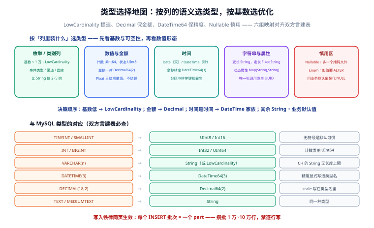

# 数据类型与 SQL 基础

ClickHouse 的 SQL 方言「接近但不等于」标准 SQL：类型体系是列式定制的（UInt8、LowCardinality、DateTime64），写入必须攒批，JOIN 与 MySQL 有语法差异。本页给出生产中最常用的类型清单、读写语法与差异对照。



## 数据类型清单

| 类别 | 类型 | 说明与建议 |
| --- | --- | --- |
| 整数 | `UInt8/16/32/64`、`Int8/16/32/64` | **无符号是默认习惯**：计数用 `UInt64`，状态枚举用 `UInt8`；没有 `TINYINT` |
| 浮点 | `Float32/Float64` | 有精度误差，金额禁用 |
| 定点 | `Decimal32/64/128(scale)` | 金额统一 `Decimal64(2)` |
| 字符串 | `String`、`FixedString(n)` | 默认 `String`；定长枚举值可用 `FixedString` |
| 低基数 | `LowCardinality(String)` | 基数 < 1 万的枚举列（事件类型、国家）**必用**，字典编码大幅提速 |
| 日期时间 | `Date`、`DateTime`、`DateTime64(3)` | 毫秒用 `DateTime64(3)`；范围查询、分区都靠它 |
| 枚举 | `Enum8/Enum16('a'=1,...)` | 存储省、语义清晰；但加值要 ALTER，多数场景 `LowCardinality(String)` 更省心 |
| 复合 | `Array(T)`、`Map(K,V)`、`Tuple` | 行为埋点属性用 `Map(String,String)` 很顺手 |
| 唯一标识 | `UUID` | 原生 UUID 类型，比 String 快 |
| 可空 | `Nullable(T)` | **能不用就不用**（见下） |

::: danger 注意
`Nullable(T)` 的两个代价：① 每列额外维护一个「空值掩码文件」，查询变慢、压缩变差；② 与默认值语义纠缠（`INSERT` 漏列时 `Nullable` 列是 NULL，普通列是类型默认值）。**最佳实践：用业务默认值替代 NULL**（0、`''`、`'N/A'`），只有「确实要区分『没有』和『默认』」的列才用 Nullable。
:::

## 建库建表与写入

```sql
-- 库
CREATE DATABASE IF NOT EXISTS analytics;

-- 表（完整参数见前两页）
CREATE TABLE analytics.events
(
    user_id    UInt64,
    event_type LowCardinality(String),
    amount     Decimal64(2) DEFAULT 0,
    props      Map(String, String),
    ts         DateTime64(3)
)
ENGINE = MergeTree
PARTITION BY toYYYYMM(ts)
ORDER BY (user_id, ts);
```

**写入必须攒批**——ClickHouse 的每个 INSERT block 是一个 part：

```sql
-- ✅ 一次一万行（客户端攒批后发）
INSERT INTO analytics.events
SELECT * FROM input('user_id UInt64, event_type LowCardinality(String),
                     amount Decimal64(2), props Map(String,String), ts DateTime64(3)')
FORMAT JSONEachRow;

-- ❌ 反例：每秒一次单行 INSERT —— 每行一个 part，合并永远追不上
```

::: tip 攒批参数经验值
单批 **1 万 ~ 10 万行**或**间隔 1 秒**先到先发；上游没有攒批能力时，服务端用 `Buffer` 引擎或消息队列（Kafka 引擎）兜底。并发写入线程数不要超过分区数 × 2。
:::

## 查询与聚合函数

```sql
-- 时间窗口聚合（toStartOfHour 直接做时间桶）
SELECT toStartOfHour(ts) AS hour,
       uniqExact(user_id) AS uv,
       count() AS pv
FROM analytics.events
WHERE ts >= now() - INTERVAL 1 DAY
GROUP BY hour
ORDER BY hour;

-- 近似计数：uv 级别用 uniq() 而不是 uniqExact()，快且误差 < 1%
SELECT uniq(user_id) FROM analytics.events;

-- 分位数
SELECT quantile(0.95)(amount) FROM analytics.events;
```

高频聚合函数速查：

| 函数 | 用途 |
| --- | --- |
| `count()` / `uniq()` / `uniqExact()` | 计数 / 近似 UV / 精确 UV |
| `sum()` / `avg()` / `min()` / `max()` | 常规聚合 |
| `quantile(0.95)(x)` | 分位数（P95 等） |
| `argMax(col, ver)` | 取 ver 最大那行的 col（Replacing 场景去重） |
| `topK(10)(col)` | Top-K |
| `countIf/sumIf/...` | 条件聚合（`sumIf(amount, type='pay')`） |

## 与 MySQL 的差异对照

| 项 | MySQL | ClickHouse |
| --- | --- | --- |
| JOIN 语法 | 支持任意列的隐式 JOIN | 推荐 `JOIN ... ON`，且**右表放小表**（右表载入内存构建哈希） |
| 事务 | 完整 ACID | 无跨行事务 |
| UPDATE/DELETE | 常规 DML | mutation/轻量更新，异步重写 |
| 分页 | `LIMIT 100000, 20` | 深分页同样性能差，用**游标条件**（`WHERE ts < 上页末值 LIMIT 20`） |
| 自增主键 | `AUTO_INCREMENT` | 无自增，用 `generateUUIDv4()` 或上游 ID |
| 特色语法 | — | `LIMIT n BY`（分组取前 n）、`WITH ... AS` CTE、数组函数族 |

## 客户端与验证

```shell
# 交互客户端
clickhouse-client -h 127.0.0.1 --port 9000

# HTTP 接口（8123），适合脚本与探活
curl "http://localhost:8123/" --data-binary "
  SELECT event_type, count() FROM analytics.events GROUP BY event_type"

# 导出 CSV / JSON
clickhouse-client --query "SELECT * FROM analytics.events LIMIT 10" --format CSVWithNames
```

::: info 验证清单
① 建表无报错；② 攒批写入 1 万行成功且 `system.parts` 只增加 1 个 part；③ `GROUP BY toStartOfHour` 查询正常返回；④ `uniq` 与 `uniqExact` 结果差异在 1% 以内。四条全过即本页内容消化完成。
:::

## 参考资料

- [数据类型官方文档](https://clickhouse.com/docs/sql-reference/data-types)
- [INSERT 语句与格式](https://clickhouse.com/docs/sql-reference/statements/insert-into)
- [聚合函数](https://clickhouse.com/docs/sql-reference/aggregate-functions/reference/count)
