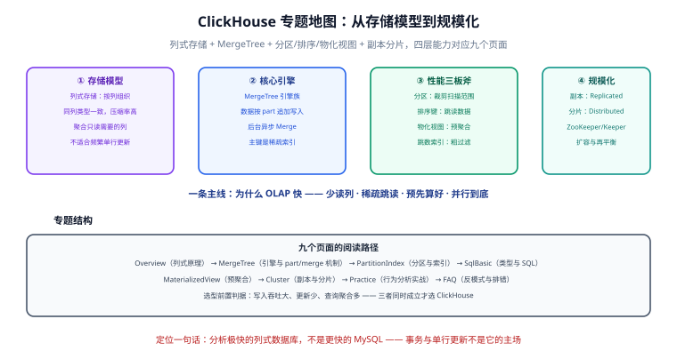

# ClickHouse

ClickHouse 是**面向在线分析处理（OLAP）的列式数据库**：十亿级数据上的聚合查询能做到亚秒级返回，代价是几乎放弃了单行事务与高频更新。用户行为分析、监控指标、日志分析、报表看板这些「写入量大、查询聚合多、更新少」的场景，是它的主场。

本专题从「为什么列式快」讲到 MergeTree 引擎机制，再到分区、索引、物化视图三件套，最后用一套用户行为分析管道把完整链路走一遍。

## 目录

- [列式存储与 ClickHouse 概述](Overview/index.md) - 行式 vs 列式、适用场景、与 MySQL/ES/时序库的边界
- [MergeTree 引擎](MergeTree/index.md) - part 追加写入、后台合并、稀疏主键索引、引擎族选型
- [分区与索引](PartitionIndex/index.md) - 两层物理裁剪、排序键设计、跳数索引
- [数据类型与 SQL 基础](SqlBasic/index.md) - 类型体系、攒批写入、与 MySQL 的语法差异
- [物化视图与预聚合](MaterializedView/index.md) - 写入时增量计算、-State/-Merge 函数族、历史回填
- [副本与分片](Cluster/index.md) - ReplicatedMergeTree、Keeper、Distributed 路由表
- [实战：用户行为分析](Practice/index.md) - 建库建表、攒批写入、预聚合、验收清单
- [常见问题与最佳实践](FAQ/index.md) - 四类反模式、排错三板斧、版本升级策略

## 一句话理解

::: tip 一句话理解
MySQL 是「账本」（每一行都要能改、要对得上账），ClickHouse 是「望远镜」（只管往一个方向看、看得远看得快）。**用它做 OLTP，不是慢，是用法本身就不成立**。
:::

## 版本状态速览（2026-09 核对）

ClickHouse 采用**日历版本号**（Year.Month.Patch.Build，如 26.8.12.53），每月一个 minor；每年 **3 月与 8 月各发布一个 LTS**，LTS 支持周期为 **1 年**；最近的三个 minor 线持续收 bug 与安全补丁。

| 状态 | 版本 | 说明 |
| --- | --- | --- |
| 当前 LTS（推荐生产落点） | **26.8 LTS**（2026-08-27 发布） | 支持至 2027-08-27；25.8 起向量检索（HNSW）GA、轻量 projection、UPDATE 语句 beta |
| 最新线 | 26.9（2026-09-21 发布） | 适合尝鲜与非关键环境 |
| 维护中 | 26.7、26.3 LTS | 26.3 LTS 支持至 2027-03-26 |
| 仅存量（已结束支持） | 25.8 LTS（2026-08-29 到期）、25.3 LTS（2026-03-20 到期）及更早 | 不再收安全补丁，应升级到 26.8 LTS |

::: danger 注意
生产环境**跟随 LTS 节奏升级**（每年两次），不要停在已到期的版本线上——ClickHouse 的非 LTS minor 只支持 3 个月左右，这是它与 MySQL/PostgreSQL「一个版本用五年」的最大差异。
:::

## 与库内其他专题的关系

| 专题 | 关系 |
| --- | --- |
| [MySQL](../Relational/MySQL/index.md) | 业务主库：事务与单行操作在这边，分析查询分发到 ClickHouse |
| [时序数据库](../TimeSeries/index.md) | 互补：InfluxDB/TDengine 面向指标场景，ClickHouse 面向事件明细 + 任意维度聚合 |
| [Elasticsearch](../NoRelational/Elasticsearch/index.md) | 检索 vs 聚合：全文检索用 ES，多维统计用 ClickHouse |
| [SQL 优化](../Relational/SQLOptimization/index.md) | 思想相通：都是「少读数据」，但 ClickHouse 的手段是物理裁剪而非 B+ 树 |

## 参考资料

- [ClickHouse 官方文档](https://clickhouse.com/docs)
- [版本支持策略](https://clickhouse.com/docs/about-us/distinctives)
- [endoflife.date/clickhouse（版本时间线）](https://endoflife.date/clickhouse)
