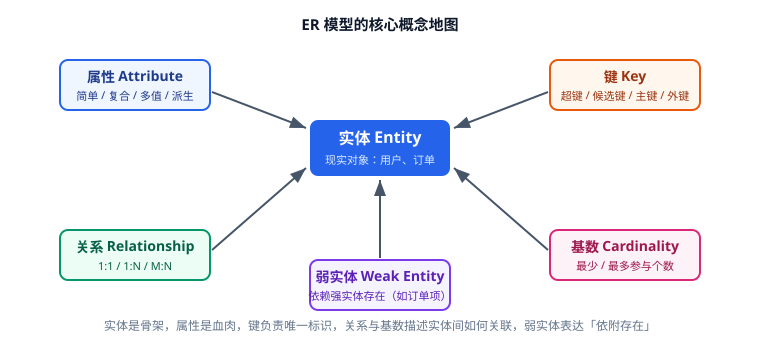

# 核心概念

数据建模的术语不多，但每一个都直接影响建表结果。本文把**实体、属性、关系、键、约束、基数**这六个概念讲透，每个都配可执行的 SQL 示例。



## 实体（Entity）

**实体**是业务中需要独立记录、独立存在的对象：用户、文章、订单、商品。判断标准有两条：

1. 它能脱离其他对象单独被查询（"列出所有标签"）。
2. 它有自己的身份标识（有个东西能唯一区分两条记录）。

反例："文章的阅读量"不是实体，它是文章的一个属性；"点赞"通常不是实体，它是用户与文章之间的关系。

术语对应：

| 概念模型 | 逻辑模型 | 物理模型（MySQL） |
| --- | --- | --- |
| 实体 | 表（Table） | `CREATE TABLE` |
| 属性 | 列（Column） | 字段定义 |
| 实例 | 行（Row） | 一条记录 |

**弱实体（Weak Entity）**：没有独立身份、必须依附于其他实体存在的实体，例如"订单明细"——它的主键由 `order_id + line_no` 组成，脱离订单没有意义。

## 属性（Attribute）

属性是实体的特征，分为四类：

| 类型 | 含义 | 例子 | 落地方式 |
| --- | --- | --- | --- |
| 简单属性 | 不可再分 | 用户名、年龄 | 单列 |
| 复合属性 | 可拆成子属性 | 地址（省/市/区/详细） | 拆多列或独立地址表 |
| 多值属性 | 一个实体有多个值 | 用户手机号、文章标签 | 拆子表或关联表 |
| 派生属性 | 可由其他数据算出 | 总价、平均分、年龄 | 不存储，或作为冗余统计列 |

::: danger 多值属性的两种错误写法
1. **逗号分隔字符串**：`tags VARCHAR(255)` 存 `"Java,MySQL,Redis"`。后果：无法建索引、无法统计"包含某标签的文章数"、无法保证标签存在性。
2. **编号列**：`tag1, tag2, tag3`。后果：超过三个标签就写不下，查询要写 `WHERE tag1=3 OR tag2=3 OR tag3=3`。

正确写法是拆关联表：

```sql
CREATE TABLE article_tags (
  article_id BIGINT UNSIGNED NOT NULL,
  tag_id     INT UNSIGNED    NOT NULL,
  PRIMARY KEY (article_id, tag_id),
  KEY idx_tag (tag_id, article_id)
) ENGINE=InnoDB DEFAULT CHARSET=utf8mb4;
```
:::

派生属性要谨慎：**计数类**（评论数、点赞数）在高频查询场景会作为冗余列存在，但必须有明确的一致性策略（见 [反范式与权衡](../Denormalization/index.md)）；**金额合计类**一般实时计算，除非性能确实不够。

## 关系（Relationship）

关系描述实体之间的业务联系，常见四类：

| 关系类型 | 含义 | 落地方式 | 例子 |
| --- | --- | --- | --- |
| 1:1 | 两边各一条 | 外键放任意一侧 + `UNIQUE` | 用户 ↔ 用户档案 |
| 1:N | 一方对多方 | 外键放在多的一方 | 用户 → 文章 |
| M:N | 两边都是多条 | 独立关联表（联合主键） | 文章 ↔ 标签 |
| 自反关系 | 实体与自身关联 | 外键指向本表主键 | 分类的父子、用户的关注 |

### 1:N 落地

```sql
CREATE TABLE articles (
  id         BIGINT UNSIGNED NOT NULL AUTO_INCREMENT,
  user_id    BIGINT UNSIGNED NOT NULL COMMENT '作者，外键指向 users.id',
  title      VARCHAR(200)    NOT NULL,
  created_at DATETIME(3)     NOT NULL DEFAULT CURRENT_TIMESTAMP(3),
  PRIMARY KEY (id),
  KEY idx_user_created (user_id, created_at DESC)
) ENGINE=InnoDB DEFAULT CHARSET=utf8mb4;
```

索引 `(user_id, created_at DESC)` 是为"查某作者的文章列表并按时间倒序"这个高频查询准备的——**建模时就要把主要查询想清楚**，而不是等慢查询出现再补索引。

### M:N 落地

M:N 必须拆成两个 1:N 加一张关联表。关联表的主键选择：

- `PRIMARY KEY (a_id, b_id)`：天然去重，且能高效支持"按 a 查 b"。
- 反向查询"按 b 查 a" 需要额外索引 `KEY (b_id, a_id)`。

### 自反关系的两种形态

```sql
-- 树形结构：分类的父子关系
CREATE TABLE categories (
  id        INT UNSIGNED NOT NULL AUTO_INCREMENT,
  parent_id INT UNSIGNED NULL COMMENT 'NULL 表示顶级分类',
  name      VARCHAR(50)  NOT NULL,
  PRIMARY KEY (id),
  KEY idx_parent (parent_id)
) ENGINE=InnoDB DEFAULT CHARSET=utf8mb4;

-- 图结构：用户关注（多对多且双向）
CREATE TABLE user_follows (
  follower_id BIGINT UNSIGNED NOT NULL COMMENT '关注者',
  followee_id BIGINT UNSIGNED NOT NULL COMMENT '被关注者',
  created_at  DATETIME(3) NOT NULL DEFAULT CURRENT_TIMESTAMP(3),
  PRIMARY KEY (follower_id, followee_id),
  KEY idx_followee (followee_id, follower_id)
) ENGINE=InnoDB DEFAULT CHARSET=utf8mb4;
```

::: warning 树形结构与图结构的查询代价
- 邻接表（`parent_id`）写入简单，但查"某分类的所有子孙"需要递归 CTE 或应用层循环。
- 深层树可考虑**路径枚举**（`path = '/1/7/23/'`，配合 `LIKE '/1/7/%'`）或**闭包表**（`category_paths` 存所有祖先-后代对），代价是写入变复杂。
- 图结构（关注、好友）中"共同关注"、"二度人脉"这类查询在关系型库里代价很高，不建议硬扛，必要时引入图数据库。
:::

## 键（Key）

键是识别与关联数据的核心，务必分清五种：

| 键类型 | 定义 | 示例 |
| --- | --- | --- |
| 超键（Super Key） | 能唯一标识一行的任意属性组合 | `(id)`、`(id, email)`、`(email)` |
| 候选键（Candidate Key） | 最小超键（去掉任一属性就不唯一） | `id`、`email` |
| 主键（Primary Key, PK） | 从候选键中选定的那一个 | `id` |
| 代理键（Surrogate Key） | 无业务含义的自增/雪花 ID | `BIGINT AUTO_INCREMENT` |
| 自然键（Natural Key） | 有业务含义的唯一标识 | 身份证号、邮箱、ISBN |
| 外键（Foreign Key, FK） | 指向另一张表主键的列 | `articles.user_id` |

选主键的经验规则：

1. **默认用代理键**（自增 BIGINT 或分布式 ID）。自然键会变（邮箱可改、手机号可换），一变就要级联改所有引用它的表。
2. **代理键 + 自然键唯一约束**是最稳的组合：`id` 做主键，`email` 加 `UNIQUE`。
3. **业务编号单独一列**：订单号、文章编号这类给人看的编号不要当主键，单独建 `order_no VARCHAR(32) UNIQUE`。

::: danger 主键选型的三个常见坑
1. **用 `VARCHAR(36)` 存 UUID 做主键**：InnoDB 聚簇索引按主键组织数据，随机 UUID 会导致页分裂与索引膨胀，写入性能明显下降。若必须用 UUID，至少存成 `BINARY(16)` 并考虑有序 UUID（UUIDv7）。
2. **主键用有业务含义的可变字段**：主键一旦被引用就不能改，改一次要更新全库。
3. **联合主键选错顺序**：`PRIMARY KEY (user_id, article_id)` 支持"查某用户的点赞"，但不支持"查某文章被谁点赞"（需要反向索引）。顺序要按查询频率最高的前缀来定。
:::

## 约束（Constraint）

约束是**把业务规则写进数据库**，比只写在应用代码里更可靠（应用可能被绕过、可能有多套写入路径）。

| 约束 | 作用 | 示例 |
| --- | --- | --- |
| `NOT NULL` | 必填 | `title VARCHAR(200) NOT NULL` |
| `DEFAULT` | 默认值 | `status TINYINT NOT NULL DEFAULT 0` |
| `UNIQUE` | 唯一（允许多个 NULL） | `UNIQUE KEY uk_username (username)` |
| `CHECK` | 值域约束（MySQL 8.0.16+ 生效） | `CHECK (score BETWEEN 0 AND 5)` |
| `FOREIGN KEY` | 引用完整性 | `FOREIGN KEY (user_id) REFERENCES users(id)` |
| `ON DELETE / ON UPDATE` | 级联行为 | `ON DELETE CASCADE` / `RESTRICT` |

```sql
CREATE TABLE article_likes (
  article_id BIGINT UNSIGNED NOT NULL,
  user_id    BIGINT UNSIGNED NOT NULL,
  score      TINYINT UNSIGNED NOT NULL DEFAULT 5,
  created_at DATETIME(3) NOT NULL DEFAULT CURRENT_TIMESTAMP(3),
  PRIMARY KEY (article_id, user_id),
  CONSTRAINT fk_like_article FOREIGN KEY (article_id) REFERENCES articles(id) ON DELETE CASCADE,
  CONSTRAINT fk_like_user    FOREIGN KEY (user_id)    REFERENCES users(id)    ON DELETE CASCADE,
  CONSTRAINT ck_like_score   CHECK (score BETWEEN 0 AND 5)
) ENGINE=InnoDB DEFAULT CHARSET=utf8mb4;
```

::: warning 外键用不用，取决于架构
- **单体应用 + 单库**：建议保留外键，天然防脏数据，级联规则也能明确表达业务语义。
- **微服务 / 分库分表**：通常**去掉外键约束**，改为应用层或定时任务校验一致性。原因：跨库无法建外键，且外键会让数据迁移、批量归档、分表拆分变得困难。
- 无论哪种方式，**索引不能省**：`articles.user_id` 即使没有外键，也应该有索引，否则关联查询会全表扫描。
:::

## 基数与参与度

基数（Cardinality）描述"一个实体实例能关联多少个另一侧实例"，参与度（Participation）描述"是否必须关联"：

| 表达 | 含义 | 落地含义 |
| --- | --- | --- |
| 1:1 强制 | 两边都必须有 | 两张表可合并，或外键 `NOT NULL UNIQUE` |
| 1:N 强制 | 多的一方必须属于一方 | 外键 `NOT NULL` |
| 1:N 可选 | 可以不属于任何一方 | 外键允许 `NULL` |
| M:N | 两边多条 | 关联表，且关联的两列都 `NOT NULL` |

::: tip 用自然语言验证基数
把关系读成一句业务话：**"一个用户可以写零篇或多篇文章，每篇文章必须属于恰好一个用户"**——能读通，关系就对了。读不通（比如"一篇文章属于多个用户"）说明基数搞错了。
:::

## 验证方式

概念是否落地，用这几条 SQL 检查：

```sql
-- 1. 检查表与约束是否与模型一致
SHOW CREATE TABLE article_likes\G

-- 2. 检查外键与索引
SELECT TABLE_NAME, CONSTRAINT_NAME, REFERENCED_TABLE_NAME
FROM information_schema.KEY_COLUMN_USAGE
WHERE TABLE_SCHEMA = 'demo' AND REFERENCED_TABLE_NAME IS NOT NULL;

-- 3. 验证约束真的生效（应报错）
INSERT INTO article_likes (article_id, user_id, score) VALUES (1, 1, 99);
-- ERROR 3819 (HY000): Check constraint 'ck_like_score' is violated.
```

预期结果：`SHOW CREATE TABLE` 输出的键与约束和 ER 图一致；非法数据被数据库拒绝，而不是靠应用代码兜着。

## 参考资料

- MySQL 官方文档：[Constraints](https://dev.mysql.com/doc/refman/8.4/en/constraints.html)、[CREATE TABLE](https://dev.mysql.com/doc/refman/8.4/en/create-table.html)
- PostgreSQL 官方文档：[Constraints](https://www.postgresql.org/docs/current/ddl-constraints.html)
- 延伸阅读：[ER 图与建模步骤](../ERDiagram/index.md) / [设计原则与规范](../DesignPrinciples/index.md)
