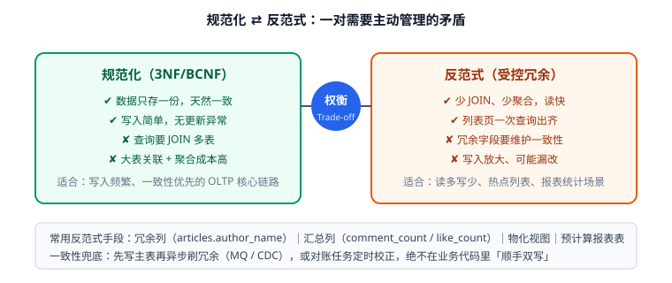

# 反范式与权衡

范式解决一致性，反范式解决性能。真实项目里两者都存在——关键是**每一处冗余都要有明确的理由和一致性保障**，而不是随手复制字段。



## 什么时候该反范式

只在这四种情况下考虑反范式：

| 场景 | 典型表现 | 手段 |
| --- | --- | --- |
| 高频读 + 多表 Join | 首页列表要 Join 5 张表 | 冗余展示字段、汇总表 |
| 高频聚合统计 | 每次都要 `COUNT(*)` | 计数列、汇总表、物化视图 |
| 历史快照需求 | 商品调价影响历史订单 | 下单时快照关键字段 |
| 报表/分析查询 | 复杂聚合拖慢线上库 | 独立宽表、数仓 |

::: warning 反范式不是"懒得 Join"的借口
判断标准很简单：**是否能用数据说明收益**。上线前用真实数据量做压测（例如 100 万行）对比规范化与反范式的查询耗时，差异显著（例如从 800ms 降到 15ms）才值得引入冗余。凭感觉反范式，通常换来的是长期的数据不一致。
:::

## 六种常见反范式手法

### 1. 冗余展示字段

列表页只需要作者昵称，不必每次 Join `users`。做法是在 `articles` 上冗余 `author_name`。

```sql
ALTER TABLE articles ADD COLUMN author_name VARCHAR(50) NOT NULL DEFAULT '' COMMENT '冗余：作者昵称';
-- 索引与查询
CREATE INDEX idx_status_created ON articles (status, created_at DESC);
```

代价：用户改昵称时需要同步更新。**同步策略见下文"一致性保障"。**

### 2. 计数列

评论数、点赞数是最典型的计数冗余：

```sql
ALTER TABLE articles ADD COLUMN comment_count INT UNSIGNED NOT NULL DEFAULT 0,
                    ADD COLUMN like_count    INT UNSIGNED NOT NULL DEFAULT 0;
```

计数列的价值在于"列表页按热度排序"：`ORDER BY like_count DESC` 可以直接走索引，而 `COUNT(*)` 子查询会让排序无法用索引。

### 3. 汇总表 / 物化统计表

按天、按标签预聚合的结果存成独立表：

```sql
CREATE TABLE article_daily_stats (
  stat_date  DATE NOT NULL,
  article_id BIGINT UNSIGNED NOT NULL,
  pv         INT UNSIGNED NOT NULL DEFAULT 0,
  uv         INT UNSIGNED NOT NULL DEFAULT 0,
  PRIMARY KEY (stat_date, article_id)
) ENGINE=InnoDB;
```

这张表可以接受"最终一致"（T+1 或分钟级更新），因为它服务的是报表而不是交易。

### 4. 扩展属性（JSON 列）

低频、稀疏、结构不固定的属性可以用 `JSON` 列承载：

```sql
ALTER TABLE articles ADD COLUMN extra JSON NULL COMMENT '低频扩展属性';
-- MySQL 8.0.17+ 支持多值索引，可直接对 JSON 数组建索引
CREATE INDEX idx_extra_tags ON articles ((CAST(extra->'$.tags' AS CHAR(20) ARRAY)));
```

::: danger JSON 列的三条红线
1. **不能用 JSON 存需要关联查询的核心数据**（如订单商品、文章的标签）——关联表才是正解。
2. **不能用 JSON 替代字段定义**：凡是需要 `NOT NULL`、`CHECK`、类型约束的核心字段都必须独立成列。
3. **不要对 JSON 深层路径做高频过滤**：能建多值索引的场景有限，深层查询往往退化为全表扫描。
:::

### 5. 冗余路径（树结构的祖先路径）

```sql
-- categories 增加 path 列，避免递归查询
-- id=23，路径为 1/7/23/
ALTER TABLE categories ADD COLUMN path VARCHAR(255) NOT NULL DEFAULT '/';
-- 查"某分类下所有子孙"：一次 LIKE 前缀匹配
SELECT * FROM categories WHERE path LIKE '/1/7/%';
```

代价：移动节点时要批量更新子孙的 `path`（写少读多场景才划算）。

### 6. 宽表 / 冗余表（读模型）

为特定页面单独建一张宽表，由异步任务或 CDC 同步：

```sql
CREATE TABLE article_list_view (
  article_id   BIGINT UNSIGNED NOT NULL,
  title        VARCHAR(200) NOT NULL,
  author_name  VARCHAR(50)  NOT NULL,
  tag_names    VARCHAR(255) NOT NULL COMMENT '逗号拼接，仅用于展示',
  like_count   INT UNSIGNED NOT NULL,
  updated_at   DATETIME(3)  NOT NULL,
  PRIMARY KEY (article_id),
  KEY idx_like (like_count DESC)
) ENGINE=InnoDB COMMENT='列表页读模型，异步同步';
```

这是典型的 CQRS（Command Query Responsibility Segregation，命令查询职责分离）思路：写模型规范化，读模型为查询优化。

## 一致性保障：冗余字段怎么同步

反范式的真正难点不是"加字段"，而是"怎么保证不脏"。三种策略：

| 策略 | 做法 | 一致性 | 适用 |
| --- | --- | --- | --- |
| 应用层同步 | 写主表时在同一事务里更新冗余列 | 强一致 | 计数、昵称等强需求 |
| 触发器 | `AFTER INSERT` 自动更新计数 | 强一致，但对 DBA 不透明 | 简单计数 |
| 异步对账 | 消息队列 / CDC 消费后更新，定时任务校验修正 | 最终一致 | 读模型、统计表 |

### 应用层同步（同一事务）

```sql
-- 发表评论：插入评论 + 更新计数放在同一事务里
START TRANSACTION;
INSERT INTO comments (article_id, user_id, content) VALUES (100, 7, '写得很清楚');
UPDATE articles SET comment_count = comment_count + 1 WHERE id = 100;
COMMIT;
```

::: danger 应用层同步的经典错误
1. **两次写不在同一事务**：中间失败就会出现"评论存在但计数少 1"，必须放进同一事务。
2. **在应用层先读后写**：`SET comment_count = ?`（先查再赋值）会丢更新，必须用 `comment_count = comment_count + 1` 这类原地自增。
3. **忘记处理删除路径**：只加了插入的自增，删除评论时没减，计数只会越涨越多。
:::

### 异步对账（修正漂移）

无论哪种策略，都建议保留一个对账任务，定期用真实数据校准冗余列：

```sql
-- 找出计数与实际不一致的文章（每天跑一次，只修差异行）
SELECT a.id,
       a.comment_count AS stored,
       COUNT(c.id)     AS actual
FROM articles a
LEFT JOIN comments c ON c.article_id = a.id AND c.deleted_at IS NULL
GROUP BY a.id, a.comment_count
HAVING stored <> actual;

-- 修正
UPDATE articles a
JOIN (
  SELECT article_id, COUNT(*) AS c
  FROM comments WHERE deleted_at IS NULL GROUP BY article_id
) t ON t.article_id = a.id
SET a.comment_count = t.c
WHERE a.comment_count <> t.c;
```

::: tip 有对账任务，才敢用最终一致
最终一致方案必须配三样东西：**对账 SQL、告警阈值（差异行数超标报警）、手动修复脚本**。没有对账的"最终一致"，实际上是"永远不一致"。
:::

## 反范式检查清单

引入冗余前逐条确认：

1. 有量化收益吗？（压测数据或线上慢查询记录）
2. 冗余的字段会变吗？变的频率多高？（昵称天天改就不适合冗余）
3. 同步策略选哪种？失败怎么补偿？
4. 对账 SQL 写了吗？差异阈值定了吗？
5. 备份/归档/迁移时，冗余列会不会漏？（宽表往往被遗漏）
6. 文档里写清楚"这是冗余字段，真实来源在 X 表"了吗？

## 验证方式

```sql
-- 1. 验证冗余计数的一致性（期望 0 行）
SELECT a.id, a.comment_count, COUNT(c.id) AS actual
FROM articles a LEFT JOIN comments c ON c.article_id = a.id
GROUP BY a.id, a.comment_count HAVING a.comment_count <> actual;

-- 2. 对比规范化查询与反范式查询的耗时
EXPLAIN ANALYZE
SELECT a.id, a.title, a.author_name, a.like_count
FROM articles a WHERE a.status = 1 ORDER BY a.like_count DESC LIMIT 20;
-- 期望：使用 idx_like，Extra 不含 filesort

-- 3. 确认冗余列有注释说明来源
SELECT COLUMN_NAME, COLUMN_COMMENT FROM information_schema.COLUMNS
WHERE TABLE_SCHEMA='demo' AND TABLE_NAME='articles' AND COLUMN_NAME='author_name';
```

收尾确认：对账查询返回 0 行、反范式查询走索引无 `filesort`、每个冗余列都有来源注释。

## 参考资料

- Martin Fowler, *Patterns of Enterprise Application Architecture*（CQRS 与读写分离）
- Ralph Kimball, *The Data Warehouse Toolkit*（维度建模中的有意冗余）
- MySQL 官方文档：[JSON 与多值索引](https://dev.mysql.com/doc/refman/8.4/en/json.html)
- 延伸阅读：[范式与函数依赖](../Normalization/index.md) / [设计原则与规范](../DesignPrinciples/index.md)
