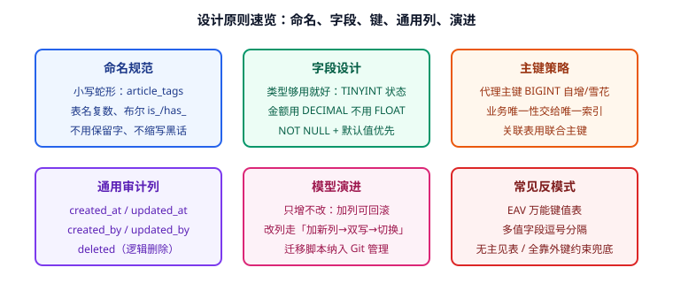

# 设计原则与规范

模型能不能用三年，取决于细节规范：命名是否统一、主键是否稳定、字段类型是否精确、必备列是否齐全。本文给出一套可直接落进团队规范的**设计清单**，以及必须避开的反模式。



## 命名规范

目标：看到名字就知道是什么，且不用查文档。

| 对象 | 规则 | 正例 | 反例 |
| --- | --- | --- | --- |
| 表名 | 小写 + 下划线，复数形式，业务域前缀可选 | `users`、`article_tags`、`order_items` | `User`、`userTab`、`userinfo2` |
| 字段名 | 小写下划线，避免保留字与拼音 | `created_at`、`phone_number` | `createTime`、`sjh`、`desc` |
| 布尔字段 | `is_` / `has_` 前缀 | `is_deleted`、`has_verified` | `deleted`（语义模糊）、`flag1` |
| 时间字段 | `_at` 结尾，动作名词 | `created_at`、`published_at`、`deleted_at` | `time`、`date1`、`addTime` |
| 外键字段 | `引用表单数_主键名` | `user_id`、`article_id` | `uid`、`aid`、`fk1` |
| 索引名 | `idx_表_列` / `uk_表_列` / `fk_表_引用表` | `idx_articles_status_created` | `index1`、`my_index` |

::: danger 命名四个必须避免的坑
1. **使用数据库保留字**：`order`、`desc`、`key`、`group` 作为表名或列名必须反引号包裹，且极易在 ORM 中踩坑。正确做法是改用 `orders`、`description`、`sort_key`。
2. **同一含义多种命名**：既有 `user_id` 又有 `uid` 又有 `memberId`，后期关联查询必错。
3. **缩写不一致**：`qty` 与 `quantity` 混用、`no` 与 `number` 混用，务必统一并写入规范文档。
4. **拼音命名**：`yonghu`、`shijian`，任何人都无法维护。
:::

## 主键设计

1. **首选自增 BIGINT 代理键**：`id BIGINT UNSIGNED NOT NULL AUTO_INCREMENT`。InnoDB 聚簇索引按主键物理排序，自增值写入是顺序追加，性能最好。
2. **自然人标识用唯一约束而非主键**：`UNIQUE KEY uk_username (username)`。
3. **分库分表再考虑分布式 ID**（雪花、号段）；即使如此，主键仍建议是数值类型（`BIGINT`），不要直接用 UUID 字符串。
4. **需要暴露给外部时另设编号列**：`article_no VARCHAR(24) UNIQUE`，避免把自增 ID 暴露成业务标识（易被遍历、量级泄露）。

::: warning UUID 主键的正确姿势
若必须使用 UUID（如多端离线生成），请：
- 使用 **UUIDv7**（时间有序）而不是 v4（完全随机）；
- 存储为 `BINARY(16)` 而不是 `VARCHAR(36)`；
- 或额外加一个自增列作为聚簇索引键（MySQL 不支持非聚簇主键，可改为"自增主键 + UUID 唯一列"的组合）。
:::

## 字段类型选择

类型选择错误是后期最难改的问题（改类型往往要锁表 + 数据迁移）。

| 数据 | 推荐类型 | 理由 | 不要用 |
| --- | --- | --- | --- |
| 主键 / 外键 | `BIGINT UNSIGNED` | 范围够大、顺序写入 | `INT`（易溢出）、`VARCHAR` |
| 金额 | `DECIMAL(18,2)` / `DECIMAL(18,6)` | 精确十进制，无浮点误差 | `FLOAT`、`DOUBLE` |
| 时间点 | `DATETIME(3)`（MySQL） / `TIMESTAMPTZ`（PG） | 精度毫秒，不受时区隐式转换 | `TIMESTAMP`（2038 限制、时区依赖） |
| 日期 | `DATE` | 只到日粒度 | `VARCHAR(10)` |
| 布尔 | `TINYINT(1)` / `BOOLEAN` | 存 0/1，紧凑 | `CHAR(1)`、`VARCHAR` |
| 短状态 | `TINYINT UNSIGNED` + 字典注释 | 索引小、比较快 | 直接存中文 |
| 定长编码 | `CHAR(n)` | 身份证、MD5、国家码 | `VARCHAR` |
| 变长文本 | `VARCHAR(n)` | 有长度上限、可索引前缀 | `TEXT`（除非确实超长） |
| 长正文 | `TEXT` / `MEDIUMTEXT` | 不占行内空间 | 把正文塞进 `VARCHAR(65535)` |
| 枚举集合 | 字典表 / `TINYINT` | 可扩展、可统计 | `ENUM`（改值要 DDL）、逗号分隔 |

::: danger 类型选择的四个高频错误
1. **金额用 `DOUBLE`**：`0.1 + 0.2 != 0.3`，对账永远差几分钱。必须用 `DECIMAL`。
2. **时间用字符串**：`VARCHAR(20)` 存 `'2026-09-14 10:00:00'`，无法直接用日期函数、排序需字符串比较、索引效率低。
3. **所有字符串都给 `VARCHAR(255)`**：让优化器无法估算、索引体积虚高。按业务真实长度给（标题 200、昵称 50、手机号 20）。
4. **用 `TEXT` 存短字段**：`TEXT` 不能直接建普通索引（需前缀长度），且会带来额外的行外存储开销。
:::

## 必备审计列

每张业务表都建议带上这四列（写入成本极低，排查价值极高）：

```sql
CREATE TABLE articles (
  id           BIGINT UNSIGNED NOT NULL AUTO_INCREMENT,
  -- ... 业务字段
  created_at   DATETIME(3) NOT NULL DEFAULT CURRENT_TIMESTAMP(3) COMMENT '创建时间',
  updated_at   DATETIME(3) NOT NULL DEFAULT CURRENT_TIMESTAMP(3)
                 ON UPDATE CURRENT_TIMESTAMP(3) COMMENT '更新时间',
  deleted_at   DATETIME(3) NULL DEFAULT NULL COMMENT '逻辑删除时间，NULL 表示未删除',
  created_by   BIGINT UNSIGNED NULL COMMENT '创建人',
  PRIMARY KEY (id),
  KEY idx_deleted_created (deleted_at, created_at DESC)
) ENGINE=InnoDB DEFAULT CHARSET=utf8mb4 COLLATE=utf8mb4_0900_ai_ci COMMENT='文章表';
```

实际建议（按项目取舍）：

| 列 | 是否必备 | 说明 |
| --- | --- | --- |
| `created_at` | 必备 | 排序、统计分析的基础 |
| `updated_at` | 必备 | 增量同步、缓存失效判断 |
| `deleted_at` | 推荐 | 逻辑删除，避免误删不可恢复 |
| 乐观锁 `version` | 推荐 | 并发更新防覆盖 |
| `created_by` / `updated_by` | 视业务 | 后台系统与合规场景必备 |

::: danger 逻辑删除的两个陷阱
1. **唯一索引冲突**：`UNIQUE KEY uk_username (username)` 在逻辑删除后无法复用同一用户名。解决办法：把删除标记并入唯一索引，例如 `UNIQUE KEY uk_username_deleted (username, deleted_at)`（MySQL 中 `NULL` 不参与唯一性判断，可多次为 NULL）。
2. **忘记过滤**：所有查询都要带 `deleted_at IS NULL`，建议在建索引时把它放在最左列，或统一用视图/ORM 全局条件兜住。
:::

## 索引前置考虑

建模阶段就要确定索引，而不是等慢查询出现：

1. **外键必须建索引**（即使没有外键约束）：`articles.author_id`。
2. **高频过滤 + 排序组合建联合索引**，顺序遵循"等值在前、范围在后"：`(status, created_at DESC)`。
3. **联合索引设计考虑最左前缀**：`(author_id, status, created_at)` 能支撑"某作者的已发布文章按时间倒序"。
4. **避免给低区分度列单独建索引**：`status` 只有 0/1/2，单独索引意义不大，放进联合索引更有价值。
5. **索引不是越多越好**：每个索引都会拖慢写入并占用空间，单表索引数量建议不超过 5~6 个。

## 反模式清单

| 反模式 | 症状 | 后果 | 正确做法 |
| --- | --- | --- | --- |
| EAV（实体-属性-值） | `entity_attrs(entity_id, attr_name, attr_value)` 存一切 | 无法约束类型、Join 爆炸 | 固定属性独立成列，仅低频扩展用 JSON |
| 万能字典表 | 一张 `dict` 表存所有枚举 | 无法建外键、类型混乱 | 每类枚举独立字典表或 TINYINT 注释 |
| 表过大 | 单表千万行以上且持续增长 | 查询与 DDL 都变慢 | 分区、归档、分库分表 |
| 宽表失控 | 单表 200+ 列 | 行溢出、维护困难 | 按业务域拆表，用 1:1 扩展表 |
| 布尔满天飞 | `flag1..flag9` | 语义不清 | 明确命名 `is_*`，或用状态位 + 字典 |
| 多态外键 | `target_type + target_id` 指向多张表 | 无法建约束、关联查询困难 | 拆成多张关联表，或用中间实体统一 |
| 大事务 | 一次事务写十几张表 | 锁等待、死锁 | 拆小事务，异步补偿 |

## 模型评审清单

提交模型前逐条打勾：

1. 每张表有主键，主键类型统一为 `BIGINT UNSIGNED`。
2. 所有外键列都有索引，且命名遵循 `引用表_id`。
3. 金额是 `DECIMAL`，时间是 `DATETIME(3)`，状态是 `TINYINT` 且有注释。
4. 每张表都有 `created_at` / `updated_at`，需要逻辑删除的有 `deleted_at`。
5. 没有逗号分隔的多值列，没有 `flag1..flagN` 式命名。
6. 高频查询都有对应索引，且最左前缀匹配。
7. 表、列、索引都有 `COMMENT`，数据字典可自动生成。
8. 删除行为明确（`CASCADE` / `RESTRICT` / 逻辑删除），并有文档说明。

## 验证方式

```sql
-- 1. 检查是否缺主键
SELECT t.TABLE_NAME FROM information_schema.TABLES t
LEFT JOIN information_schema.TABLE_CONSTRAINTS c
  ON c.TABLE_SCHEMA=t.TABLE_SCHEMA AND c.TABLE_NAME=t.TABLE_NAME AND c.CONSTRAINT_TYPE='PRIMARY KEY'
WHERE t.TABLE_SCHEMA='demo' AND t.TABLE_TYPE='BASE TABLE' AND c.CONSTRAINT_NAME IS NULL;
-- 期望：无输出

-- 2. 检查外键列是否都有索引（外键列若无索引会拖慢关联与删除）
SELECT k.TABLE_NAME, k.COLUMN_NAME
FROM information_schema.KEY_COLUMN_USAGE k
LEFT JOIN information_schema.STATISTICS s
  ON s.TABLE_SCHEMA=k.TABLE_SCHEMA AND s.TABLE_NAME=k.TABLE_NAME AND s.COLUMN_NAME=k.COLUMN_NAME
WHERE k.TABLE_SCHEMA='demo' AND k.REFERENCED_TABLE_NAME IS NOT NULL AND s.INDEX_NAME IS NULL;

-- 3. 检查是否有列缺少注释（数据字典友好度）
SELECT TABLE_NAME, COLUMN_NAME FROM information_schema.COLUMNS
WHERE TABLE_SCHEMA='demo' AND COLUMN_COMMENT='' AND TABLE_NAME NOT LIKE 'tmp%';
```

收尾确认：三条检查均无输出，且表结构在设计文档与 DDL 之间一致。

## 参考资料

- MySQL 官方文档：[Optimization and Indexes](https://dev.mysql.com/doc/refman/8.4/en/optimization-indexes.html)
- Alibaba Java 开发手册（数据库设计章节，命名与类型约定）
- 延伸阅读：[范式与函数依赖](../Normalization/index.md) / [反范式与权衡](../Denormalization/index.md) / [常见问题](../FAQ/index.md)
