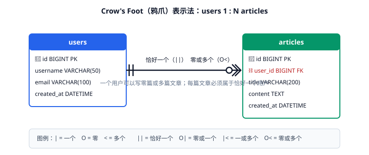
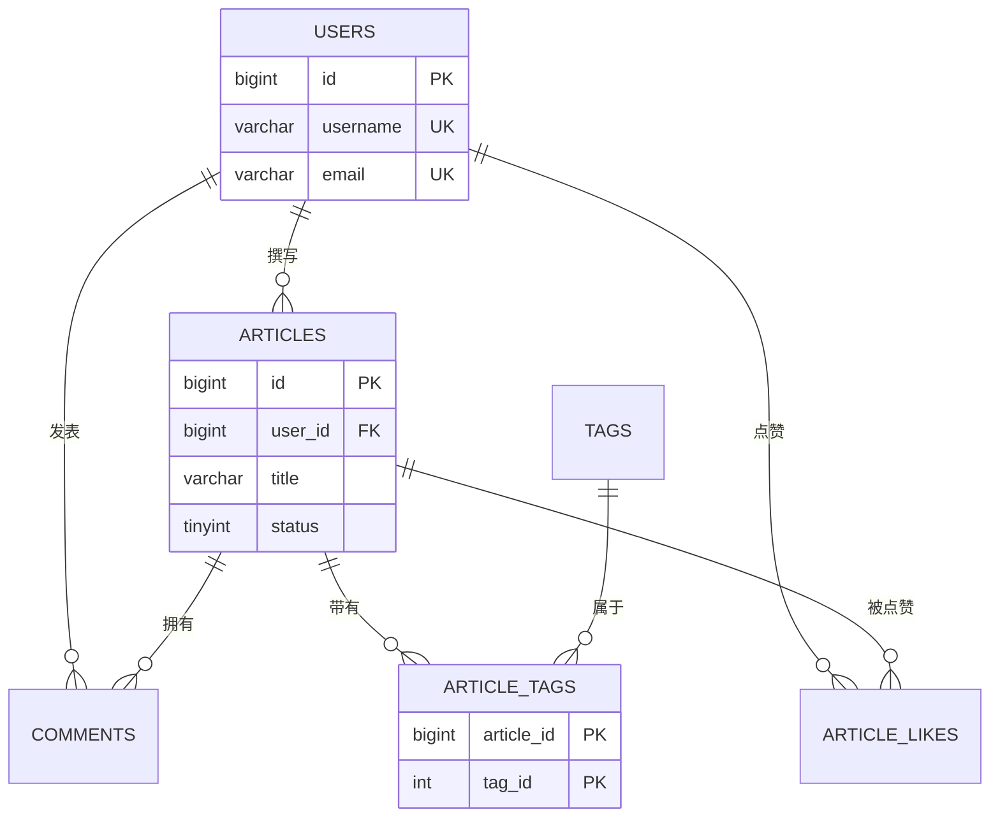

# ER 图与建模步骤

ER 图（Entity-Relationship Diagram）是数据建模的通用语言。同一个模型在不同表示法下画法不同，但语义一致——**先把符号学准，再谈怎么画得好**。

本文讲三部分：主流表示法与符号对照、建模五步法的具体操作、以及可直接写进仓库的代码化 ER 图（Mermaid / DBML）。

## 三种主流表示法

| 表示法 | 提出者 / 常见工具 | 关系画法 | 特点 |
| --- | --- | --- | --- |
| Chen 表示法 | Peter Chen，经典教材 | 菱形表示关系，椭圆表示属性 | 适合教学与业务沟通，画大图会很乱 |
| Crow's Foot（鸦爪） | 工业界事实标准，drawDB / PowerDesigner / Navicat 默认 | 线两端用符号表达基数 | 紧凑、信息密度高，最常用 |
| IDEF1X | 美国空军标准，ER/Studio 常用 | 实心点表示强制参与 | 严格，企业建模常用 |

**建议**：与业务方沟通用 Chen 表示法（直观），工程落地用 Crow's Foot（紧凑、工具支持好）。

## Crow's Foot 符号速查



| 符号 | 含义 | 中文读法 |
| --- | --- | --- |
| `\|` 单竖线 | 一个 | 恰好一个 |
| `O` 圆圈 | 零 | 可选 |
| `<` 鸦爪 | 多个 | 多 |
| `\|\|` 双竖线 | 强制一个 | 恰好一个（必填） |
| `O\|` 圆 + 竖线 | 零或一个 | 可选且最多一个（1:1 必用） |
| `\|<` 竖线 + 鸦爪 | 一或多 | 至少一个 |
| `O<` 圆 + 鸦爪 | 零或多 | 可为空的一对多 |

符号一律**从两端向中间读**，例如 `users ||----O< articles` 读作："一个用户对应零或多篇文章"。

::: danger 最容易画错的三个地方
1. **把基数画反**：外键在 `articles.user_id` 上，所以"多"的一端是 `articles`。符号要画在 `articles` 侧。
2. **1:1 关系两边都用普通线**：1:1 必须写成 `||----O|` 这类明确形式，否则无法与 1:N 区分。
3. **M:N 直接连线**：业务上虽然是 M:N，但**图里必须画成两张 1:N 加一张关联表**，因为物理模型里不存在 M:N。概念图可画 M:N，逻辑图不能。
:::

## 建模五步法

### 第一步：抽取业务名词与规则

列出需求文档里的名词与动词：

```text
名词：用户、文章、评论、标签、分类、点赞、关注
规则：
- 一个用户可写多篇文章，一篇文章只有一个作者
- 一篇文章可有多个标签，一个标签可挂多篇文章
- 评论可以回复评论（两级或无限级）
- 用户可点赞多篇文章，同一篇只能点一次
```

### 第二步：区分实体与关系

- 能"独立查询"的名词 → 实体：用户、文章、标签、分类。
- 描述"两个实体怎么联系"的动词 → 关系：点赞、关注、文章的标签。

"点赞"落地为关联表 `article_likes`，而不是实体表。

### 第三步：定属性与键

每个实体列出属性并标注键：

| 实体 | 主键（代理键） | 自然唯一键 | 主要属性 |
| --- | --- | --- | --- |
| 用户 | `id` | `username`、`email` | 昵称、头像、状态、创建时间 |
| 文章 | `id` | 无 | 标题、正文、状态、发布时间 |
| 标签 | `id` | `name` | 名称、颜色 |
| 评论 | `id` | 无 | 内容、父评论、创建时间 |

### 第四步：定基数与参与度

用一句业务话验证每个关系（读不通就是画错了）：

| 关系 | 业务话术 | 落地 |
| --- | --- | --- |
| 用户—文章 | 一个用户可写零或多篇文章；每篇文章必须属于恰好一个用户 | `articles.user_id NOT NULL` + 索引 |
| 文章—标签 | 一篇文章可有零或多个标签；一个标签可挂零或多篇文章 | 关联表 `article_tags` |
| 文章—评论 | 一篇文章可有零或多条评论；每条评论必须属于一篇文章 | `comments.article_id NOT NULL` |
| 评论—评论 | 一条评论可有零或多条子评论 | 自反外键 `parent_id` |
| 用户—文章（点赞） | 一个用户可点赞零或多篇；同一篇只能点一次 | 联合主键 `(user_id, article_id)` |

### 第五步：评审与冻结

评审时必须回答的问题：

1. 每个实体的主键确定了吗？是否用了会变的自然键？
2. 所有 M:N 都拆成关联表了吗？
3. 高频查询有对应索引吗？（`WHERE`、`JOIN`、`ORDER BY` 涉及的列）
4. 删除父数据时子数据怎么处理？（`CASCADE` / `RESTRICT` / 逻辑删除）
5. 未来 6 个月可能新增哪些字段？现在的结构能否容纳？

## 代码化 ER 图：把模型放进 Git

图是二进制的话没法 Review、没法 diff。**推荐用文本描述模型**，让 ER 图随代码一起评审。

### Mermaid（VitePress / GitHub 原生渲染）



### DBML（dbdiagram.io 语法）

```dbml
Table users {
  id bigint [pk, increment]
  username varchar(50) [unique, not null]
  email varchar(100) [unique, not null]
  created_at datetime [not null, default: `CURRENT_TIMESTAMP`]
}

Table articles {
  id bigint [pk, increment]
  user_id bigint [not null, ref: > users.id]
  title varchar(200) [not null]
  status tinyint [not null, default: 0]
  indexes {
    (user_id, created_at) [name: 'idx_user_created']
  }
}

Table article_tags {
  article_id bigint [ref: > articles.id]
  tag_id int [ref: > tags.id]
  indexes {
    (article_id, tag_id) [pk]
  }
}
```

DBML 的优势是**一个文件同时表达结构与索引**，可直接在 dbdiagram.io 渲染成图，也可以导出 MySQL / PostgreSQL / SQL Server 方言的 DDL。

::: tip 把模型纳入 CI
1. 模型文件（`.dbml` / `.sql`）提交到仓库，和代码一起 Review。
2. CI 中跑一次"模型导出 DDL → 在空库执行"的检查，防止模型与 DDL 不一致。
3. 变更模型时同时提交迁移脚本，禁止"直接改线上表不回写模型"。
:::

## 常见错误画法对照

| 错误画法 | 后果 | 正确画法 |
| --- | --- | --- |
| 概念图里直接把 M:N 落到两张表 | 物理模型缺关联表 | 逻辑图拆出关联表 |
| 属性画成独立实体（如"颜色"表只有一个 name） | 表爆炸、Join 变多 | 属性用枚举或字典表，谨慎建实体 |
| 双向 1:N 混乱（两边都放外键） | 数据可能不一致 | 外键只在多的一方 |
| 弱实体给了自增主键 | 丢失"必须依附父实体"的语义 | 联合主键包含父实体键 |
| 关系线不带基数符号 | 无法判断可空性与必填性 | 每端都标符号 |

## 验证方式

画完图后，用三件事确认它真的可落地：

```sql
-- 1. 图上的每张表都能建出来（最直接的验证）
-- 把 DDL 在空库执行一遍，无报错即通过

-- 2. 图上的每个关系都有对应的外键或索引
SELECT TABLE_NAME, COLUMN_NAME, REFERENCED_TABLE_NAME
FROM information_schema.KEY_COLUMN_USAGE
WHERE TABLE_SCHEMA = 'demo';

-- 3. 高频查询能走索引（结合 EXPLAIN 验证）
EXPLAIN SELECT * FROM articles WHERE user_id = 100 ORDER BY created_at DESC LIMIT 20;
```

收尾确认：所有表创建成功、外键与索引数量与图中关系一致、关键查询 `EXPLAIN` 的 `key` 列不为 `NULL`。

## 参考资料

- drawDB 官方文档：[drawdb.app](https://www.drawdb.app/)
- dbdiagram / DBML 语法参考：[dbml.dbdiagram.io](https://dbml.dbdiagram.io/docs/)
- Mermaid ER 图语法：[mermaid.js.org/syntax/entityRelationshipDiagram.html](https://mermaid.js.org/syntax/entityRelationshipDiagram.html)
- 延伸阅读：[核心概念](../CoreConcepts/index.md) / [范式与函数依赖](../Normalization/index.md)
