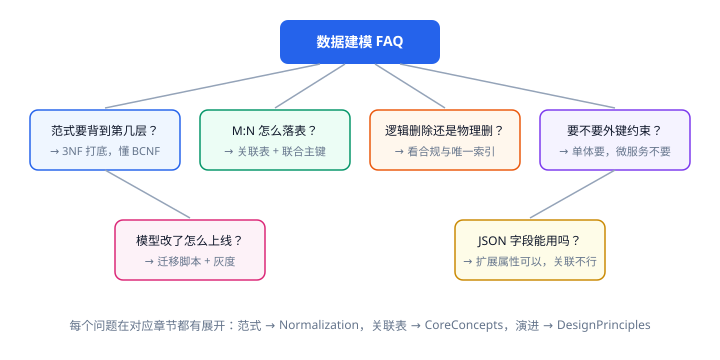

# 常见问题与最佳实践

这里汇总数据建模过程中最高频的疑问，每个都给结论、原因和可执行的做法。



## 范式要掌握到第几层？

**结论：3NF 打底，能判断 BCNF；4NF 知道概念即可。**

- 日常业务库以 3NF 为目标，能消除插入/删除/更新异常就够；
- BCNF 用于处理"候选键重叠"这类特殊情况（如"教师决定课程"）；
- 4NF/5NF 主要出现在多值依赖高度独立的场景，实践中很少遇到。

::: tip 判断标准比"到第几层"更重要
问自己一句话：**"这处冗余会不会导致同一事实有多份可能不一致的拷贝？"** 会 → 拆掉；不会（如订单里的价格快照）→ 保留。
:::

## M:N 关系一定要建关联表吗？

**结论：逻辑上一层必须拆，物理上必须有关联表。**

关系型数据库无法直接表达 M:N。做法是关联表 + 联合主键：

```sql
CREATE TABLE article_tags (
  article_id BIGINT UNSIGNED NOT NULL,
  tag_id     INT UNSIGNED NOT NULL,
  PRIMARY KEY (article_id, tag_id),   -- 天然防重复
  KEY idx_tag_article (tag_id, article_id)  -- 支持反向查询
) ENGINE=InnoDB;
```

::: warning 关联表也要考虑"关系本身有属性"的情况
如果关系带属性（如"用户对文章的评分"），属性直接加在关联表上：`article_likes(article_id, user_id, score, created_at)`。
:::

## 要不要用外键约束？

**结论：单体单库用，微服务/分库分表不用，但索引永远要有。**

| 场景 | 外键约束 | 原因 |
| --- | --- | --- |
| 单体应用 + 单库 | 建议使用 | 天然防脏数据，级联语义明确 |
| 微服务多库 | 不使用 | 跨服务无法约束，且阻碍独立演进 |
| 分库分表 | 不使用 | 跨分片无法约束，迁移/归档困难 |
| 高频写入大表 | 谨慎使用 | 外键检查有额外开销与锁风险 |

## 逻辑删除还是物理删除？

**结论：默认逻辑删除，但必须解决唯一索引与查询过滤两个问题。**

```sql
-- 唯一索引带上 deleted_at，NULL 不参与唯一性判断，可重复删除
UNIQUE KEY uk_username_deleted (username, deleted_at)
```

- 逻辑删除适合：用户、文章、订单等需要审计与恢复的数据。
- 物理删除适合：日志、临时数据、严格合规要求"必须删除"的场景（此时逻辑删除反而违规）。
- 无论哪种，都要明确"删除后关联数据怎么处理"（`CASCADE` / `RESTRICT` / 保留）。

## `is_deleted` 和 `deleted_at` 选哪个？

**结论：优先 `deleted_at`。**

- `deleted_at` 一个字段同时表达"是否删除"和"何时删除"，信息量更大；
- 需要软删除 + 唯一索引时，`deleted_at` 比 `is_deleted` 更好用（`NULL` 特性）；
- 索引 `(deleted_at, created_at)` 也能直接服务"未删除数据按时间排序"的查询。

## JSON 字段到底能不能用？

**结论：能，但只用于"低频、稀疏、非关联"的扩展属性。**

| 可以存 JSON | 不能用 JSON 存 |
| --- | --- |
| 用户个性化配置、埋点扩展字段 | 订单商品明细（要关联与统计） |
| 第三方回调原始报文 | 状态、金额、时间等需要约束的字段 |
| 低频、结构不固定的属性 | 需要频繁过滤、Join、聚合的核心数据 |

MySQL 8.0.17+ 支持多值索引，可对 JSON 数组建索引：

```sql
CREATE INDEX idx_extra_tags ON articles ((CAST(extra->'$.tags' AS CHAR(20) ARRAY)));
```

## 模型改动了怎么上线？

**结论：迁移脚本 + 模型回写 + 预发演练，三件套缺一不可。**

1. 先改**模型文件**（DBML / SQL），提交评审；
2. 生成**迁移脚本**（`ALTER`）与**回滚脚本**，一并提交；
3. 在预发库执行迁移 → 验证业务查询 → 演练回滚；
4. 生产低峰执行，大表加索引用 `ALGORITHM=INPLACE, LOCK=NONE`；
5. 严禁"手改线上表但不回写模型"，否则下次建库就会与生产不一致。

::: danger 上线时最容易翻车的三种变更
1. **改字段类型或长度**（如 `VARCHAR(50)` → `VARCHAR(20)`）：可能截断数据，必须先检查现有数据长度。
2. **重命名列**：直接 `CHANGE` 会导致旧代码立即报错，应"新增列 → 双写 → 迁移数据 → 删除旧列"分步走。
3. **在大表上直接加不可空列且无默认值**：MySQL 8 通常会失败或长时间锁表，必须先加可空列并回填。
:::

## 需不需要给每张表都加 `created_at` / `updated_at`？

**结论：需要，成本极低、价值极高。**

- `created_at`：分页排序、增量统计的基础；
- `updated_at`：增量同步、缓存失效判断；
- 建议 `DATETIME(3)` + `ON UPDATE CURRENT_TIMESTAMP(3)`，避免应用层忘记更新。

## 什么时候该分库分表？

**结论：单表数据量持续增长到千万级并且优化空间已经用尽时。**

判断顺序：

1. 先看**索引与 SQL**（多数慢查询是索引问题，见 [SQL 优化](../../Relational/SQLOptimization/index.md)）；
2. 再看**归档与冷热分离**（历史数据迁出，成本最低）；
3. 再看**分区表**（按时间分区，查询裁剪）；
4. 最后才是**分库分表**（引入分布式 ID、分布式事务、跨片查询的复杂度）。

::: warning 分库分表的隐性成本
分片键选错会导致数据倾斜、跨片查询泛滥；后续所有关联查询都可能要改成"应用层聚合"。**没有明确的容量与性能瓶颈证据之前，不要上分库分表。**
:::

## 命名能不能用中文/拼音？

**结论：一律用英文小写下划线。**

- 中文表名/列名在跨库、跨工具、备份恢复时极易乱码；
- 拼音命名等于没命名（`yonghu` 谁知道是用户还是用户组）；
- 业务名与英文名不一致时，在数据字典里给出对照表（如"专栏 → column"）。

## 一个概念在多张表都要用，怎么处理？

**结论：找准"归属实体"，其他表只引用不外扩。**

- 用户的昵称属于 `users`，其他表需要展示时要么 `JOIN`，要么接受受控冗余（见 [反范式与权衡](../Denormalization/index.md)）；
- 公共字段（如 `status`、`created_at`）可以统一命名规范，但**不要建"公共表"**（万能字典表是反模式）。

## 验证方式

把本文结论落成可执行的检查：

```sql
-- 1. 有没有缺主键的表？
SELECT t.TABLE_NAME FROM information_schema.TABLES t
LEFT JOIN information_schema.TABLE_CONSTRAINTS c
  ON c.TABLE_SCHEMA=t.TABLE_SCHEMA AND c.TABLE_NAME=t.TABLE_NAME AND c.CONSTRAINT_TYPE='PRIMARY KEY'
WHERE t.TABLE_SCHEMA='community' AND t.TABLE_TYPE='BASE TABLE' AND c.CONSTRAINT_NAME IS NULL;

-- 2. 有没有逗号分隔的多值列（1NF 违规嫌疑）
SELECT TABLE_NAME, COLUMN_NAME FROM information_schema.COLUMNS
WHERE TABLE_SCHEMA='community' AND COLUMN_NAME REGEXP '(tags|list|ids|items)$';

-- 3. 冗余计数是否漂移
SELECT a.id, a.like_count, COUNT(l.user_id) actual
FROM articles a LEFT JOIN article_likes l ON l.article_id=a.id
GROUP BY a.id, a.like_count HAVING a.like_count <> actual;
```

收尾确认：三条查询均返回 0 行，说明结构规范、无 1NF 违规、冗余一致。

## 参考资料

- MySQL 官方文档：[ALTER TABLE 与在线 DDL](https://dev.mysql.com/doc/refman/8.4/en/alter-table.html)
- 延伸阅读：[设计原则与规范](../DesignPrinciples/index.md) / [实战案例](../Practice/index.md) / [SQL 优化](../../Relational/SQLOptimization/index.md)
