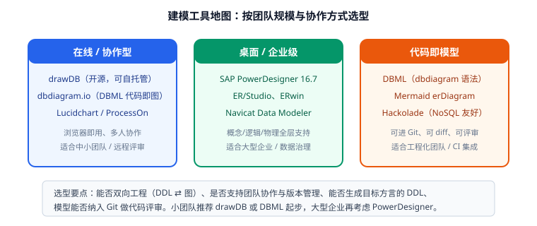
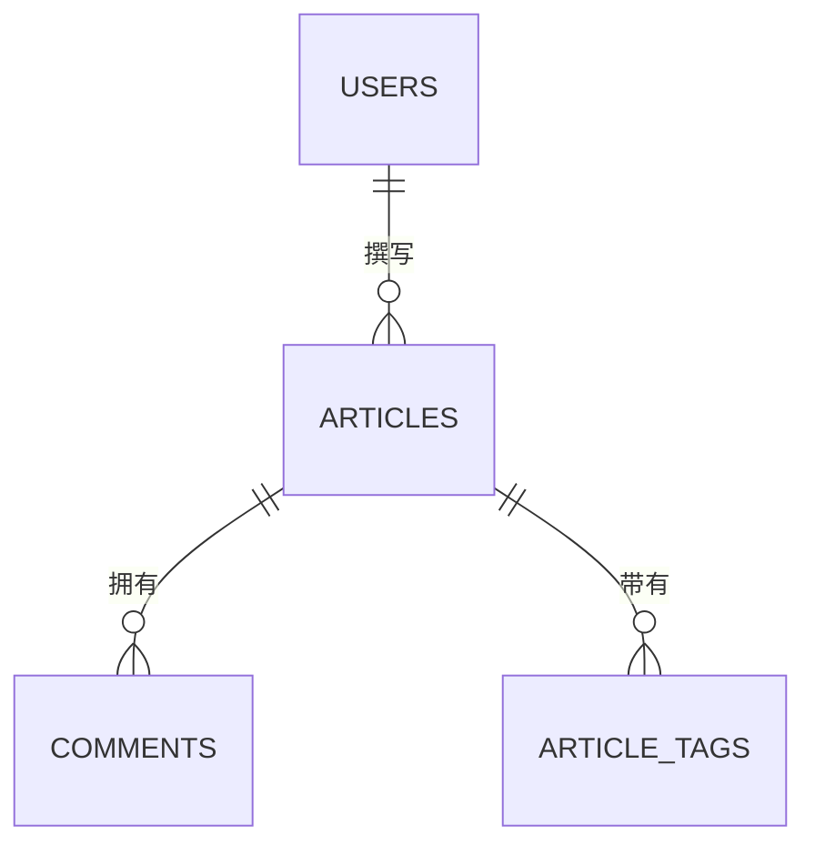

# 建模工具选型

工具只解决两件事：**把模型画出来给人看**、**把模型转成能跑的 DDL**。本文按"在线协作 / 桌面企业级 / 代码即模型"三类给出选型建议与实操命令。



## 选型维度

先明确四个判断标准，再看具体工具：

| 维度 | 说明 | 为什么重要 |
| --- | --- | --- |
| 双向工程 | 能否"图 → DDL"和"DDL → 图" | 存量库接管、模型与线上一致性核对 |
| 目标方言 | 是否支持你实际用的数据库 | MySQL / PostgreSQL / Oracle 语法差异大 |
| 协作与版本 | 多人编辑、评审、历史版本 | 模型要能被 Review，能回滚 |
| 模型可进 Git | 模型是否为文本格式 | 二进制文件无法 diff，评审等于没评 |

## 在线 / 协作型

### drawDB：开源、可自托管

drawDB 是目前最流行的开源浏览器端 ER 建模工具（AGPL-3.0，GitHub 约 38k stars，最新版本 v1.8.1）。特点：

- 支持 MySQL、PostgreSQL、SQLite、MariaDB、SQL Server、Oracle 等方言的 DDL 导入导出；
- 免费版数据存在浏览器 IndexedDB 里，**刷新前记得导出 JSON 备份**；
- 支持 Docker 自托管，适合把模型留在内网。

```shell
# 自托管（官方提供镜像）
git clone https://github.com/drawdb-io/drawdb
cd drawdb
docker compose up -d
# 访问 http://localhost:5173 ，新建 Diagram → 建表 → Export → MySQL DDL
```

::: warning drawDB 使用注意
- 免费版**不上云**，浏览器清缓存会丢图，务必定期 `Export → JSON` 并提交到仓库；
- 反向工程（DDL → 图）对复杂 DDL（分区、生成列、复杂 CHECK）解析可能不完整，导入后要人工核对。
:::

### dbdiagram.io：DBML 代码即图

用 DBML 语法描述模型，实时渲染为图，可导出多种方言 DDL。优点是**模型就是文本**，可进 Git、可 diff、可评审。语法示例见 [ER 图与建模步骤](../ERDiagram/index.md)。

### 通用在线白板

Lucidchart、ProcessOn、draw.io 适合画概念图与评审用图，但**不具备正向工程能力**（不能生成 DDL），适合业务沟通而非工程落地。

## 桌面 / 企业级

| 工具 | 定位 | 优势 | 代价 |
| --- | --- | --- | --- |
| SAP PowerDesigner 16.7 | 企业级数据架构 | 概念/逻辑/物理三层模型、模型比较合并、影响分析、仓库协作；文档版本 16.7 SP10（2026-04） | 商业授权，界面传统，学习成本高 |
| ER/Studio、ERwin | 企业级建模 | IDEF1X 严格建模、数据治理集成 | 商业授权，偏重数据治理团队 |
| Navicat Data Modeler | 中小团队桌面工具 | 与 Navicat 生态打通、逆向工程方便 | 商业授权（有免费试用） |
| Hackolade | NoSQL / 多模型 | 对 MongoDB、Cassandra 等文档型支持强 | 商业授权 |

PowerDesigner 的核心价值在**大型组织**：一份模型可以有概念、逻辑、物理三层，且支持多人仓库协作、模型差异比较与影响分析。中小团队通常用不上这套能力。

## 代码即模型（推荐给工程团队）

### Mermaid

VitePress、GitHub、GitLab 原生支持 `erDiagram`，写在 Markdown 里就能渲染，零成本进 Git：



缺点是 Mermaid 不生成 DDL，只适合表达与评审。

### DBML + 命令行工具

DBML 可配合命令行工具做自动化检查与导出：

```shell
# 安装 dbml 命令行（Node.js 环境）
npm install -g @dbml/cli

# 导出 MySQL / PostgreSQL DDL
dbml2sql schema.dbml --mysql -o schema.sql
dbml2sql schema.dbml --postgres -o schema.pg.sql

# 反向：把现有 DDL 转成 DBML（接管存量库）
sql2dbml --mysql dump.sql -o schema.dbml
```

把这三条命令接进 CI，就能保证"模型文件与 DDL 永远一致"。

## 工具对比总结

| 能力 | drawDB | dbdiagram/DBML | Mermaid | PowerDesigner |
| --- | --- | --- | --- | --- |
| 图形编辑体验 | 好 | 中（文本驱动） | 无（文本） | 好 |
| 生成 DDL | 支持多方言 | 支持多方言 | 不支持 | 支持多 DBMS |
| DDL 反推模型 | 支持 | 支持（sql2dbml） | 不支持 | 支持（逆向工程） |
| 模型进 Git | JSON 导出后可 | **原生支持** | **原生支持** | 模型文件（二进制/XML） |
| 多人协作 | 付费版 | 付费版 | 依赖 Git | 仓库协作 |
| 费用 | 免费开源 | 免费 + 付费 | 免费 | 商业授权 |
| 适合规模 | 中小团队 | 中小团队 / 工程化 | 文档与评审 | 大型企业 |

::: tip 推荐组合
- **个人 / 小团队**：drawDB 画图（沟通好用）+ DBML 或 SQL 文件进 Git（保证可评审）。
- **中大型团队**：DBML 为唯一模型来源 + CI 校验 DDL 一致性 + drawDB 做评审可视化。
- **大型企业 / 数据治理**：PowerDesigner 或 ER/Studio，配合数据仓库与元数据平台。
:::

## 把模型接进 CI

无论用哪种工具，建议在流水线里加一道"模型一致性"检查：

```yaml
# .github/workflows/schema-check.yml（示例）
name: schema-check
on: [pull_request]
jobs:
  check:
    runs-on: ubuntu-latest
    steps:
      - uses: actions/checkout@v4
      - uses: actions/setup-node@v4
        with: { node-version: '22' }
      - run: npm install -g @dbml/cli
      - run: dbml2sql schema.dbml --mysql -o /tmp/schema.sql
      - name: 在空库执行 DDL，验证模型可落地
        run: |
          sudo apt-get install -y mysql-server
          sudo service mysql start
          mysql -uroot -e "CREATE DATABASE demo;"
          mysql -uroot demo < /tmp/schema.sql
```

::: danger CI 校验的两个容易忽略的点
1. **只校验语法不校验语义**：DDL 能执行不等于设计正确，建议同时检查"是否所有表都有主键、外键列是否有索引"（SQL 见 [设计原则与规范](../DesignPrinciples/index.md)）。
2. **模型与迁移脚本脱节**：模型改了但忘记写 `ALTER` 脚本，会导致新环境建库和老环境升级结果不一致。变更模型时必须同时提交迁移脚本。
:::

## 验证方式

```shell
# 1. 模型能生成 DDL
dbml2sql schema.dbml --mysql -o /tmp/schema.sql && echo "DDL 生成成功"

# 2. DDL 能在空库执行（干净验证）
mysql -h 127.0.0.1 -uroot -p -e "DROP DATABASE IF EXISTS schema_check; CREATE DATABASE schema_check;"
mysql -h 127.0.0.1 -uroot -p schema_check < /tmp/schema.sql && echo "建库成功"

# 3. 反向工程能还原（验证模型信息完整）
sql2dbml --mysql /tmp/schema.sql -o /tmp/roundtrip.dbml && wc -l /tmp/roundtrip.dbml
```

收尾确认：DDL 生成与执行均无报错、反向工程结果与原模型表数量一致、模型文件已在 Git 中可 diff。

## 参考资料

- drawDB 官网与仓库：[drawdb.app](https://www.drawdb.app/) / [github.com/drawdb-io/drawdb](https://github.com/drawdb-io/drawdb)
- DBML 语法与命令行：[dbml.dbdiagram.io/docs](https://dbml.dbdiagram.io/docs/)
- SAP PowerDesigner 官方文档：[help.sap.com](https://help.sap.com/docs/SAP_POWERDESIGNER)
- 延伸阅读：[ER 图与建模步骤](../ERDiagram/index.md) / [实战：内容社区数据库设计](../Practice/index.md)
