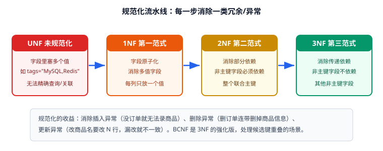

# 范式与函数依赖

范式（Normal Form）不是考试知识点，而是**消除数据冗余与更新异常的一套可验证规则**。本文用一个"订单表"从零规范化到 BCNF，每一步都给出前后的表结构与问题。



## 为什么需要范式：三类异常

先看一张典型的问题表：

| order_no | customer_name | customer_phone | product_name | unit_price | qty |
| --- | --- | --- | --- | --- | --- |
| SO20260914001 | 张三 | 13800000001 | 机械键盘 | 399.00 | 1 |
| SO20260914001 | 张三 | 13800000001 | 鼠标垫 | 29.00 | 2 |
| SO20260914002 | 李四 | 13900000002 | 机械键盘 | 399.00 | 3 |

问题：

1. **插入异常**：还没有订单时，无法把新客户或新商品录进系统。
2. **删除异常**：删掉唯一一条含某商品的订单，商品信息也跟着消失了。
3. **更新异常**：客户换手机号要改多行，漏改就出现同一客户两个号码。

这三类异常统称**冗余导致的异常**，范式的目标就是逐步消除它们。

## 函数依赖基础

**函数依赖（Functional Dependency，FD）**：若知道了 X，就唯一确定 Y，记作 `X → Y`。

| 类型 | 定义 | 例子 |
| --- | --- | --- |
| 完全函数依赖 | Y 依赖 X 的全部属性 | `(order_no, product_id) → qty` |
| 部分函数依赖 | Y 只依赖 X 的一部分 | `(order_no, product_id) → customer_name`（只依赖 order_no） |
| 传递函数依赖 | X → Y，Y → Z，则 X → Z | `order_no → customer_id → customer_phone` |
| 多值依赖 | 一个 X 对应一组独立的多值 Y | 课程的"授课教师"与"教材"互相独立 |

**候选键判定**：能推出其他所有属性的最小属性集。常用求法：先求属性闭包，再看是否覆盖全部属性。

```text
关系 R(order_no, product_id, qty, product_name, unit_price)
函数依赖：
  (order_no, product_id) → qty            -- 完全依赖
  (order_no, product_id) → product_name   -- 实际只依赖 product_id（部分依赖）
  (order_no, product_id) → unit_price     -- 实际只依赖 product_id（部分依赖）
候选键：(order_no, product_id)
```

## 第一范式（1NF）：字段原子化

**要求**：每列都是不可再分的基本项，不存在多值列与重复组。

::: danger 违反 1NF 的常见写法
1. 多值塞一列：`tags = "MySQL,Redis"`、`phones = "138...,139..."`。
2. 编号列模拟多值：`tag1, tag2, tag3`。
3. 复合列不拆：`address = "浙江省杭州市西湖区文三路 100 号"`（需要按城市统计时就废了）。

正确做法：多值拆子表或关联表，复合属性按查询需求拆列。
:::

```sql
-- 违反 1NF
CREATE TABLE articles_bad (
  id BIGINT PRIMARY KEY,
  tags VARCHAR(255)  -- "MySQL,Redis"
);

-- 满足 1NF：多值属性拆关联表
CREATE TABLE articles (id BIGINT PRIMARY KEY, title VARCHAR(200) NOT NULL);
CREATE TABLE tags (id INT PRIMARY KEY, name VARCHAR(50) NOT NULL);
CREATE TABLE article_tags (
  article_id BIGINT NOT NULL,
  tag_id INT NOT NULL,
  PRIMARY KEY (article_id, tag_id)
);
```

## 第二范式（2NF）：消除部分依赖

**要求**：满足 1NF，且所有非主键属性都**完全依赖**于整个主键（只对联合主键有意义）。

订单明细表的问题：

```text
order_items(order_no, product_id, qty, product_name, unit_price)
主键：(order_no, product_id)
product_name、unit_price 只依赖 product_id  → 部分依赖
```

规范化：把只依赖部分主键的属性拆到独立表。

```sql
CREATE TABLE products (
  id INT UNSIGNED NOT NULL AUTO_INCREMENT,
  name VARCHAR(100) NOT NULL,
  price DECIMAL(10,2) NOT NULL,
  PRIMARY KEY (id)
) ENGINE=InnoDB;

CREATE TABLE order_items (
  order_no VARCHAR(32) NOT NULL,
  product_id INT UNSIGNED NOT NULL,
  qty INT UNSIGNED NOT NULL,
  unit_price DECIMAL(10,2) NOT NULL COMMENT '下单时价格快照',
  PRIMARY KEY (order_no, product_id),
  KEY idx_product (product_id)
) ENGINE=InnoDB;
```

::: tip 价格快照该不该留？
`unit_price` 看似与 `products.price` 重复，但业务语义不同：**它是"下单时的成交价"**，属于订单事实，商品后续调价不应影响历史订单。这不是冗余，是必要的快照字段——反范式与"记录事实"要分清（见 [反范式与权衡](../Denormalization/index.md)）。
:::

## 第三范式（3NF）：消除传递依赖

**要求**：满足 2NF，且非主键属性之间不存在函数依赖（不能有 `A → B → C`）。

订单表的问题：

```text
orders(order_no, customer_id, customer_name, customer_phone)
主键：order_no
order_no → customer_id，customer_id → customer_name / customer_phone  → 传递依赖
```

规范化：把客户信息拆到独立表，订单只保留 `customer_id`。

```sql
CREATE TABLE customers (
  id BIGINT UNSIGNED NOT NULL AUTO_INCREMENT,
  name VARCHAR(50) NOT NULL,
  phone VARCHAR(20) NOT NULL,
  PRIMARY KEY (id),
  UNIQUE KEY uk_phone (phone)
) ENGINE=InnoDB;

CREATE TABLE orders (
  order_no VARCHAR(32) NOT NULL,
  customer_id BIGINT UNSIGNED NOT NULL,
  status TINYINT NOT NULL DEFAULT 0,
  created_at DATETIME(3) NOT NULL DEFAULT CURRENT_TIMESTAMP(3),
  PRIMARY KEY (order_no),
  KEY idx_customer_created (customer_id, created_at DESC)
) ENGINE=InnoDB;
```

::: warning 3NF 不是终点，也不是唯一目标
- **多数 OLTP 业务库以 3NF 为标准目标**：冗余最少，写入一致性最好。
- **OLAP / 报表库通常刻意反范式**：维度建模就是"有计划地保留冗余"换查询性能。
- 判断标准不是"有没有到 3NF"，而是"**每处冗余是否都有明确的一致性保障**"。
:::

## BCNF：处理候选键重叠

**要求**：满足 3NF，且每个非平凡函数依赖的左侧都是超键。

经典反例（学生选课与教师）：

```text
course_teacher(student_id, course, teacher)
业务规则：一个学生一门课只跟一个教师；一个教师只教一门课。
函数依赖：
  (student_id, course) → teacher
  teacher → course          ← 左侧 teacher 不是超键 → 违反 BCNF
```

问题：`teacher → course` 意味着改某教师的课，要改多行；插入"某教师教某课"也必须绑定学生。

拆分为：

```sql
CREATE TABLE teacher_course (
  teacher VARCHAR(50) NOT NULL,
  course VARCHAR(50) NOT NULL,
  PRIMARY KEY (teacher),
  UNIQUE KEY uk_course (course)
) ENGINE=InnoDB;

CREATE TABLE student_teacher (
  student_id BIGINT UNSIGNED NOT NULL,
  teacher VARCHAR(50) NOT NULL,
  PRIMARY KEY (student_id, teacher)
) ENGINE=InnoDB;
```

## 第四范式（4NF）与更高范式

**4NF**：消除非平凡的多值依赖（同一实体上两个互相独立的多值属性，不应放在一张表里）。

```text
course_material(course, teacher, book)
一门课有多个教师、多本教材，教师与教材互相独立 → 多值依赖
应拆成 course_teacher(course, teacher) 与 course_book(course, book)
```

::: info 实践建议
绝大多数业务系统做到 **3NF 或 BCNF** 就够了；4NF 与 5NF 更多出现在理论分析与特殊业务（多值属性高度独立）里。**不要为了范式而范式**——过度拆表会让简单查询变成五表 Join。
:::

## 规范化实操：一步一步走完

以"电商订单"为例，把上述步骤串起来：

1. **需求**：客户下订单，订单含多个商品，每个商品有名称与价格，客户有姓名与手机号。
2. **原始宽表**（UNF）：一张表塞下所有字段，含 `product_list = "键盘x1,鼠标x2"`。
3. **1NF**：拆出 `order_items`，每行一个商品。
4. **2NF**：商品名称与价格移到 `products`，`order_items` 只保留 `qty` 与价格快照。
5. **3NF**：客户信息移到 `customers`，`orders` 只留 `customer_id`。
6. **检查 BCNF**：确认所有函数依赖左侧都是超键（订单场景通常自然满足）。
7. **物理设计**：按查询加索引、定类型、写 DDL。

## 验证方式

规范化后必须验证"结构真的消除了异常"：

```sql
-- 1. 验证 1NF：不应存在可拆的多值列
SELECT TABLE_NAME, COLUMN_NAME, DATA_TYPE
FROM information_schema.COLUMNS
WHERE TABLE_SCHEMA = 'shop' AND DATA_TYPE IN ('text','json','varchar')
  AND COLUMN_NAME REGEXP '(tags|list|items|phones)';
-- 期望：无输出（若输出，逐个人工确认是否为合法用途）

-- 2. 验证无部分依赖：联合主键表中不应有只依赖单个主键列的字段
SHOW CREATE TABLE order_items\G

-- 3. 验证异常消失：重复客户手机号不再可能
SELECT phone, COUNT(*) c FROM customers GROUP BY phone HAVING c > 1;
-- 期望：0 行
```

收尾确认：多值列已消除、联合主键表无非依赖字段、客户/商品信息只有一处真实来源。

## 参考资料

- E. F. Codd, *A Relational Model of Data for Large Shared Data Banks*, CACM, 1970
- E. F. Codd, *Further Normalization of the Data Base Relational Model*, 1971
- MySQL 官方文档：[Normalization](https://dev.mysql.com/doc/refman/8.4/en/data-types.html)
- 延伸阅读：[反范式与权衡](../Denormalization/index.md) / [实战案例](../Practice/index.md)
