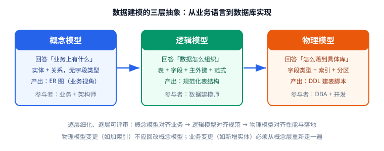

# 数据建模概述

数据建模（Data Modeling）是把现实业务抽象成数据结构的过程。它回答三个问题：**有哪些事物（实体）、事物有哪些特征（属性）、事物之间是什么关系（关系）**——最终转化为可执行的建表语句。

本文讲清三件事：为什么必须先建模、三层模型分别干什么、一套可落地的建模流程。

## 为什么需要数据建模

很多人觉得"直接写 CREATE TABLE 就行"，直到遇到这些问题：

- 同一个"用户"概念在三张表里叫三种名字（`user`、`member`、`account`），后期对不上账。
- 订单表里塞了商品名称，商品改名后历史订单显示错误。
- 删除一个标签，把带该标签的文章全部级联删掉了。
- 上线三个月就要加字段，每次都是 `ALTER TABLE` 大表锁表。

这些问题的共同点是：**结构错了，业务代码只能不停打补丁**。数据建模的价值就是把这部分错误提前暴露在设计阶段——改一张图的成本，远低于改一张线上表的成本。

::: tip 数据建模的三个直接收益
1. **沟通工具**：ER 图是产品、研发、DBA 都能看懂的对齐物，比口头描述少扯皮。
2. **一致性保障**：一份模型对应一个真相来源（Single Source of Truth），避免同一概念多处定义。
3. **可演进性**：规范化设计让新增需求多数是"加表、加字段"，而不是"改主键、拆大表"。
:::

## 三层模型

数据建模不是一步到位，而是从业务语言逐层翻译到机器语言，分三层：



| 层次 | 名称 | 关注点 | 不关心 | 典型产出 |
| --- | --- | --- | --- | --- |
| ① 概念层 | 概念模型（Conceptual Data Model，CDM） | 业务实体与关系 | 字段类型、索引、DBMS | 业务 ER 图（中文命名） |
| ② 逻辑层 | 逻辑模型（Logical Data Model，LDM） | 表、列、主外键、基数、范式化 | 具体数据库方言 | 表结构清单 + 关系图 |
| ③ 物理层 | 物理模型（Physical Data Model，PDM） | 具体数据类型、字符集、索引、分区、存储引擎 | 业务语义 | 可执行 DDL 脚本 |

要点：

1. **概念层一定要用业务语言**。画概念图时写"作者"而不是 `users`，目的是让业务方确认"我们说的是一回事"。
2. **逻辑层是评审的主战场**。这一层决定表怎么拆、关系怎么连，改起来的成本远低于物理层。
3. **物理层绑定具体数据库**。同一个逻辑模型，落到 MySQL 和 PostgreSQL 的 DDL 可能不同（类型、默认值、字符集）。

::: warning 不要跳层
直接从需求跳到 `CREATE TABLE`，等于跳过逻辑评审。中小项目可以合并概念层与逻辑层，但**逻辑层不能省**——它就是那张要被人 Review 的图。
:::

## 两种主流建模方法论

| 维度 | ER 建模（Entity-Relationship） | 维度建模（Dimensional Modeling） |
| --- | --- | --- |
| 提出者 | Peter Chen（1976） | Ralph Kimball |
| 核心结构 | 实体 + 关系，规范化 | 事实表 + 维度表，星型/雪花模型 |
| 主要目标 | 消除冗余、保证一致性 | 查询性能、分析友好 |
| 典型场景 | OLTP 业务库（订单、用户、内容） | OLAP 数据仓库、BI 报表 |
| 是否范式化 | 是（通常到 3NF/BCNF） | 否（有意保留冗余） |
| 本专题定位 | **主线**，业务系统设计必学 | 数仓方向，属于后续专题（数仓建模） |

业务系统的库表设计以 ER 建模为主线：先规范化建模，再按查询场景有选择地反范式（见 [反范式与权衡](../Denormalization/index.md)）。

## 建模流程：从需求到 DDL

一套可复用的七步流程：

1. **需求收集**：整理业务名词（用户、订单、评论……）和业务规则（"一个订单可以包含多个商品"）。
2. **识别实体**：把名词里能独立存在、需要长期保存的对象抽成实体（用户、文章、标签）。动作往往是关系而不是实体。
3. **定义属性**：为每个实体列出属性，标注是否为必填、是否唯一、是否可计算（如"总价 = 单价 × 数量"不必存）。
4. **识别关系与基数**：明确 1:1、1:N、M:N，以及是否强制参与（"文章必须属于某作者"）。
5. **逻辑建模与规范化**：定主键、拆 M:N 关联表、检查范式，形成表结构清单与 ER 图。
6. **物理设计**：选数据类型、字符集、索引、分区策略，生成目标方言的 DDL。
7. **验证与评审**：在测试库执行 DDL，用真实查询验证（`EXPLAIN` 看执行计划），团队评审后才进生产。

::: danger 顺序不能颠倒的四个坑
1. **先建表后想关系**：M:N 关系直接塞两个外键到一张表里，导致数据重复且无法维护。正确做法是拆出关联表（如 `article_tags`）。
2. **把动作当实体**："点赞"是关系，不该做成只有主键的 `like` 表再冗余文章标题；正确做法是 `article_likes(user_id, article_id)` 联合主键。
3. **用物理类型指导业务设计**：因为"懒得加表"就把属性存成逗号分隔字符串，后期无法索引与统计。正确做法是拆子表或关联表。
4. **跳过逻辑评审直接上生产**：模型缺陷在生产暴露的修复成本是设计阶段的 10 倍以上（需要数据迁移 + 灰度）。
:::

## 常见交付物清单

| 交付物 | 说明 | 谁看 |
| --- | --- | --- |
| 业务 ER 图（概念模型） | 中文实体与关系，无技术细节 | 产品、业务方 |
| 逻辑模型图 + 表结构清单 | 表、列、键、关系、约束说明 | 研发、DBA |
| 数据字典 | 字段含义、取值范围、示例值 | 研发、测试、数据团队 |
| 可执行 DDL | 建表语句 + 索引 + 初始化数据 | DBA、CI 流程 |
| 迁移脚本 | 版本化的 `ALTER` 脚本，可回滚 | DBA、发布流程 |
| 查询验证记录 | 关键查询的 `EXPLAIN` 与耗时 | 性能负责人 |

## 验证方式

建模不能只停留在图上。落地后至少做三项验证：

```shell
# 1. 在测试库执行 DDL，确认可执行
mysql -h 127.0.0.1 -uroot -p -e "source schema.sql"

# 2. 确认表与约束真的建好了
mysql -h 127.0.0.1 -uroot -p demo -e "SHOW TABLES;"
mysql -h 127.0.0.1 -uroot -p demo -e "SHOW CREATE TABLE article_tags\G"
```

```sql
-- 3. 用典型查询验证设计是否支撑业务（看是否走索引）
EXPLAIN SELECT a.id, a.title
FROM articles a
JOIN article_tags at ON at.article_id = a.id
WHERE at.tag_id = 3 AND a.status = 1
ORDER BY a.created_at DESC
LIMIT 20;
-- 预期：type 不应为 ALL（全表扫描），key 应命中 article_tags 或 articles 的索引
```

收尾确认：所有表建表成功、约束与索引与模型一致、关键查询执行计划无全表扫描。

## 参考资料

- Peter Pin-Shan Chen, *The Entity-Relationship Model—Toward a Unified View of Data*, ACM TODS, 1976
- MySQL 官方文档：[Data Types](https://dev.mysql.com/doc/refman/8.4/en/data-types.html)
- PostgreSQL 官方文档：[Data Types](https://www.postgresql.org/docs/current/datatype.html)
- 延伸阅读：[核心概念](../CoreConcepts/index.md) / [范式与函数依赖](../Normalization/index.md) / [实战案例](../Practice/index.md)
