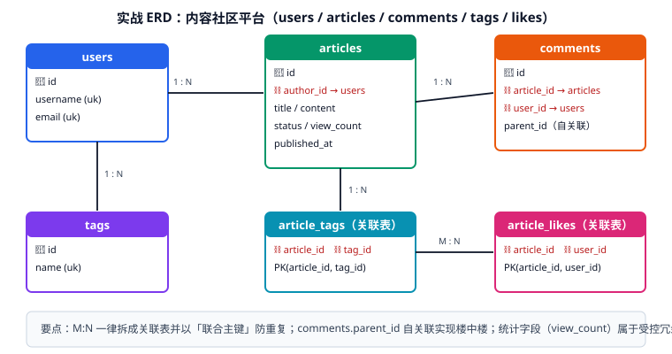

# 实战：内容社区数据库设计

本文用一个真实的"内容社区平台"把前面所有知识串起来：从需求到概念模型、逻辑模型、物理 DDL、索引设计与查询验证。**所有 SQL 都可以直接执行**，用于本地验证。



## 第一步：需求与业务规则

产品需求（简化版）：

1. 用户可注册、登录，有唯一用户名与邮箱。
2. 用户可发布文章（草稿 / 已发布 / 已下架三态）。
3. 文章可打多个标签，标签可复用。
4. 用户可评论文章，评论可回复评论（楼中楼）。
5. 用户可点赞文章，同一篇文章只能点一次。
6. 用户可关注其他用户，可查看关注列表与粉丝列表。
7. 首页需要"最新文章"和"最热文章"两个列表。

业务规则（决定结构与约束）：

| 规则 | 对结构的影响 |
| --- | --- |
| 用户名、邮箱全局唯一 | `UNIQUE` 约束 |
| 文章必须属于作者 | `author_id NOT NULL` + 外键 |
| 删除文章不影响用户 | 外键 `ON DELETE RESTRICT` 或逻辑删除 |
| 一个用户对一篇文章只能点一次赞 | 关联表联合主键 `(article_id, user_id)` |
| 评论删除后子评论保留 | `parent_id` 逻辑删除，不级联删 |
| 首页要按点赞数排序 | 冗余计数列 `like_count` + 索引 |

## 第二步：概念模型（与业务确认）

用业务语言描述实体与关系，请业务方确认后再进入下一步：

```text
实体：用户、文章、标签、评论
关系：
- 用户 1:N 文章（一个用户可以写多篇文章，每篇文章只有一个作者）
- 用户 1:N 评论（一个用户可以发多条评论）
- 文章 1:N 评论（一篇文章可以有多条评论）
- 文章 M:N 标签（一篇文章可有多个标签，一个标签可挂多篇文章）
- 用户 M:N 文章（点赞关系，同一对用户与文章只能出现一次）
- 用户 M:N 用户（关注关系，自反）
```

::: tip 概念阶段的两个确认点
1. **"草稿算不算文章"**：算，用 `status` 区分，而不是为草稿单独建表。
2. **"标签能不能删除"**：能，但删除标签不应删文章——因此 `article_tags` 的外键用 `CASCADE`（删标签时清关联），而 `articles` 的外键用 `RESTRICT`。
:::

## 第三步：逻辑模型

| 表 | 主键 | 关键列 | 关系 |
| --- | --- | --- | --- |
| `users` | `id` | `username`(UK)、`email`(UK)、`status` | 被 `articles`、`comments`、`article_likes`、`user_follows` 引用 |
| `articles` | `id` | `author_id`(FK)、`title`、`status`、`like_count`、`view_count` | 属于 `users` |
| `tags` | `id` | `name`(UK)、`slug`(UK) | 通过 `article_tags` 关联文章 |
| `article_tags` | `(article_id, tag_id)` | — | 关联 `articles` 与 `tags` |
| `comments` | `id` | `article_id`(FK)、`user_id`(FK)、`parent_id`(自反) | 属于 `articles` 与 `users` |
| `article_likes` | `(article_id, user_id)` | `created_at` | 记录点赞事实 |
| `user_follows` | `(follower_id, followee_id)` | `created_at` | 自反 M:N |

设计要点：

- 所有表用自增 `BIGINT UNSIGNED` 代理键（`article_likes`、`article_tags`、`user_follows` 用联合主键，天然去重）。
- 逻辑删除统一用 `deleted_at`，唯一索引带上它避免删除后无法复用。
- `like_count`、`view_count` 是**受控冗余**，用于首页排序（见 [反范式与权衡](../Denormalization/index.md)）。

## 第四步：物理 DDL（MySQL 8.4）

::: info 关于验证环境
以下 DDL 按 **MySQL 8.4 LTS** 语法编写（类型、降序索引、字符集排序规则均对照官方文档），但**当前编写环境没有可用的 MySQL 实例**，请在本地或容器中执行第六步的验证脚本确认。若使用 PostgreSQL，需注意 `AUTO_INCREMENT` → `GENERATED ... AS IDENTITY`、`DATETIME(3)` → `TIMESTAMP(3)`、`ON UPDATE CURRENT_TIMESTAMP` → 触发器或应用层维护。
:::

```sql
-- 建库
CREATE DATABASE IF NOT EXISTS community
  DEFAULT CHARACTER SET utf8mb4 COLLATE utf8mb4_0900_ai_ci;

USE community;

-- 1. 用户
CREATE TABLE users (
  id            BIGINT UNSIGNED NOT NULL AUTO_INCREMENT,
  username      VARCHAR(50)  NOT NULL COMMENT '用户名，登录用',
  email         VARCHAR(100) NOT NULL COMMENT '邮箱',
  password_hash VARCHAR(100) NOT NULL COMMENT '密码哈希（bcrypt）',
  nickname      VARCHAR(50)  NOT NULL DEFAULT '' COMMENT '显示昵称',
  avatar_url    VARCHAR(255) NULL COMMENT '头像地址',
  status        TINYINT UNSIGNED NOT NULL DEFAULT 1 COMMENT '1 正常 0 禁用',
  created_at    DATETIME(3) NOT NULL DEFAULT CURRENT_TIMESTAMP(3),
  updated_at    DATETIME(3) NOT NULL DEFAULT CURRENT_TIMESTAMP(3) ON UPDATE CURRENT_TIMESTAMP(3),
  deleted_at    DATETIME(3) NULL DEFAULT NULL COMMENT '逻辑删除时间',
  PRIMARY KEY (id),
  UNIQUE KEY uk_username_deleted (username, deleted_at),
  UNIQUE KEY uk_email_deleted (email, deleted_at)
) ENGINE=InnoDB DEFAULT CHARSET=utf8mb4 COMMENT='用户表';

-- 2. 文章
CREATE TABLE articles (
  id           BIGINT UNSIGNED NOT NULL AUTO_INCREMENT,
  author_id    BIGINT UNSIGNED NOT NULL COMMENT '作者，引用 users.id',
  title        VARCHAR(200) NOT NULL COMMENT '标题',
  summary      VARCHAR(500) NOT NULL DEFAULT '' COMMENT '摘要，列表页展示',
  content      MEDIUMTEXT   NOT NULL COMMENT '正文 Markdown',
  status       TINYINT UNSIGNED NOT NULL DEFAULT 0 COMMENT '0 草稿 1 已发布 2 已下架',
  view_count   INT UNSIGNED NOT NULL DEFAULT 0 COMMENT '冗余：阅读量',
  like_count   INT UNSIGNED NOT NULL DEFAULT 0 COMMENT '冗余：点赞数',
  comment_count INT UNSIGNED NOT NULL DEFAULT 0 COMMENT '冗余：评论数',
  published_at DATETIME(3) NULL COMMENT '首次发布时间',
  created_at   DATETIME(3) NOT NULL DEFAULT CURRENT_TIMESTAMP(3),
  updated_at   DATETIME(3) NOT NULL DEFAULT CURRENT_TIMESTAMP(3) ON UPDATE CURRENT_TIMESTAMP(3),
  deleted_at   DATETIME(3) NULL DEFAULT NULL,
  PRIMARY KEY (id),
  KEY idx_author_created (author_id, created_at DESC),
  KEY idx_status_like (status, like_count DESC),
  KEY idx_status_published (status, published_at DESC),
  CONSTRAINT fk_article_author FOREIGN KEY (author_id) REFERENCES users (id)
) ENGINE=InnoDB DEFAULT CHARSET=utf8mb4 COMMENT='文章表';

-- 3. 标签
CREATE TABLE tags (
  id         INT UNSIGNED NOT NULL AUTO_INCREMENT,
  name       VARCHAR(50) NOT NULL COMMENT '标签名，展示用',
  slug       VARCHAR(50) NOT NULL COMMENT 'URL 标识',
  created_at DATETIME(3) NOT NULL DEFAULT CURRENT_TIMESTAMP(3),
  PRIMARY KEY (id),
  UNIQUE KEY uk_name (name),
  UNIQUE KEY uk_slug (slug)
) ENGINE=InnoDB DEFAULT CHARSET=utf8mb4 COMMENT='标签表';

-- 4. 文章-标签关联表（M:N）
CREATE TABLE article_tags (
  article_id BIGINT UNSIGNED NOT NULL,
  tag_id     INT UNSIGNED    NOT NULL,
  created_at DATETIME(3) NOT NULL DEFAULT CURRENT_TIMESTAMP(3),
  PRIMARY KEY (article_id, tag_id),
  KEY idx_tag_article (tag_id, article_id),
  CONSTRAINT fk_at_article FOREIGN KEY (article_id) REFERENCES articles (id) ON DELETE CASCADE,
  CONSTRAINT fk_at_tag     FOREIGN KEY (tag_id)     REFERENCES tags (id)     ON DELETE CASCADE
) ENGINE=InnoDB DEFAULT CHARSET=utf8mb4 COMMENT='文章标签关联表';

-- 5. 评论（自反，支持楼中楼）
CREATE TABLE comments (
  id         BIGINT UNSIGNED NOT NULL AUTO_INCREMENT,
  article_id BIGINT UNSIGNED NOT NULL,
  user_id    BIGINT UNSIGNED NOT NULL,
  parent_id  BIGINT UNSIGNED NULL COMMENT '父评论，NULL 为顶层评论',
  content    VARCHAR(1000) NOT NULL,
  created_at DATETIME(3) NOT NULL DEFAULT CURRENT_TIMESTAMP(3),
  deleted_at DATETIME(3) NULL DEFAULT NULL,
  PRIMARY KEY (id),
  KEY idx_article_created (article_id, created_at),
  KEY idx_parent (parent_id),
  CONSTRAINT fk_comment_article FOREIGN KEY (article_id) REFERENCES articles (id) ON DELETE CASCADE,
  CONSTRAINT fk_comment_user    FOREIGN KEY (user_id)    REFERENCES users (id)
) ENGINE=InnoDB DEFAULT CHARSET=utf8mb4 COMMENT='评论表';

-- 6. 点赞（M:N，联合主键天然防重复点赞）
CREATE TABLE article_likes (
  article_id BIGINT UNSIGNED NOT NULL,
  user_id    BIGINT UNSIGNED NOT NULL,
  created_at DATETIME(3) NOT NULL DEFAULT CURRENT_TIMESTAMP(3),
  PRIMARY KEY (article_id, user_id),
  KEY idx_user_created (user_id, created_at DESC),
  CONSTRAINT fk_like_article FOREIGN KEY (article_id) REFERENCES articles (id) ON DELETE CASCADE,
  CONSTRAINT fk_like_user    FOREIGN KEY (user_id)    REFERENCES users (id)    ON DELETE CASCADE
) ENGINE=InnoDB DEFAULT CHARSET=utf8mb4 COMMENT='文章点赞表';

-- 7. 关注（自反 M:N）
CREATE TABLE user_follows (
  follower_id BIGINT UNSIGNED NOT NULL COMMENT '关注者',
  followee_id BIGINT UNSIGNED NOT NULL COMMENT '被关注者',
  created_at  DATETIME(3) NOT NULL DEFAULT CURRENT_TIMESTAMP(3),
  PRIMARY KEY (follower_id, followee_id),
  KEY idx_followee_follower (followee_id, follower_id),
  CONSTRAINT fk_follow_follower FOREIGN KEY (follower_id) REFERENCES users (id) ON DELETE CASCADE,
  CONSTRAINT fk_follow_followee FOREIGN KEY (followee_id) REFERENCES users (id) ON DELETE CASCADE
) ENGINE=InnoDB DEFAULT CHARSET=utf8mb4 COMMENT='用户关注表';
```

## 第五步：索引设计说明

索引不是"看到 `WHERE` 就加"，而是对应到具体查询：

| 查询场景 | SQL 片段 | 命中索引 |
| --- | --- | --- |
| 某作者的文章按时间倒序 | `WHERE author_id=? ORDER BY created_at DESC` | `idx_author_created` |
| 首页最热文章 | `WHERE status=1 ORDER BY like_count DESC LIMIT 20` | `idx_status_like` |
| 首页最新文章 | `WHERE status=1 ORDER BY published_at DESC LIMIT 20` | `idx_status_published` |
| 某标签下的文章 | `WHERE tag_id=?` | `idx_tag_article`（含 cover 效果） |
| 某文章的评论时间序 | `WHERE article_id=? AND deleted_at IS NULL` | `idx_article_created` |
| 我点赞过的文章 | `WHERE user_id=? ORDER BY created_at DESC` | `idx_user_created` |
| 我的粉丝列表 | `WHERE followee_id=?` | `idx_followee_follower` |

::: warning 排序字段与索引顺序
`ORDER BY ... DESC` 在 MySQL 8.0 起支持**降序索引**，`(status, like_count DESC)` 这类定义才能真正避免 filesort。若写成 `(status, like_count)` 且查询是 `ORDER BY like_count DESC`，在旧版本上可能仍出现 `Using filesort`。
:::

## 第六步：初始化数据与查询验证

```sql
-- 造一批测试数据（可直接执行）
INSERT INTO users (username, email, password_hash, nickname) VALUES
  ('alice', 'alice@example.com', '$2b$12$fakehashalice', '爱丽丝'),
  ('bob',   'bob@example.com',   '$2b$12$fakehashbob',   '鲍勃');

INSERT INTO articles (author_id, title, summary, content, status, published_at) VALUES
  (1, 'MySQL 索引从入门到放弃', '覆盖 B+ 树与最左前缀', '# 正文', 1, NOW(3)),
  (1, '数据建模实战', '从需求到 DDL', '# 正文', 1, NOW(3)),
  (2, 'Redis 缓存设计', '穿透击穿雪崩', '# 正文', 0, NULL);

INSERT INTO tags (name, slug) VALUES ('MySQL','mysql'), ('Redis','redis'), ('建模','modeling');

INSERT INTO article_tags (article_id, tag_id) VALUES (1,1), (1,3), (2,3), (3,2);

INSERT INTO article_likes (article_id, user_id) VALUES (1,2), (2,2), (1,1);

INSERT INTO comments (article_id, user_id, parent_id, content) VALUES
  (1, 2, NULL, '写得很清楚，收藏了'),
  (1, 1, 1,    '谢谢支持，后续补执行计划部分');

INSERT INTO user_follows (follower_id, followee_id) VALUES (2,1);
```

### 验证 1：M:N 关系查询正确

```sql
-- 查带「建模」标签的已发布文章
SELECT a.id, a.title, a.like_count
FROM articles a
JOIN article_tags at ON at.article_id = a.id
JOIN tags t ON t.id = at.tag_id
WHERE t.slug = 'modeling' AND a.status = 1
ORDER BY a.published_at DESC;
-- 预期：返回「MySQL 索引从入门到放弃」「数据建模实战」两行
```

### 验证 2：同一篇不能重复点赞

```sql
INSERT INTO article_likes (article_id, user_id) VALUES (1, 2);
-- 预期报错：ERROR 1062 (23000): Duplicate entry '1-2' for key 'article_likes.PRIMARY'
```

### 验证 3：计数冗余一致性

```sql
-- 点赞后必须同事务更新 like_count，用下面的对账 SQL 检查漂移
SELECT a.id, a.like_count AS stored, COUNT(l.user_id) AS actual
FROM articles a
LEFT JOIN article_likes l ON l.article_id = a.id
GROUP BY a.id, a.like_count
HAVING stored <> actual;
-- 预期：0 行（若不为 0，说明某次写入没放进同一事务）
```

### 验证 4：核心查询走索引

```sql
EXPLAIN SELECT id, title, like_count
FROM articles
WHERE status = 1
ORDER BY like_count DESC
LIMIT 20;
-- 预期：type=ref 或 range，key=idx_status_like，Extra 不含 "Using filesort"

EXPLAIN SELECT a.id, a.title
FROM articles a
JOIN article_tags at ON at.article_id = a.id
WHERE at.tag_id = 3;
-- 预期：at 表 key=idx_tag_article，articles 表 key=PRIMARY
```

## 第七步：模型演进（迁移脚本示例）

需求变化：文章需要支持"置顶"和"阅读时长统计"。

```sql
-- 迁移脚本：V2026_09_14__add_article_pin_and_read_time.sql
ALTER TABLE articles
  ADD COLUMN is_pinned TINYINT(1) NOT NULL DEFAULT 0 COMMENT '是否置顶' AFTER status,
  ADD COLUMN read_seconds INT UNSIGNED NOT NULL DEFAULT 0 COMMENT '累计阅读秒数' AFTER view_count,
  ADD INDEX idx_status_pinned_published (status, is_pinned DESC, published_at DESC);

-- 回滚脚本
-- ALTER TABLE articles
--   DROP INDEX idx_status_pinned_published,
--   DROP COLUMN is_pinned,
--   DROP COLUMN read_seconds;
```

::: danger 大表加字段的注意事项
1. MySQL 8.0 起 `ADD COLUMN` 多数场景支持 `INSTANT` 算法，但仍需确认：`ALTER TABLE articles ADD COLUMN ... , ALGORITHM=INSTANT;`（若报错则退化为 `INPLACE`）。
2. **加索引一定要评估锁**：千万行表上建索引建议用 `ALGORITHM=INPLACE, LOCK=NONE`，并在业务低峰执行。
3. 迁移脚本必须**与模型文件一起提交**，否则新环境建库结果与线上升级结果不一致。
4. 每次变更都写回滚脚本，发布前先在预发环境演练一遍回滚。
:::

## 验收清单

- [ ] 7 张表全部创建成功，`SHOW TABLES` 输出与逻辑模型一致。
- [ ] 所有外键列都有索引（用 [设计原则与规范](../DesignPrinciples/index.md) 的检查 SQL 验证）。
- [ ] 重复点赞、重复标签、重复关注均被主键拒绝。
- [ ] 核心查询（最热列表、标签页、评论列表）`EXPLAIN` 均命中索引，无 `Using filesort`。
- [ ] 计数列对账 SQL 返回 0 行（在插入评论/点赞时同事务更新计数）。
- [ ] 迁移脚本与回滚脚本成对存在，且已在预发库演练。
- [ ] ER 图（Mermaid / DBML）与线上表结构一致。

## 相关专题

- [完整项目交付 · 数据建模与迁移](../../../Others/ProjectDelivery/DataModel/index.md)：把本页「第七步：模型演进」的迁移脚本示例扩展为完整的**迁移六步法**（加字段 → 双写 → 回填 → 切读 → 观察 → 清理）、破坏性变更拆两次发布的流程，以及回滚设计——本页回答「表怎么设计」，该页回答「上线中的表怎么改而不停机」

## 参考资料

- MySQL 官方文档：[CREATE TABLE](https://dev.mysql.com/doc/refman/8.4/en/create-table.html)、[InnoDB 索引与排序](https://dev.mysql.com/doc/refman/8.4/en/order-by-optimization.html)
- 延伸阅读：[核心概念](../CoreConcepts/index.md) / [反范式与权衡](../Denormalization/index.md) / [常见问题](../FAQ/index.md)
