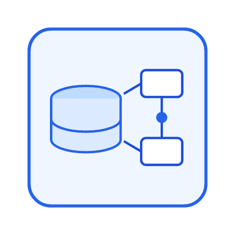

# 数据建模

数据建模（Data Modeling）是**在写建表语句之前，先把业务世界翻译成数据结构**的过程。它决定了表怎么拆、字段怎么定、关系怎么连——做对了，后面加需求只是加字段；做错了，后面每次改需求都要动数据结构。

本专题从概念模型讲到物理 DDL，覆盖范式、ER 图、反范式权衡、命名规范与工具选型，最后用一个内容社区平台的完整案例走完全流程。

## 目录

- [数据建模概述](Overview/index.md) - 三层模型、建模方法论与完整流程
- [核心概念](CoreConcepts/index.md) - 实体、属性、关系、键与约束
- [ER 图与建模步骤](ERDiagram/index.md) - 表示法、鸦爪符号与建模五步法
- [范式与函数依赖](Normalization/index.md) - 1NF 到 BCNF 的逐步推导与分解
- [反范式与权衡](Denormalization/index.md) - 冗余手法、一致性保障与适用边界
- [设计原则与规范](DesignPrinciples/index.md) - 命名、主键、字段类型、审计列与反模式
- [建模工具选型](ModelingTools/index.md) - drawDB、DBML、PowerDesigner 与代码即模型
- [实战：内容社区数据库设计](Practice/index.md) - 从需求到可执行 DDL 的完整案例
- [常见问题与最佳实践](FAQ/index.md) - 高频疑问与落地经验

## 一句话理解

::: tip 一句话理解
数据建模就是**"先画图纸再盖楼"**：ER 图是图纸，DDL 是施工，"范式"是钢筋用量标准——图纸画错，楼盖得再快也要拆。
:::
