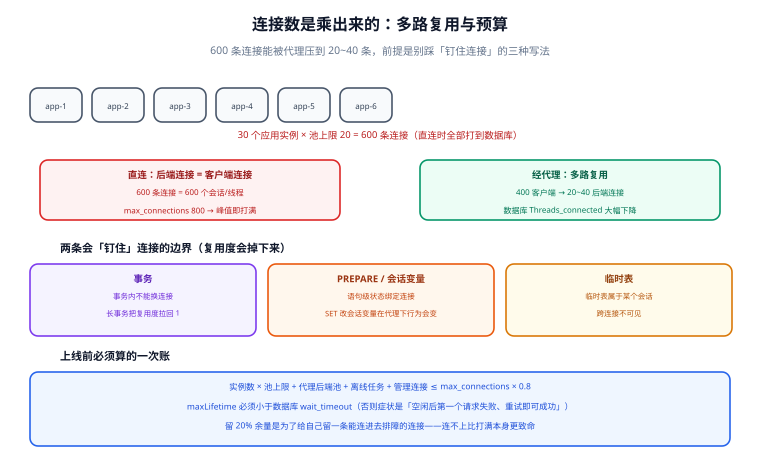

# 连接治理

「连接数打满」是生产上出现频率最高的数据库故障之一，而且它有一个非常反直觉的特征：**报错的往往不是压力最大的那个服务，而是最先撞到 `max_connections` 的那一刻进来的任何一个请求**。本页讲清连接是怎么被放大的、中间件如何把连接数压回去、以及连接风暴来临时的处置顺序。

## 1. 连接数是乘出来的，不是加出来的

数据库看到的连接数，是**所有客户端加起来**的结果：

```text
后端实例数 × 每个实例连接池上限 = 数据库侧连接数（理论上限）
     20    ×        20         =        400
     50    ×        20         =       1000   ← 一次扩容就可能打满
```



| 放大来源 | 倍数示例 | 说明 |
| --- | --- | --- |
| 应用实例数 | 20 → 50 | 扩容通常只看 CPU，没人同时算连接数 |
| 每个实例的池上限 | 10 → 20 | 调大池上限是「加吞吐」的直觉动作，但库存有限 |
| 同一应用的多数据源 | ×2 | 读写分离各一个池，主从各占一份 |
| 定时任务 / 离线脚本 | +N | 独立进程、独立池，经常不在容量表里 |
| 中间件自身的后端池 | +N | 代理也要连数据库，忘了算就少一块 |

::: danger 一次扩容就把数据库打满，是最常见的生产事故
`max_connections` 默认 151（MySQL 8.x）。**上线前必须算一次**：后端实例数 × 池上限 + 代理池 + 离线任务 + 管理连接 ≤ `max_connections` × 0.8。

留 20% 余量不是保守，而是为了**给自己留一条能连进去排障的连接**——连接打满时连不上数据库，比连接打满本身更致命。
:::

## 2. 连接池参数：只有六个真正重要

| 参数（HikariCP 命名） | 作用 | 定值方法 |
| --- | --- | --- |
| `maximumPoolSize` | 池上限，即对该数据库的最大并发连接数 | 由「数据库总预算 ÷ 实例数」反推，**不是越大越好** |
| `minimumIdle` | 保持的最小空闲连接 | 与 `maximumPoolSize` 相等可避免突发时的建连抖动 |
| `connectionTimeout` | 取连接的最长等待 | 要**小于**上游的接口超时，否则失败会跨层放大 |
| `maxLifetime` | 连接最长存活时间 | **必须小于**数据库的 `wait_timeout`（MySQL 默认 28800 s；很多云实例默认更短） |
| `idleTimeout` | 空闲回收 | 只在 `minimumIdle < maximumPoolSize` 时有意义 |
| `keepaliveTime` | 心跳保活 | 有中间设备（防火墙、LB）静默断连时需要 |

::: danger `maxLifetime` 大于数据库 `wait_timeout` 的后果
数据库先把它那一侧的死连接回收了，而连接池仍认为连接可用 → 应用取到一条**已被服务端关闭的连接** → 报 `Communications link failure` / `Connection reset`。

症状非常有特征：**空闲一段时间后的第一个请求失败，重试即可成功**。看到这个特征，直接去对比这两个参数。
:::

## 3. 多路复用：代理最实在的一项能力

代理可以在**后端侧只维持少量连接**，把大量客户端连接复用到这些连接上：

| 维度 | 无代理（直连） | 有代理（多路复用） |
| --- | --- | --- |
| 客户端连接数 | 400（20 实例 × 20） | 400（不变） |
| **后端连接数** | **400** | **20~40**（按主机组与并发） |
| 数据库 `Threads_connected` | 高 | 低 |
| 故障放大 | 每个应用实例独立重试，可能引发风暴 | 代理统一重试与排队 |

ProxySQL 的复用策略里有两条要理解的边界：

1. **事务会「钉住」连接**：进入事务后不能换连接，复用度下降；长事务会让后端连接数快速逼近客户端连接数；
2. **PREPARE / 临时表 / 会话变量**同样钉住连接——所以「用 `SET` 改会话变量」的代码在代理下行为可能变化。

```sql
-- ProxySQL：查看复用效果（后端连接池）
SELECT hostgroup, srv_host, status, ConnUsed, ConnFree, ConnOK, ConnERR
FROM stats_mysql_connection_pool
ORDER BY hostgroup, srv_host;
```

判读：`ConnUsed` 长期远小于客户端连接数说明复用生效；`ConnUsed` 接近客户端连接数说明有大量长事务或会话绑定。

## 4. 连接风暴：来源与处置

| 来源 | 机制 | 缓解 |
| --- | --- | --- |
| **发布时同时重启** | 所有实例同时建池，瞬间打出 N×池上限 的建连请求 | 滚动发布、设置启动预热延迟 |
| 数据库短暂不可用后恢复 | 所有池同时重连 | 连接池的建连退避 + 抖动（jitter） |
| 缓存/依赖雪崩 | 请求打到数据库，池被占满并排队 | 上游限流；`connectionTimeout` 配合快速失败 |
| 慢 SQL 占住连接 | 单条慢查询把连接长时间占用 | 慢查询治理（见 [SQL 优化](../../Relational/SQLOptimization/index.md)） |
| 连接泄漏 | 代码里 `getConnection()` 未归还 | 池的泄漏检测 + 连接持有时间监控 |

```shell
# MySQL：按来源 IP 聚合连接数，一眼看出谁在放大
mysql -e "
SELECT SUBSTRING_INDEX(host, ':', 1) AS client_host, COUNT(*) AS conns
FROM information_schema.processlist
GROUP BY client_host ORDER BY conns DESC;"
# MySQL 8.0.22+ 也可用：SHOW PROCESSLIST 或 performance_schema.threads
```

```sql
-- 当前连接数与上限
SHOW STATUS LIKE 'Threads_connected';
SHOW STATUS LIKE 'Max_used_connections';   -- 历史峰值，用来判断「最坏到过多少」
SHOW VARIABLES LIKE 'max_connections';
```

::: tip PostgreSQL 不一样，别照抄 MySQL 的直觉
PostgreSQL 每个连接对应一个**操作系统进程**，连接数上去内存与上下文切换成本陡增（`max_connections` 默认 100）。PG 侧的连接治理几乎等价于「必须上 PgBouncer」：用 **transaction 池模式**（事务结束即归还，复用率最高）而不是 session 模式；代价是会话级特性（`SET`、`LISTEN`、`PREPARE`、advisory lock）不可用或行为变化。
:::

## 5. 处置顺序（连接打满时的值班手册）

::: danger 顺序不能换
1. **先保住管理通道**：用一个专用高权限账号（或超级用户）连进去，客户端连接打满时这一步最容易失败——所以预留余量要提前做；
2. **看是谁**：按来源 IP / 用户 / `state` 聚合，区分「很多短连接」与「少量长连接」；
3. **短连接多** → 大概是池配置或重连风暴，处理入口是**应用侧**（缩小池、加退避、滚动重启）；
4. **长连接多** → 找 `state = 'Sending data'` / 长时间运行的 SQL，杀慢查询（`KILL`）**并**修 SQL；
5. **杀连接前先确认**：`KILL` 会回滚事务，正在写数据的事务被杀会造成业务失败；
6. **恢复后必做**：把本次峰值写进容量台账，更新 `max_connections` 与池上限。
:::

## 6. 验证方式

```shell
# ① 池上限与数据库预算核对（上线前必跑）
mysql -e "SHOW VARIABLES LIKE 'max_connections'; SHOW STATUS LIKE 'Max_used_connections';"
#   期望：实例数 × 池上限 + 代理池 + 离线任务 <= max_connections * 0.8

# ② maxLifetime 与 wait_timeout 关系核对
mysql -e "SHOW VARIABLES LIKE 'wait_timeout';"
#   期望：连接池 maxLifetime < wait_timeout（且留出足够余量）

# ③ 空闲后首请求验证（复现「连接被服务端回收」问题）
#   步骤：让服务空闲超过 wait_timeout，然后打一个请求
#   期望：不出现 Communications link failure；若出现 → 调小 maxLifetime

# ④ 复用比验证（有代理时）
#   SELECT SUM(ConnUsed + ConnFree) FROM stats_mysql_connection_pool;
#   期望：远小于客户端连接数
```

## 7. 参考资料

- [MySQL 官方 · Server Status Variables（Threads_connected 等）](https://dev.mysql.com/doc/refman/8.4/en/server-status-variables.html)
- [HikariCP · Configuration 参数说明](https://github.com/brettwooldridge/HikariCP#configuration-knobs-baby)
- [ProxySQL · Connection Pooling 与多路复用](https://proxysql.com/documentation/)
- [PgBouncer 官方文档](https://www.pgbouncer.org/usage.html)
- [中间件全景与选型](../Overview/index.md)｜[代理形态与运维](../ProxyMode/index.md)｜[SQL 优化专题](../../Relational/SQLOptimization/index.md)
