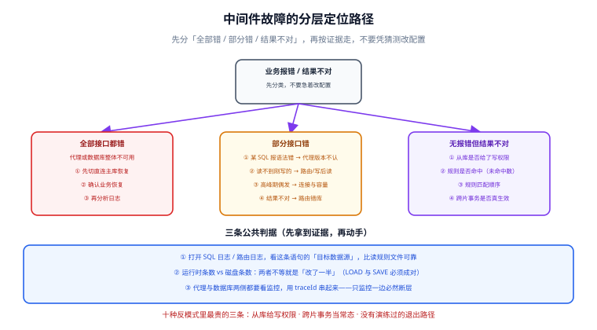

# 常见问题与排错

中间件的故障有一个共同特征：**症状出现在业务侧，根因在配置或代理层**。本页按「症状 → 定位路径 → 处置」组织，覆盖路由、一致性、性能、连接、变更、升级六类问题，最后给一份反模式清单。

## 1. 排查总原则：先分层，再分叉



```text
业务报错
  ├─ 全部接口都错？ → 代理或数据库整体不可用 → 走应急退出路径（先恢复）
  ├─ 部分接口错？
  │    ├─ 某个 SQL 报语法错 → 代理版本不认新语法
  │    ├─ 某个接口读不到数据 → 路由错（读到从库）或写后读问题
  │    └─ 偶发、集中在高峰期 → 连接池/代理容量
  └─ 无报错但结果不对 → 路由错库（写进了从库或错误分片）
```

::: danger 第一动作永远是「先恢复」
代理层的故障是**全量**的（不是降级）。预案顺序：① 应用切直连主库 → ② 确认业务恢复 → ③ 才开始分析日志。

反过来做（先分析再恢复），业务不可用时间会从分钟级变成小时级。
:::

## 2. 路由问题

| 症状 | 可能原因 | 定位 | 处置 |
| --- | --- | --- | --- |
| 刚写的数据读不到 | 读走了从库（延迟窗口） | 打开 SQL 日志看目标数据源 | 加 `force_master` / 会话级强制主库 |
| 事务里读不到自己写的数据 | 中间件没把事务标为写事务 | 事务内语句的目标数据源是否一致 | 确认事务模式；必要时事务内显式 Hint |
| 数据出现在错误的库 | 规则未命中 / 匹配顺序错误 | 查「规则未命中数」指标是否升高 | 补规则；**规则要按特异性从高到低排序** |
| 从库上出现了新写入 | 从库给了写权限（或规则把写路由到从库） | `SELECT @@hostname` 定位 | **立刻收掉从库写权限**，再查规则 |
| 某张表始终路由不对 | 「未命中任何表规则时」的行为不明确 | 检查是否有默认算法 | 显式配置默认算法，别依赖隐式行为 |

::: tip 一条常被忽略的技巧
**把路由结果打出来，比读规则文件可靠。** 规则文件是静态的，路由结果是动态的（受 Hint、事务、连接状态影响）。所有中间件都提供了 SQL 日志或路由日志开关——在预发环境打开它，用真实流量跑一轮，比在纸上推演规则有效得多。
:::

## 3. 一致性问题

| 症状 | 根因 | 处置 |
| --- | --- | --- |
| 报表数字比事实少 | 报表查了从库，且复制延迟期间有写入 | 报表单独从库；对账任务强制主库 |
| 主从切换后丢了一批数据 | 异步复制 + 主库宕机 | 关键业务改半同步；重新评估 RPO |
| 跨库写入一个成功一个失败 | 用了 `LOCAL` 模式却跨片 | 改 XA / BASE，或重构为单分片写入 |
| 缓存与数据库不一致 | 事务内删缓存 / 先删后写 | 改 `afterCommit`；见 [缓存设计](../../NoRelational/Redis/Advanced/CacheDesign/index.md) |
| 有 XA 未决事务 | prepare 后宕机 | `XA RECOVER` 巡检 + 恢复流程 |

::: danger 对账不是补救，是常规机制
只要引入了「跨资源写入」（库 + 缓存 + MQ），就必须有对账任务，日粒度跑、输出差异清单。**没有对账的最终一致方案，等于没有一致性。**
:::

## 4. 性能问题

| 症状 | 定位入口 | 处置 |
| --- | --- | --- |
| 整体 P99 抬高，数据库不忙 | 代理 CPU、转发线程、实例数 | 扩代理实例；与业务同可用区 |
| 数据库 CPU 高 | 慢查询（`stats_mysql_query_digest` 按 `sum_time` 排序） | 先优化 SQL 与索引，再谈分离 |
| 从库延迟高 | `Seconds_Behind_Source` | 避开大事务与 DDL；拆批量任务 |
| 高峰排队 | 连接池等待时间、`connectionTimeout` 命中 | 限流 + 快速失败；扩读容量 |
| 规则命中导致额外开销 | 规则条数过多、正则复杂 | 合并规则、用指纹匹配替代表达式 |

## 5. 连接问题

| 症状 | 定位 | 处置 |
| --- | --- | --- |
| `Too many connections` | `SHOW STATUS LIKE 'Max_used_connections'` + 按来源 IP 聚合 | 见 [连接治理](../ConnectionGovernance/index.md) 的处置顺序 |
| `Communications link failure`（空闲后首个请求失败） | 连接池 `maxLifetime` vs 数据库 `wait_timeout` | 调小 `maxLifetime` |
| 复用比接近 1 | 连接池统计 + 是否存在长事务 | 缩短事务；检查 `multiplex` 是否被会话特性禁用 |
| 代理后端连接打满 | `stats_mysql_connection_pool` 的 `ConnUsed` | 调整后端池预算；定位长事务 |
| 发布瞬间连接风暴 | 部署日志与数据库连接曲线对齐 | 滚动发布 + 建连退避 |

## 6. 变更与升级

| 类别 | 纪律 | 判据 |
| --- | --- | --- |
| 规则变更 | 配置进版本库、评审、双人确认 | 有 diff、有变更单 |
| 变更生效 | `LOAD ... TO RUNTIME` + `SAVE ... TO DISK` 都做 | 运行时条数 == 磁盘条数 |
| 代理升级 | 先单实例灰度，再全量 | 单实例观测 30 分钟无异常 |
| **数据库升级** | **升级前用真实 SQL 回放压测** | 回放脚本 0 语法错 |
| 配置回滚 | 保留上一版配置且可一键加载 | 回滚演练通过 |

::: danger 数据库升级是中间件最容易出事的一次操作
代理要解析 SQL 才能改写。数据库新增的语法（窗口函数、CTE、新的 JSON 操作符）在中间件看来可能「不认识」，表现是**报语法错**或**改写错**。升级窗口必须包含：① 用生产 SQL 采样回放；② 中间件版本确认支持目标数据库大版本；③ 准备「临时放行某类 SQL 直连」的应急手段。
:::

## 7. 反模式清单（评审时逐条对照）

::: danger 十种不应该出现的写法
1. **从库给写权限** —— 让路由错误静默通过，最终丢数据；
2. **在业务代码里硬编码数据源** —— 破坏中间件的可撤换性，退出成本翻倍；
3. **跨片事务当常态** —— 性能与失败模式都不可控，应按业务主键同源分片避免；
4. **规则里写死 IP** —— 扩容、切换、迁移都要改规则；
5. **改了运行时配置不落盘** —— 重启后配置回退，事故重放；
6. **只监控数据库不监控代理** —— 观测断层，故障时找不到根因；
7. **压测标只在前端透传** —— 异步链路写进生产；
8. **没有退出路径（或没演练过）** —— 代理故障 = 全量不可用；
9. **代理单实例部署** —— 中间件本身成了单点；
10. **规则配置没有版本与评审** —— 它已经是生产数据流向的定义，却不按生产代码管理。
:::

## 8. 快速自查表

| 上线前必须回答的问题 | 期望答案 |
| --- | --- |
| 从库账号是否只读？ | 是（且验证过写会报错） |
| 事务内读写是否在一个数据源？ | 是（SQL 日志确认） |
| 写后读接口清单是否明确？ | 有清单，且逐个验证 |
| 连接数预算是否算过？ | 有算式，≤ `max_connections` × 0.8 |
| `maxLifetime` 是否小于 `wait_timeout`？ | 是 |
| 代理是否多实例 + 前置 L4？ | 是 |
| 退出路径是否演练过？ | 有演练记录与耗时 |
| 规则是否进版本库并有评审？ | 是 |
| 代理与数据库两侧监控是否都接？ | 是 |
| 压测标是否有丢失率指标？ | 有，期望恒为 0 |

## 9. 参考资料

- [ProxySQL 官方文档](https://proxysql.com/documentation/)
- [ShardingSphere · 官方文档](https://shardingsphere.apache.org/document/current/cn/overview/)
- [MySQL 官方 · Replication](https://dev.mysql.com/doc/refman/8.4/en/replication.html)
- [中间件全景与选型](../Overview/index.md)｜[读写分离工程化](../ReadWriteSplit/index.md)｜[代理形态与运维](../ProxyMode/index.md)
- [连接治理](../ConnectionGovernance/index.md)｜[中间件视角的分布式事务](../DistributedTransaction/index.md)｜[实战：为订单服务接入中间件](../Practice/index.md)
