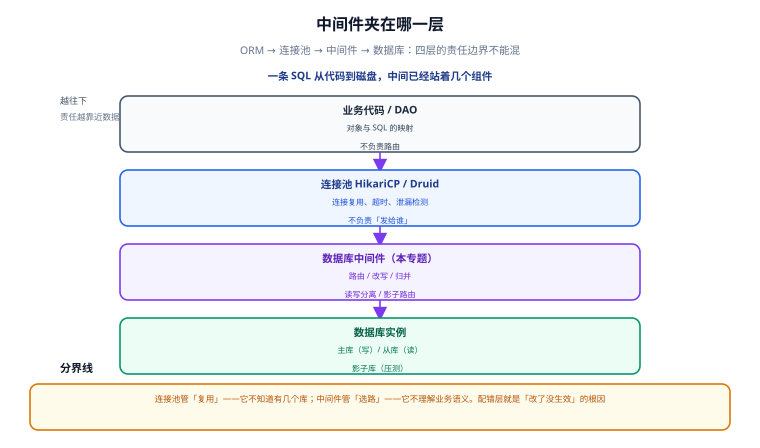
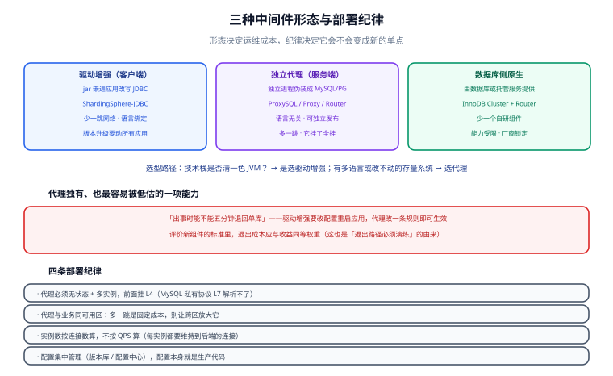

# 中间件全景与选型

「数据库中间件」不是某一个产品，而是一类位置。**先看清它夹在哪一层、能做什么、代价是什么**，再看具体选哪个——顺序反了，就会为了一个「读写分离」的需求引入一套需要三个人维护的分布式系统。

## 1. 它到底夹在哪一层

一条 SQL 从业务代码到磁盘，中间其实已经站着好几个组件。中间件是**在连接池之后、数据库之前**再加的一环：

```text
业务代码
  └─ ORM / DAO（MyBatis、JPA）
      └─ 连接池（HikariCP、Druid）      ← 管「连接复用」，不管「发给谁」
          └─ 数据库中间件             ← 本专题：管「发给谁、怎么改、怎么合」
              ├─ 主库（写）
              ├─ 从库 1、从库 2（读）
              └─ 影子库（压测流量）
```



三个层次的分工必须分清，否则会把参数配到错误的组件上：

| 层 | 它解决什么 | 它**不**解决什么 | 典型代表 |
| --- | --- | --- | --- |
| ORM / DAO | 对象与 SQL 的映射、结果装配 | 路由、读写分离、跨库事务 | MyBatis、JPA、MyBatis-Plus |
| 连接池 | 连接复用、超时、泄漏检测 | 一条 SQL 该走哪个实例 | HikariCP、Druid、Lettuce |
| **数据库中间件** | **路由、改写、归并、读写分离、影子路由** | 业务语义、慢 SQL 本身 | ShardingSphere、ProxySQL、MySQL Router |

::: danger 最常见的误配
「读写分离」在连接池里配置（配两个 DataSource 手动切换）不是不行，但它把**「读走从库」这件事写进了业务代码**：一旦某天要临时让全部读回主库（主从切换、复制延迟告警），你改不动——改动散落在几百个 Service 方法里。

**判据**：这条规则会不会在运行时被临时改掉？会 → 放中间件（改配置即生效）；不会 → 放代码里也可以。
:::

## 2. 三种形态：驱动增强、独立代理、数据库侧

同样是「做路由」，有三种完全不同的落地形态，它们的运维成本差一个数量级：



| 形态 | 工作方式 | 代表 | 优点 | 代价 |
| --- | --- | --- | --- | --- |
| **驱动增强（客户端）** | 以 jar 形式嵌进应用，改写 JDBC 行为 | ShardingSphere-JDBC | 少一跳网络、无独立进程、延迟最低 | **语言绑定**（Java 才能用）；版本升级要动所有应用；配置分散在各服务 |
| **独立代理（服务端）** | 独立进程，对应用伪装成 MySQL/PostgreSQL | ShardingSphere-Proxy、ProxySQL、MySQL Router、MyCat、Vitess | 语言无关；**可独立发布与灰度**；能接存量老系统 | 多一跳网络；多一套要监控与扩容的集群；**它挂了业务全挂** |
| **数据库侧原生** | 由数据库自身或托管服务提供 | MySQL InnoDB Cluster + Router、云厂商读写分离地址 | 少一个自研组件、由厂商保证一致性 | 能力被厂商锁定；跨引擎不可移植；深度定制受限 |

**一句话选型**：

- 技术栈**清一色 Java**、且团队有能力管理依赖 → 驱动增强，省一跳网络与一个集群；
- 技术栈**多语言**（Java + Go + Python）、或有**改不动的存量系统** → 独立代理；
- 需求只是「读写分离 + 故障切换」，且愿意用官方组件 → 数据库侧原生，别自建。

::: tip 一句话理解
驱动增强是**「把交换机装进每家每户的电话里」**，代理是**「在小区门口装一台交换机」**。前者快、统一不了；后者统一得了、多一跳、且门口那台不能坏。
:::

## 3. 能力矩阵：中间件到底能干什么

引入中间件前，先确认你要的能力在它这一列里存在：

| 能力 | 驱动增强 | 独立代理 | 说明 |
| --- | --- | --- | --- |
| 读写分离 | ✅ | ✅ | 见 [读写分离工程化](../ReadWriteSplit/index.md) |
| 分片路由 | ✅ | ✅ | 拆不拆的决策见 [分库分表](../../Relational/Sharding/index.md) |
| **影子库 / 影子表** | ✅ | ✅ | 全链路压测的数据隔离，见 [影子库与全链路压测](../ShadowDatabase/index.md) |
| **连接多路复用** | ❌ | ✅ | 代理独有：N 个应用连接复用 M 个数据库连接 |
| SQL 防火墙 / 审计 | 部分 | ✅ | 拦截无 `WHERE` 的 `UPDATE`、记录全量 SQL |
| 加解密与脱敏 | ✅ | ✅ | 列级加密、查询结果脱敏 |
| 灰度 / 流量染色 | 部分 | ✅ | 按标头路由到新库新版本 |
| 分布式事务协调 | ✅（XA / Seata 集成） | ✅ | 原理见 [分布式事务](../../../Backend/Microservices/DistributedTransaction/index.md) |
| **降级到单库** | 需改配置重启应用 | **改代理配置即可** | 这是独立代理最被低估的价值 |

最后一行值得展开：**「出事时能不能五分钟退回单库」**，往往比「平时快 3 毫秒」更重要。生产引入新组件的评价标准里，退出成本应该和收益同等权重。

## 4. 选型决策清单

按顺序回答下面五个问题，答案会直接把选项收敛到一两个：

1. **不加行不行？** 加索引、加从库走应用侧注解、加缓存能不能解决？（能 → 停在这里，别加中间件）
2. **要的能力里有没有「代理独有」的**？（连接复用、SQL 审计、语言无关、独立灰度）→ 有则代理
3. **技术栈是否单一且全在 JVM 上？** → 是则驱动增强优先
4. **团队能否承担一个「它挂了业务全挂」的组件？** → 不能则用数据库侧原生或托管服务
5. **退出路径是什么？** 写下来：怎么在 10 分钟内把所有流量打回单库

## 5. 引入成本清单（评审时必须摆上桌）

| 成本项 | 具体表现 | 缓解手段 |
| --- | --- | --- |
| 多一跳网络 | 每条 SQL 多一次进程间转发，P99 抬升 | 与业务同机架部署；代理侧连接复用摊薄开销 |
| **只读 SQL 解析** | 中间件要解析 SQL 才能改写，遇到新语法可能报错 | 升级数据库前用真实 SQL 回放；代理版本跟随数据库大版本 |
| 故障域扩大 | 代理集群故障 = 全部读写不可用 | 代理无状态多实例 + 前置负载均衡；准备「应用直连主库」的应急开关 |
| 观测断层 | 应用侧看到的是代理地址，真实慢 SQL 在代理与数据库两侧 | 代理与数据库两侧都要接监控，用 `trace_id` 串联 |
| 配置即生产代码 | 路由规则写错会静默打错库 | 规则入库版本化 + 上线前用 `EXPLAIN` 类工具验证路由结果 |
| 事务语义变化 | 跨库事务不再是本地事务 | 见 [中间件视角的分布式事务](../DistributedTransaction/index.md) |

::: danger 注意：路由错库不会报错，只会算错
「本来该写主库，结果写了从库」这类问题在从库是**只读账号**时会报错，最容易被发现；但如果你为了让某些同步任务能写而从库也给了写权限，**写从库会静默成功**，然后在主从切换时整批数据消失。

规则：**从库一律只给只读账号**。这不是规范癖好，它是让「路由错误」立刻变成「显式报错」的唯一低成本手段。
:::

## 6. 一个可复制的最小骨架

不管最终选哪个产品，配置都可以按这个骨架组织——把「路由规则」与「数据源定义」分开写，规则里只出现逻辑名：

```yaml
# middleware.yml —— 逻辑名 → 物理源，规则里不出现真实地址
sources:
  ds_master:
    url: jdbc:mysql://${DB_HOST}:3306/blog
    username: ${DB_USER}
    password: ${DB_PASSWORD}
  ds_replica_0:
    url: jdbc:mysql://${DB_REPLICA_HOST}:3306/blog

rules:
  - type: readwrite-splitting
    write-source: ds_master
    read-sources: [ds_replica_0]
```

三条纪律：

1. **地址与凭据只出现在 `sources` 段**，用环境变量占位、**不给默认值**（缺配置就该启动失败）；
2. **规则里只用逻辑名**（`ds_master`），这样扩从库、换实例都不用改规则；
3. **规则文件进版本库**，与 DDL 一样有 diff 可查——`docs/..` 里的配置片段永远只是示意，真正的唯一来源是仓库。

## 7. 验证方式

选型评审的收尾必须给出可验证的动作，而不是「方案已评审通过」：

```shell
# ① 路由结果验证：让中间件打印这条 SQL 实际走向
#    ShardingSphere-Proxy 侧用 Hint 强制路由，对比是否与预期一致
mysql -h 127.0.0.1 -P 3307 -uroot -p -e "
  /* ShardingSphere hint: readwrite_splitting_write */ SELECT 1;"

# ② 从库只读校验：拿应用账号直接连从库，写一条必须失败
mysql -h <replica> -u app_rw -p -e "CREATE TEMPORARY TABLE t_probe(id INT);" ; echo "rc=$?"
# 期望：rc 非 0（ERROR 1290 只读），若 rc=0 说明从库给了写权限，必须收回

# ③ 退出路径演练：把应用指向主库地址，确认业务仍可读写
# 期望：不需要改代码、不需要重新构建，只改一个环境变量
```

第 ③ 条是评审通过的必要条件：**退出路径没演练过，就不算有退出路径**。

## 8. 参考资料

- [Apache ShardingSphere · 读写分离](https://shardingsphere.apache.org/document/current/cn/features/readwrite-splitting/)
- [Apache ShardingSphere · 影子库](https://shardingsphere.apache.org/document/current/cn/features/shadow/)
- [ProxySQL 官方文档](https://proxysql.com/documentation/)
- [MySQL Router 官方文档](https://dev.mysql.com/doc/mysql-router/en/)
- [Vitess 官方文档](https://vitess.io/docs/)
- [分库分表专题](../../Relational/Sharding/index.md)｜[SQL 优化专题](../../Relational/SQLOptimization/index.md)｜[分布式事务专题](../../../Backend/Microservices/DistributedTransaction/index.md)
