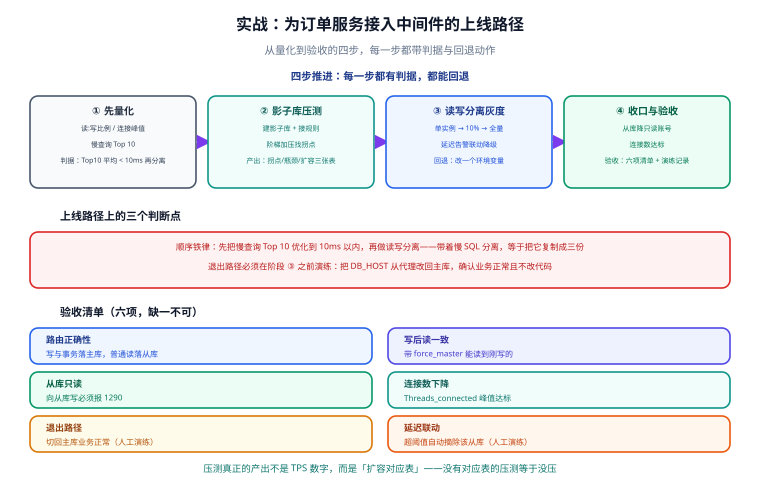

# 实战：为订单服务接入中间件

本页把前面几页的能力串成一条可执行的上线路径：一个真实的订单服务，读 QPS 是写的 8 倍、连接数逼近数据库上限、大促前需要压出真实容量。目标是在**不改业务代码**的前提下解决这三件事，并且每一步都能验证、都能回退。

## 1. 现状与目标

| 维度 | 现状 | 目标 | 手段 |
| --- | --- | --- | --- |
| 读压力 | 读 QPS 8000，主库 CPU 70% | 读压力分散，主库 CPU < 30% | 读写分离（2 从库） |
| 连接数 | 30 实例 × 20 = 600，`max_connections` = 800，峰值 720 | 后端连接数 ≤ 60 | 代理多路复用 |
| 大促容量 | 不知道能扛多少 | 给出拐点表与扩容对应表 | 影子库全链路压测 |
| 故障恢复 | 出事只能改代码重启 | 5 分钟内切回单库 | 退出路径 + 演练 |



::: info 为什么选代理而不是驱动增强
订单服务的调用方里除了 Java 服务，还有两个 Go 服务与一个报表导出脚本——它们**改不动**（没人维护源码）。代理是唯一能让这三类客户端一起受益的形态。

**判据**：客户端种类数 > 1 且包含「改不动」的系统 → 代理。
:::

## 2. 第一步：先量化，再动手

不要一上来就配中间件。先用两周的慢查询与连接数据确认「问题真的在主库读压力与连接数」：

```sql
-- ① 读:写比例（按 SQL 指纹聚合，ProxySQL 统计表）
SELECT
  CASE WHEN digest_text LIKE 'SELECT%' THEN 'read' ELSE 'write' END AS kind,
  SUM(count_star) AS calls,
  ROUND(SUM(sum_time) / 1000000, 1) AS total_seconds
FROM stats_mysql_query_digest
GROUP BY kind;

-- ② 连接峰值与来源
SHOW STATUS LIKE 'Max_used_connections';
SELECT SUBSTRING_INDEX(host, ':', 1) AS client_host, COUNT(*) AS conns
FROM information_schema.processlist GROUP BY client_host ORDER BY conns DESC;

-- ③ 主库上耗时 Top 10 的语句（决定「先优化还是先分离」）
SELECT digest_text, count_star, sum_time / count_star AS avg_us
FROM stats_mysql_query_digest ORDER BY sum_time DESC LIMIT 10;
```

::: danger 顺序：先优化，再分离
如果 Top 10 里有一条没走索引的全表扫描，**先加索引**。带着这条慢 SQL 做读写分离，你会得到「两个从库也一起慢」的结果——慢查询是会被复制到每一个从库的。

判据：**主库慢查询 Top 10 的平均耗时都降到 10 ms 以内，再开始做读写分离。** 这条顺序反过来做，等于把一个问题复制成三份。
:::

## 3. 第二步：影子库压测，先把容量摸清

压测的目标不是「数字好看」，是拿到上一节说的三张表（拐点表、瓶颈排序表、扩容对应表）。

| 阶段 | 动作 | 判据 |
| --- | --- | --- |
| 建影子库 | 用生产同一份迁移脚本建影子库；结构比对通过 | 结构比对脚本退出码 0，两侧列数一致 |
| 接影子规则 | 中间件配置影子库规则 + 压测标透传 | 带标写入 → 影子库有数据、生产库无数据 |
| 阶梯加压 | 100 / 300 / 600 / 1000 / 2000 并发，每档 10 分钟 | 每档记录 TPS、P95、错误率、资源水位 |
| 定位拐点 | TPS 增量衰减到前一段 50% 以下 **且** 资源触顶 | 只满足一条不算拐点 |
| 清理 | 影子库 `TRUNCATE` 或重建；跑两遍确认幂等 | 各行数为 0 |

**压测期间的三个观测点必须同时看**：

1. 应用侧：TPS、P95、错误率、GC；
2. 代理侧：客户端连接数、后端连接数（复用比）、转发延迟；
3. 数据库侧：`Threads_running`、慢查询数、磁盘 IO、主从延迟。

::: tip 提示
压测中最容易被忽略的是**代理自身**。一次实测中应用与数据库都还很闲，但 P99 突然抬高 40 ms，最后定位到是代理实例的 CPU 打满在转发上——**代理是链路中的一环，它的容量也要压**。
:::

## 4. 第三步：读写分离灰度上线

灰度按「先只读后写、先小比例后全量」推进：

| 阶段 | 配置 | 观测 | 回退动作 |
| --- | --- | --- | --- |
| A. 只加从库不切流 | 从库接入监控，读仍全走主库 | 复制延迟基线 | 无需回退 |
| B. 单实例灰度 | 1 个应用实例（约 3% 流量）读走从库 | 该实例错误率、业务投诉 | 该实例改回直连主库 |
| C. 小比例 | 负载均衡 10% 连接走代理 | 从库读占比、`Seconds_Behind_Source` | 摘除代理权重 |
| D. 全量 | 全部实例走代理 | 30 分钟全指标 | 应用数据源改回主库（**一个环境变量**） |
| E. 收紧 | 从库账号降为只读；开启延迟告警联动降级 | 无新增告警 | — |

**阶段 D 的退出路径必须提前演练**，演练内容就一条命令：把 `DB_HOST` 从代理地址改回主库地址、重启应用，确认业务读写正常。演练不通过就不许进 D。

## 5. 配置清单（可直接照抄骨架）

```text
# 应用侧：只改一处
DB_HOST=proxy-vip.internal      # 之前是 mysql-master.internal
DB_PORT=6033                    # 之前是 3306

# 代理侧：主机组（writer 10 / reader 20）
mysql_servers =
  { address="mysql-master", port=3306, hostgroup=10, max_connections=40 },
  { address="mysql-replica1", port=3306, hostgroup=20, max_connections=30 },
  { address="mysql-replica2", port=3306, hostgroup=20, max_connections=30 }

# 读写分离规则：默认读走 reader，事务与 force_master 走 writer
mysql_query_rules =
  { rule_id=1, active=1, match_digest="^SELECT", destination_hostgroup=20, apply=1, multiplex=1 },
  { rule_id=2, active=1, match_digest="^/\\* force_master \\*/", destination_hostgroup=10, apply=1, multiplex=1 }
```

::: danger 三条不能省的配置动作
1. **`multiplex=1`**：只在确实安全的 SELECT 上开启多路复用；开了却遇到会话绑定行为会出错；
2. **从库账号只读**：`GRANT SELECT ON blog.* TO 'app_ro'@'%';` 且**不要**给 `INSERT/UPDATE`；
3. **`max_connections` 按预算分配**：代理后端池预算（40 + 30 + 30 = 100）+ 离线任务 + 管理连接 ≤ 数据库上限 × 0.8。
:::

## 6. 验收清单（六项，缺一不可）

| # | 项 | 判据 | 类型 |
| --- | --- | --- | --- |
| 1 | 路由正确性 | 写与事务内语句落在主库；普通读落在从库 | 自动 |
| 2 | 写后读一致 | 带 `force_master` 的读能读到刚写的数据 | 自动 |
| 3 | 从库只读 | 用应用账号向从库写必须报错（`ERROR 1290`） | 自动 |
| 4 | 连接数下降 | 数据库 `Threads_connected` 峰值 ≤ 目标的 120% | 自动 |
| 5 | 退出路径 | 切回主库后业务读写正常，且**不需要改代码** | 人工（演练记录） |
| 6 | 延迟告警联动 | 模拟从库延迟超阈值，读流量被摘除 | 人工（演练记录） |

```shell
# ①②③ 可脚本化的三条
mysql -h $PROXY -P 6033 -uapp_ro -p -e "SELECT @@hostname;"                       # 期望：从库
mysql -h $PROXY -P 6033 -uapp -p -e "BEGIN; SELECT @@hostname; COMMIT;"           # 期望：主库
mysql -h $REPLICA -uapp_ro -p -e "CREATE TEMPORARY TABLE t(id INT);"; echo "rc=$?" # 期望：rc != 0

# ④ 连接数
mysql -h $MASTER -e "SHOW STATUS LIKE 'Threads_connected';"

# ⑤⑥ 演练记录归档（示例：写入验收目录）
#   docs 侧不存记录，记录落在项目目录的验收文档里（见完整项目交付专题）
```

## 7. 常见问题与复盘要点

| 现象 | 原因 | 处置 |
| --- | --- | --- |
| 上线后发现少量请求读不到刚写的数据 | 写后读路径没加 `force_master` | 按业务接口逐个补；把「写后读」的接口列成清单 |
| 从库读流量占比很低（如 5%） | 规则只匹配了 `^SELECT`，但 ORM 生成的 SQL 前面有注释或空格 | 用 `match_digest` 的正确指纹；先统计未命中规则数 |
| 大盘延迟上去了 | 代理转发成为瓶颈 | 扩代理实例；把健康检查间隔调长 |
| 报表查询把从库拖慢，进而影响线上读 | 报表与线上读共用从库 | 单独从库 + 按 SQL 特征路由 |
| 压测数据出现在生产报表里 | 有写入口没接中间件或压测标丢失 | 立刻停压测、清理数据、补入口清单 |

::: tip 复盘要点（写进上线记录，供下一个项目复用）
1. **先优化再分离**的判据（Top 10 平均耗时 < 10 ms）在本项目里省下了两个从库的成本；
2. **退出路径演练**只花了 20 分钟，但它把「代理故障 = 全量不可用」的持续时间从可能的小时级降到分钟级；
3. 压测真正的产出是**扩容对应表**，不是 TPS 数字——没有对应表的压测等于没压。
:::

## 8. 参考资料

- [ProxySQL 官方文档](https://proxysql.com/documentation/)
- [ShardingSphere · 影子库](https://shardingsphere.apache.org/document/current/cn/features/shadow/)
- [MySQL 官方 · Replication](https://dev.mysql.com/doc/refman/8.4/en/replication.html)
- [完整项目交付 · 一键部署与上线验收](../../../Others/ProjectDelivery/Delivery/index.md)
- [中间件全景与选型](../Overview/index.md)｜[读写分离工程化](../ReadWriteSplit/index.md)｜[影子库与全链路压测](../ShadowDatabase/index.md)｜[连接治理](../ConnectionGovernance/index.md)
