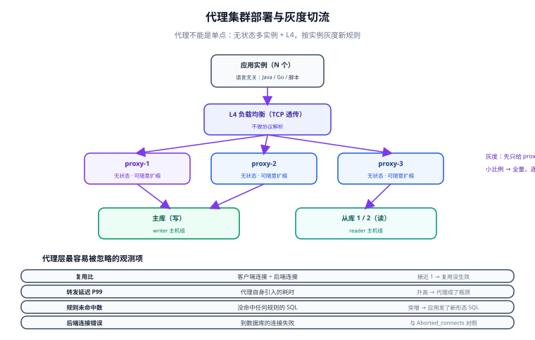

# 代理形态与运维

代理形态（Proxy）是中间件里**最需要运维投入**的一类：它多了一个独立进程、多了两个端口、多了一层要监控的延迟，但也换来了「语言无关」「可独立发布」「改配置就能处置故障」这三条别处拿不到的能力。本页把主流代理横向比完，再把部署、灰度、监控、故障四件事落成可执行的动作。

## 1. 主流代理横向对比

| 代理 | 协议支持 | 核心强项 | 分片能力 | 运维复杂度 | 适合 |
| --- | --- | --- | --- | --- | --- |
| **ShardingSphere-Proxy** | MySQL / PostgreSQL | 分片 + 读写分离 + 影子库 + 数据加密，规则与 JDBC 版同构 | 强 | 中 | 已经用 ShardingSphere-JDBC、想统一治理；多语言栈 |
| **ProxySQL** | MySQL（含兼容协议） | **连接多路复用**、查询规则重写、SQL 防火墙、查询缓存 | 无（不做分片） | 中 | 读写分离 + 连接治理 + 慢 SQL 治理，规模大但不需要分片 |
| **MySQL Router** | MySQL | 官方组件、随 InnoDB Cluster 发行、上手最快 | 弱 | 低 | 只是要读写分离与故障切换，愿意用官方栈 |
| **Vitess** | MySQL | 超大规模分片、在线重分片（resharding）、强大的控制面 | 很强 | 高 | 几百张分片表、要求在线扩容 |
| **MyCat** | MySQL | 历史项目多、文档中文多 | 中 | 中 | 存量系统维护；**新项目不建议** |

::: tip 选型的一句话判据
**要不要分片决定排除项，要不要连接复用决定加分项。** 不需要分片但连接数爆炸（Java 应用多、实例多）→ ProxySQL 的收益最大；需要分片 → ShardingSphere-Proxy 或 Vitess，按规模二选一。
:::

## 2. 部署拓扑：代理不能是单点



```text
应用实例（N 个）
  └─ VIP / L4 负载均衡（TCP 透传，不做协议解析）
      ├─ proxy-1   ← 无状态，可随意扩缩
      ├─ proxy-2
      └─ proxy-3
          ├─ 主库（写）
          └─ 从库 1 / 从库 2（读）
```

四条部署纪律：

1. **代理无状态化**：规则配置集中管理（配置中心 / 版本库），实例启动时拉取。有状态的代理没法水平扩。
2. **前面挂 L4 而不是 L7**：代理走的是 MySQL 私有协议，L7 网关解析不了，只会添乱。
3. **代理与业务同可用区**：多一跳网络是代理的固定成本，别让跨区把成本放大。
4. **代理实例数按连接数算，不按 QPS 算**：每个代理进程都要维持到后端的连接与转发线程，连接数是更硬的约束。

## 3. 配置管理与灰度

代理最大的优势是「改配置即可变更流量」，代价是**配置本身就是生产代码**。

以 ProxySQL 为例，它的配置分三层，理解这三层就理解了它的运维模型：

```sql
-- 登录管理端口（默认 6032，业务端口是 6033，别搞混）
-- mysql -h 127.0.0.1 -P 6032 -uadmin -padmin

-- ① 查询当前生效的规则
SELECT rule_id, match_digest, destination_hostgroup, active FROM mysql_query_rules;

-- ② 新增一条：把 `/* force_master */` 的查询送进 writer 主机组
INSERT INTO mysql_query_rules (rule_id, active, match_digest, destination_hostgroup, apply)
VALUES (10, 1, '^/\\* force_master \\*/', 10, 1);

-- ③ 载入运行时（立即生效，重启后丢失）→ 再落盘（持久化）
LOAD MYSQL QUERY RULES TO RUNTIME;
SAVE MYSQL QUERY RULES TO DISK;

-- ④ 复核：确认运行时里的规则与磁盘上的一致，避免「只改了运行时」
SELECT COUNT(*) AS runtime_rules FROM runtime_mysql_query_rules;
SELECT COUNT(*) AS disk_rules    FROM disk_mysql_query_rules;
```

::: danger 三层配置最容易踩的坑
- 只改了 `mysql_query_rules`（内存表）**没有** `LOAD ... TO RUNTIME` → **完全不生效**；
- 只做了 `LOAD ... TO RUNTIME` **没有** `SAVE ... TO DISK` → 重启后**规则消失**，故障恢复时间点正好是你最虚弱的时候；
- 用 `DELETE` 删规则后忘记 `LOAD TO RUNTIME` → 规则仍在生效。

**复核方式固定为两条 SQL**：运行时条数 vs 磁盘条数。两者不等就是「改了一半」。
:::

### 灰度切流

代理集群可以按实例灰度，做法是把「新规则」先只发给一个实例：

| 阶段 | 动作 | 观测 | 回退 |
| --- | --- | --- | --- |
| 1. 单实例 | 只在 `proxy-1` 应用新规则 | 该实例的命中数、错误率、P99 | 该实例 `LOAD` 旧规则 |
| 2. 小比例 | 负载均衡把 5% 连接指向 `proxy-1` | 业务侧错误率、路由命中率 | 摘除该实例权重 |
| 3. 全量 | 全部实例应用 | 全量指标 30 分钟 | 回滚规则文件 + `LOAD` |

## 4. 监控：代理层要看什么

代理引入的最大隐患是**观测断层**：应用看到的是代理地址，真实慢 SQL 在代理与数据库两侧，只监控一边就会漏。

| 指标 | 含义 | 异常信号 |
| --- | --- | --- |
| 客户端连接数 / 后端连接数 | 复用比 = 客户端数 ÷ 后端数 | 复用比接近 1 → 多路复用没生效，后端连接压力等于没加代理 |
| 转发延迟（P99） | 代理自身引入的额外耗时 | 显著上升 → 代理 CPU 或网络成为瓶颈 |
| 路由命中分布 | 各主机组 / 各从库的请求占比 | 某个从库为 0 → 规则或健康检查有问题 |
| 规则未命中数 | 没有命中任何规则的 SQL 数 | 突然升高 → 应用发了新的 SQL 形态，规则需要补 |
| 后端连接错误 | 到数据库的连接失败 | 与数据库侧 `Aborted_connects` 对照定位 |
| ProxySQL 专有：`stats_mysql_query_digest` | 按 SQL 指纹聚合的调用量与耗时 | 是定位「谁在拖慢」的最快入口 |

```sql
-- 按总耗时排序，找最值得优化的 SQL（ProxySQL）
SELECT digest_text, count_star, sum_time, sum_time / count_star AS avg_us
FROM stats_mysql_query_digest
ORDER BY sum_time DESC LIMIT 20;

-- 复用比（客户端连接 vs 后端连接）
SELECT SUM(ConnUsed + ConnFree) AS backend_used_or_idle FROM stats_mysql_connection_pool;
```

## 5. 四类典型故障与定位

| 现象 | 可能原因 | 定位动作 | 处置 |
| --- | --- | --- | --- |
| **代理启动后业务全挂** | 后端主机组配置为空 / 健康检查全失败 | 管理端口查后端状态；直连数据库确认可用 | 修规则；临时把应用直连主库（退出路径） |
| 部分 SQL 报语法错误 | 代理不认识数据库新语法（版本落后） | 取报错 SQL 在代理与数据库侧分别执行 | 升级代理或加规则放行；短期让该 SQL 直连 |
| 延迟整体升高但数据库不忙 | 代理 CPU 饱和、转发排队 | 看代理 CPU、转发线程数、链接数 | 扩代理实例；降低单实例连接数 |
| **连接数没降** | 多路复用被禁用 / 事务把连接钉住 | 看复用比；检查是否有长事务、PREPARE | 关掉长事务；按需调整复用策略 |
| 换了规则但不生效 | 改了内存表没 `LOAD`，或改了 disk 表没 `LOAD` | 运行时条数 vs 磁盘条数 | 补齐 `LOAD` + `SAVE` 并复核条数 |

::: danger 故障时的第一动作：先恢复，再定位
代理故障时业务是**全量不可用**（不是降级）。预案里必须写死顺序：
1. 应用侧切到「直连主库」的应急开关（**预先演练过**）；
2. 确认业务恢复（健康检查 + 冒烟）；
3. **然后**才去分析代理日志。

顺序反了，就是拿业务可用性换排障体验。
:::

## 6. 验证方式

```shell
# ① 代理协议兼容性：业务端口直连执行一条典型 SQL
mysql -h 127.0.0.1 -P 6033 -uapp -p -e "SELECT VERSION(), @@hostname;"
# 期望：能看到实际后端实例；若报协议错则代理与数据库大版本不兼容

# ② 路由正确性：写走主库、读走从库
mysql -h 127.0.0.1 -P 6033 -uapp -p -e "SELECT @@hostname;"            # 通常落到从库
mysql -h 127.0.0.1 -P 6033 -uapp -p -e "BEGIN; SELECT @@hostname; COMMIT;"  # 事务内应落到主库

# ③ 配置三层一致性（ProxySQL）
#    runtime 条数 == disk 条数 == 预期条数，三者不等即「改了一半」

# ④ 退出路径演练：把应用数据源指回主库地址，确认业务读写正常、无需改代码
```

## 7. 参考资料

- [ProxySQL 官方文档](https://proxysql.com/documentation/)
- [ShardingSphere-Proxy · 快速入门](https://shardingsphere.apache.org/document/current/cn/quick-start/shardingsphere-proxy-quick-start/)
- [MySQL Router 官方文档](https://dev.mysql.com/doc/mysql-router/en/)
- [Vitess 官方文档](https://vitess.io/docs/)
- [MySQL 官方 · Replication](https://dev.mysql.com/doc/refman/8.4/en/replication.html)
- [中间件全景与选型](../Overview/index.md)｜[读写分离工程化](../ReadWriteSplit/index.md)｜[连接治理](../ConnectionGovernance/index.md)
