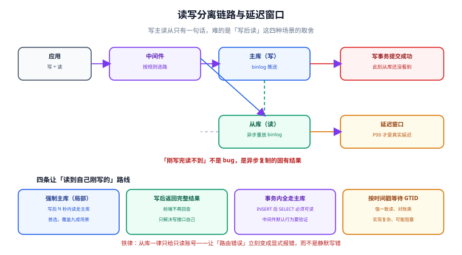

# 读写分离工程化

读写分离的原理只有一句话：**写走主库、读走从库**。它难的地方从来不是原理，而是「读走从库」之后，同一个请求里**刚写的数据可能读不到**——这不是 bug，是复制机制的固有结果。本页把这件事拆成可配、可验、可降级的工程方案。

## 1. 复制是异步的，延迟是常态不是异常

MySQL 的默认复制是**异步复制**：主库写完并提交事务就算成功，之后才把 binlog 发给从库。于是「主库提交成功」与「从库能看到」之间，存在一个天然的时间窗。



| 复制模式 | 主库提交时机 | 数据丢失风险 | 延迟量级 | 适用 |
| --- | --- | --- | --- | --- |
| 异步复制（默认） | 不等从库 | 主库宕机可能丢最后一段事务 | 通常 0~1 ms，大事务或网络抖动可到秒级 | 大多数读写分离场景 |
| 半同步复制（`AFTER_SYNC`） | 至少一个从库落盘 ack | 显著降低（但仍可能丢） | 比异步多一次网络往返 | 对丢数据敏感、可接受写延迟 |
| 组复制（MGR）/ 同步复制 | 多数派确认 | 基本不丢 | 写延迟明显上升 | 金融级一致性要求 |

::: danger 注意
**延迟量级必须按 P99 看，不能看平均值。** 一个 50 ms 的 P99 延迟意味着：每 100 次读有 1 次可能读到旧数据。而「读旧数据」的表现是**用户刷新一下就好了**——这类问题在监控上完全看不见，只能靠日志里的版本/时间戳比对发现。
:::

会造成延迟突然变大的三件事，要提前知道：

1. **大事务**：一次 `UPDATE` 影响百万行的批量任务，会在从库上串行重放很久（`Seconds_Behind_Source` 直接冲高）；
2. **DDL**：从库重放 DDL 时是阻塞的，期间该表上的查询都会排队；
3. **从库上的慢查询 / 备份**：从库同时承担读流量与备份任务时，重放速度会被拖慢。

## 2. 「读到自己刚写的」：四条路线

同一个用户连续的两个请求，第二个请求必须看到第一个的结果——这是**会话级一致性**（read-your-writes）。四种做法，从便宜到贵：

| 方案 | 做法 | 代价 | 适用 |
| --- | --- | --- | --- |
| **强制主库（局部）** | 写之后的若干秒内，该会话的读全部走主库 | 需要会话态；主库读压力小幅上升 | **首选**，覆盖 90% 场景 |
| 写后返回完整结果 | 写接口直接返回新对象，前端不再回查 | 只解决「写接口自己」 | 表单保存后跳转详情页这类 |
| 按 SQL 类型强制 | `SELECT ... FOR UPDATE`、事务内读一律走主库 | 无需会话态 | 事务一致性（见第 3 节） |
| 按时间戳等待 | 从库追到指定 GTID / 位点再返回 | 实现复杂、可能阻塞请求 | 强一致读、对账类 |
| 全部走主库 | 不给从库读权限 | 失去读写分离意义 | 只在故障应急时用 |

**强制主库**是最常用的一条，中间件侧的写法（ShardingSphere）是在 SQL 前加 Hint 注释：

```sql
-- 写操作之后的一段时间内（同会话），让读也走主库
/* ShardingSphere hint: readwrite_splitting_write */ SELECT * FROM t_post WHERE id = 1001;
```

::: tip 提示
Hint 是**逐条 SQL** 生效的，中间件不知道「会话」是什么。真要做「写后 N 秒内都走主库」，需要在应用侧维护一个**会话级标记**（例如把 `forceMasterUntil` 写进本地 ThreadLocal 或 Redis），或者把这段逻辑包进一个统一的 `ReadTemplate`。**别指望中间件替你记住会话状态。**
:::

## 3. 事务内的一致性：一条铁律

::: danger 铁律：事务内读也必须走主库
一个事务里 `INSERT` 之后紧跟 `SELECT`（比如插入订单再查订单号），如果这条 `SELECT` 被路由到从库，**从库根本还没有这条数据**——表现是「刚下单就提示订单不存在」。

中间件的正确处理方式有两种：

1. 中间件把**整个事务标记为写事务**，事务内所有语句走主库（ShardingSphere 的默认行为）；
2. 中间件没做这个标记时，应用侧必须在事务内显式 Hint。

**验证方法**：打开中间件的 SQL 日志，跑一个「事务内 INSERT + SELECT」的用例，确认两条语句的目标数据源一致。这是上线前必须做的一条，不是可选项。
:::

## 4. 延迟感知与自动降级

生产上不能只靠「人发现告警后手动切」。降级要分两档，并且**降级动作本身要可观测**：

```yaml
# ShardingSphere 侧示意：把「延迟过高就不读从库」交给可观测系统联动
dataSources:
  ds_master: ...
  ds_replica_0: ...
rules:
  - !READWRITE_SPLITTING
    dataSourceGroups:
      readwrite_ds:
        writeDataSourceName: ds_master
        readDataSourceNames: [ds_replica_0]
        loadBalancerName: roundRobin        # 或 random / 自定义权重点
```

```sql
-- 监控侧取延迟的两个手段（二选一，按版本环境挑可用的）
SHOW REPLICA STATUS;   -- 关注 Seconds_Behind_Source / Replica_IO_Running / Replica_SQL_Running
-- 8.0.22+ 起旧命令 SHOW SLAVE STATUS 已被 SHOW REPLICA STATUS 取代
```

| 信号 | 阈值示例 | 动作 | 由谁执行 |
| --- | --- | --- | --- |
| `Seconds_Behind_Source > 5` 持续 30 s | 告警 | 只告警 | 监控 |
| `Seconds_Behind_Source > 30` 持续 60 s | 降级 | **把读流量摘除该从库**（权重置 0） | 中间件配置变更 / 脚本 |
| `Replica_SQL_Running = No` | 紧急 | 摘除 + 人工介入 | 值班 |
| 从库全部不可用 | 应急 | 全部读回主库（**提前演练过的退出路径**） | 值班 + 预案 |

::: danger 注意
「摘除从库」这个动作**必须有权限与审计**：一个能改路由配置的人，等于能改生产数据流向。配置变更走与代码相同的评审与记录流程（变更单 + 双人确认），不要给「临时改一下」留口子。
:::

## 5. 从库数量与负载均衡

| 场景 | 建议 | 理由 |
| --- | --- | --- |
| 读 QPS < 2000 | 1 从库 | 更少的从库意味着更少的延迟源与故障点 |
| 读 QPS 2000~20000 | 2~3 从库 + 轮询/随机 | 单从库的中继日志重放会成为瓶颈 |
| 读有明显热点（某几张表吃满） | 按业务拆从库（不同从库只服务特定表） | 避免一个慢查询影响全部读流量 |
| 有报表 / 导出类长查询 | **单独从库**，并在中间件里按 SQL 特征路由过去 | 长查询不能和线上读抢同一实例 |

负载均衡算法只有三种，选择依据是「从库是否同构」：

- **轮询（roundRobin）**：从库规格一致时的默认选择；
- **随机（random）**：实现最简，但从库为奇数台时分布更均匀；
- **权重（自定义）**：从库规格不一致（如一台是旧机型）时给低权重。

## 6. 完整可验证的最小案例

以 ShardingSphere-JDBC 为例，验证「读写分离真的生效、且写后读不再读旧数据」：

```yaml [application-readwrite.yml]
spring:
  datasource:
    driver-class-name: org.apache.shardingsphere.driver.ShardingSphereDriver
    url: jdbc:shardingsphere:classpath:sharding-readwrite.yml
```

```yaml [src/main/resources/sharding-readwrite.yml]
dataSources:
  ds_master:
    dataSourceClassName: com.zaxxer.hikari.HikariDataSource
    driverClassName: com.mysql.cj.jdbc.Driver
    jdbcUrl: jdbc:mysql://${DB_MASTER_HOST}:3306/blog?useSSL=false
    username: ${DB_USER}
    password: ${DB_PASSWORD}
  ds_replica_0:
    dataSourceClassName: com.zaxxer.hikari.HikariDataSource
    driverClassName: com.mysql.cj.jdbc.Driver
    jdbcUrl: jdbc:mysql://${DB_REPLICA_HOST}:3306/blog?useSSL=false
    username: ${DB_READONLY_USER}
    password: ${DB_READONLY_PASSWORD}

rules:
  - !READWRITE_SPLITTING
    dataSourceGroups:
      blog_ds:
        writeDataSourceName: ds_master
        readDataSourceNames: [ds_replica_0]
```

```sql [验证脚本 sql/verify-rw.sql]
-- ① 写：确认落在主库
INSERT INTO t_post (id, title) VALUES (9001, 'rw-probe');
-- ② 立刻读：不加 Hint 时可能读不到（这就是延迟窗口）
SELECT COUNT(*) FROM t_post WHERE id = 9001;
-- ③ 加 Hint 强制主库：必须读到 1
/* ShardingSphere hint: readwrite_splitting_write */ SELECT COUNT(*) FROM t_post WHERE id = 9001;
```

**期望结果与判读**：

| 步骤 | 期望 | 不符合时的含义 |
| --- | --- | --- |
| ② 立刻读 | 可能返回 0（延迟窗口内）或 1 | 稳定返回 1 说明从库是**同步**的，或读根本没走从库（配置没生效） |
| ③ Hint 读 | **必须**返回 1 | 返回 0 说明 Hint 未生效——事务/Hint 路由是必须验证的项 |
| 清理 | `DELETE FROM t_post WHERE id = 9001;` | 探针数据不要留在生产表里 |

## 7. 易错点与最佳实践

::: danger 五条必须遵守的规则
1. **从库只读账号**：让路由错误的唯一表现是报错，而不是静默写错。
2. **事务内全走主库**：验证方式是打开 SQL 日志，确认一次事务里没有出现两个数据源。
3. **写后读用会话级强制主库**，不要指望中间件记住会话；Hint 是逐条的。
4. **上线前演练「全部读回主库」**，并把命令写进预案——这是唯一的退出路径。
5. **DDL 与大事务避开业务高峰**，它们是复制延迟最主要的人为来源。
:::

::: tip 最佳实践
- 把 `Seconds_Behind_Source` 与「从库读流量占比」一起看：延迟高但读流量小，说明是复制本身的问题；两者同时高，说明读流量把从库压住了。
- 给每个业务读接口定义**一致性等级**（强一致 / 可接受短暂过期），并在代码注释里写明。这把「读旧数据」从玄学问题变成可评审的设计决策。
:::

## 8. 参考资料

- [MySQL 官方 · Replication 复制](https://dev.mysql.com/doc/refman/8.4/en/replication.html)
- [MySQL 官方 · SHOW REPLICA STATUS](https://dev.mysql.com/doc/refman/8.4/en/show-replica-status.html)
- [ShardingSphere · 读写分离](https://shardingsphere.apache.org/document/current/cn/features/readwrite-splitting/)
- [ShardingSphere · Hint 强制路由](https://shardingsphere.apache.org/document/current/cn/user-manual/shardingsphere-jdbc/yaml-config/rules/hint/)
- [中间件全景与选型](../Overview/index.md)｜[影子库与全链路压测](../ShadowDatabase/index.md)｜[连接治理](../ConnectionGovernance/index.md)
