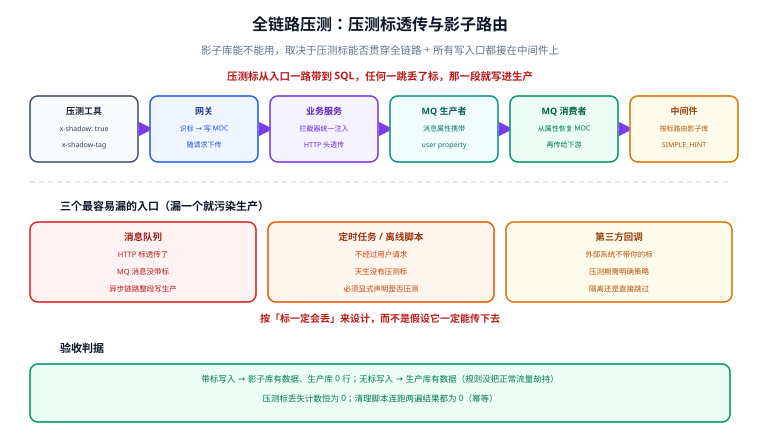

# 影子库与全链路压测

「压测会不会污染生产数据」是每个要上生产的系统都会撞上的问题。用测试环境压测，测出来的是**测试环境的容量**，不是生产的；用生产压，写进去的数据会把报表、推荐、结算全部带偏。**影子库**就是中间件给出的第三条路：**生产环境、生产配置、真实链路，但写进另一个库**。

## 1. 影子方案的三种做法

| 做法 | 隔离粒度 | 改造量 | 数据真实性 | 适用 |
| --- | --- | --- | --- | --- |
| **影子库** | 整库复制一套 | 应用零改造，只加压测标透传 | 高（同一套代码与配置，只有库地址不同） | **推荐**，全链路压测首选 |
| **影子表** | 同库内加后缀表（`t_order` → `t_order_shadow`） | 中间件改写表名 | 中（共享实例资源，会互相影响） | 数据库实例紧张时 |
| 只读压测 / 数据隔离库 | 无写入 | 最小 | 低（测不出写链路瓶颈） | 只关心查询性能 |

::: tip 一句话理解
**影子库 = 给压测流量开一条平行的下水道。** 水（请求）还是那些水、管道（应用与中间件）还是那些管道，但最终流进另一个池子，不会溅到生产数据上。
:::

## 2. 全链路压测的两个前提

影子库能不能用，取决于两件事能不能做到——**做不到就别做全链路压测**：

1. **压测标能贯穿全链路**：从入口请求头一路透传到每一个下游调用，任何一个环节丢了标，那一段流量就会落回生产；
2. **所有写入口都接在中间件上**：只要有一个人「图省事」用另一个数据源直连生产（离线任务、定时脚本、运维工具），压测数据就会漏进生产。



### 压测标怎么透传

```text
压测工具（带 x-shadow: true / x-shadow-tag: 20260929-full）
  └─ 网关：识别标头 → 写入 MDC（traceId 之外再加 shadowTag）
      └─ 业务服务：HTTP 调用下游时自动带上（拦截器统一注入）
          └─ MQ 生产者：消息属性（user property）携带 shadowTag
              └─ MQ 消费者：从消息属性恢复 MDC
                  └─ 中间件：从 SQL Hint 或连接属性取标，路由到影子库
```

::: danger 三个最容易漏的入口
1. **消息队列**：HTTP 标透传做了，但 MQ 消息没带标——异步链路整段写进生产。
2. **定时任务 / 离线脚本**：由调度触发、不经过用户请求，**天生没有标**。必须显式在任务配置里指定「本任务是否压测」。
3. **第三方回调**：支付、短信回执等外部系统回调时不带你的标，压测期间这类回调要**按业务决定**是隔离还是直接跳过。

判据：**把「标丢了」当成默认情况来设计**，而不是假设它一定会传下去。
:::

## 3. 中间件侧的配置

以 ShardingSphere 的影子库规则为例，核心是「默认数据源 + 影子数据源 + 匹配规则」三段：

```yaml [sharding-shadow.yml]
dataSources:
  ds_prod:
    dataSourceClassName: com.zaxxer.hikari.HikariDataSource
    jdbcUrl: jdbc:mysql://${DB_MASTER_HOST}:3306/blog?useSSL=false
    username: ${DB_USER}
    password: ${DB_PASSWORD}
  ds_shadow:
    dataSourceClassName: com.zaxxer.hikari.HikariDataSource
    jdbcUrl: jdbc:mysql://${DB_SHADOW_HOST}:3306/blog?useSSL=false
    username: ${DB_SHADOW_USER}
    password: ${DB_SHADOW_PASSWORD}

rules:
  - !SHADOW
    dataSources:
      shadowDataSource:
        sourceDataSourceNames: [ds_prod]
        shadowDataSourceNames: [ds_shadow]
    tables:
      t_order:
        dataSourceNames: [shadowDataSource]
        shadowAlgorithmNames: [order-shadow-by-tag, order-shadow-by-value]
    shadowAlgorithms:
      order-shadow-by-tag:
        type: SIMPLE_HINT
        props:
          shadow: true
      order-shadow-by-value:
        type: VALUE_MATCH
        props:
          operation: insert
          column: order_no
          value: "shadow_"
    defaultShadowAlgorithmName: order-shadow-by-value
```

| 规则 | 作用 | 什么时候用 |
| --- | --- | --- |
| `SIMPLE_HINT` | 认 SQL Hint / 连接属性里的压测标 | 全链路压测的主通道 |
| `VALUE_MATCH` | 按某列取值判断（如 `shadow_` 前缀） | 兜底：标丢了但数据有明显特征 |
| `REGEX_MATCH` | 按 SQL 正则 | 精细控制单条语句 |
| `defaultShadowAlgorithmName` | 未命中任何表规则时的默认算法 | **必须有**，否则漏配的表会静默写生产 |

::: danger 注意
`tables` 段漏配一张表，这张表的压测数据就会**静默写进生产**——中间件不会因为「你没配」而报错。

上线前必须做一件事：**用压测标把全部写接口刷一遍，然后对生产库与影子库各跑一次「按业务时间窗统计写入行数」**，两边数字之和应该等于总写入量、且生产库侧只应有压测前的老数据。这一步是人工核对，没有替代品。
:::

## 4. 数据隔离之后：清理与容量

压测数据会撑爆影子库，所以影子库**必须能整体丢弃**：

| 环节 | 做法 | 验证 |
| --- | --- | --- |
| 压测前 | 影子库结构与生产一致（用同一份迁移脚本建） | `parity` 类结构比对脚本，见 [项目侧做法](../../../Others/ProjectDelivery/DataModel/index.md) |
| 压测中 | 影子库独立实例，不与生产共享磁盘与 IO | 观察影子库所在实例的 IO，不得影响生产 |
| 压测后 | **按表 `TRUNCATE` 或整库重建**，不要把影子数据「就地转成生产数据」 | 清理脚本可重复执行，`TRUNCATE` 后行数全 0 |
| 复盘数据 | 压测产生的**指标**要留存，压测产生的**业务数据**要丢弃 | 指标进监控平台，业务数据清空 |

**容量评估的输出不是「TPS 多少」，而是这三张表**：

1. **拐点表**：每档并发的 TPS、P95、错误率、资源水位（找到 TPS 不再线性增长的那一档）；
2. **瓶颈排序表**：先触顶的资源是哪一个（应用 CPU / 数据库 CPU / 连接池 / 磁盘 IO / 网络）；
3. **扩容对应表**：从当前水位到目标容量，需要加多少实例、加多少从库、连接池上限调到多少。

## 5. 上线判据与回滚

| 判据 | 阈值示例 | 不满足时的动作 |
| --- | --- | --- |
| 压测标丢失率 | 应恒为 0（用「压测标丢失计数」指标直接观测） | 定位丢失入口，**压测暂停** |
| 生产库写入异常增量 | 压测期间生产业务表写入量应与无压测时相当 | 立即停止压测并清理误写数据 |
| 影子库无残留 | 清理后各行数为 0 | 修正清理脚本 |
| 退出路径 | 关闭影子规则后，业务在 5 分钟内恢复常态 | 无退出路径则不上线 |

::: danger 压测期间的三条硬纪律
1. **压测窗口要提前通知**：下游依赖方（风控、结算、客服）要知情，否则他们会把压测数据当成真实订单处理。
2. **压测数据必须可识别**：统一加前缀 / 统一来源标记，便于事后一键清理与核对。
3. **不允许边压测边改配置**：路由配置一改，前半段数据与后半段数据的归属就说不清了。
:::

## 6. 验证方式

```shell
# ① 影子路由生效验证：带标写一条，确认落在影子库
mysql -h <prod>   -e "SELECT COUNT(*) FROM t_order WHERE order_no LIKE 'shadow_%';"   # 期望 0
mysql -h <shadow> -e "SELECT COUNT(*) FROM t_order WHERE order_no LIKE 'shadow_%';"   # 期望 >= 1

# ② 无标写入必须落在生产（确认规则没有把正常流量也劫持）
mysql -h <prod>   -e "SELECT COUNT(*) FROM t_order WHERE order_no LIKE 'normal_%';"   # 期望 >= 1

# ③ 清理脚本幂等性：连跑两次，第二次不应报错、结果都为 0
python cleanup_shadow.py && python cleanup_shadow.py

# ④ 压测标丢失观测：压测期间查指标
#   shadow_tag_missing_total 期望恒为 0；非 0 说明有入口没透传
```

## 7. 参考资料

- [ShardingSphere · 影子库](https://shardingsphere.apache.org/document/current/cn/features/shadow/)
- [ShardingSphere · 影子算法](https://shardingsphere.apache.org/document/current/cn/user-manual/shardingsphere-jdbc/yaml-config/rules/shadow/)
- [分布式事务专题](../../../Backend/Microservices/DistributedTransaction/index.md)（压测往往会把跨库一致性问题暴露出来）
- [完整项目交付 · 测试策略与门禁](../../../Others/ProjectDelivery/Testing/index.md)
- [中间件全景与选型](../Overview/index.md)｜[读写分离工程化](../ReadWriteSplit/index.md)｜[实战：为订单服务接入中间件](../Practice/index.md)
