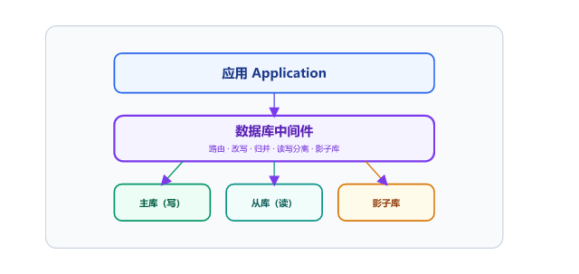
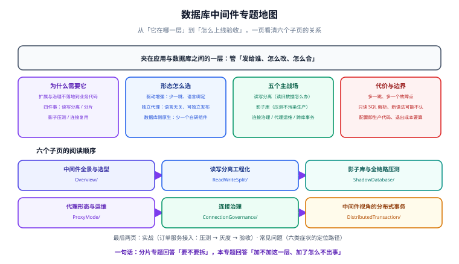

# 数据库中间件

数据库中间件是**夹在应用与数据库之间的一层**：应用连的是它，它再决定这条 SQL 该发往哪个库、哪个实例、哪个影子环境。加这一层的直接收益是**读写分离、分片路由、影子压测、连接复用**这四件事不用改业务代码；代价是多一跳网络、多一套要运维的组件、多一类只有它才懂的故障。

本专题面向要在生产里引入这层中间件的后端与 DBA：先讲清「它在哪一层、该不该加」，再把读写分离、影子库、连接治理、代理形态、分布式事务五个高频场景逐个落成可执行的配置与验收。

::: info 本专题与既有专题的分工
库里已有 [分库分表](../Relational/Sharding/index.md) 与 [分布式事务](../../Backend/Microservices/DistributedTransaction/index.md)，本专题**不重复它们的内容**，边界如下：

| 问题 | 去哪看 |
| --- | --- |
| 该不该拆、怎么拆、分片键怎么选、迁移怎么迁 | [分库分表](../Relational/Sharding/index.md)（那是**「拆」的决策与设计**） |
| 单机内的索引、慢查询、执行计划 | [SQL 优化](../Relational/SQLOptimization/index.md) |
| 分布式事务的原理、2PC/TCC/SAGA 怎么选 | [分布式事务](../../Backend/Microservices/DistributedTransaction/index.md) |
| **本专题**：中间件这一层怎么选形态、读写分离怎么不读脏数据、影子库怎么压出真实容量、连接怎么不被拖垮 | 就是这里 |

一句话：分片专题回答「**要不要拆**」，本专题回答「**加不加这一层、加了之后怎么不出事**」。
:::

## 目录

- [中间件全景与选型](Overview/index.md) - 它夹在哪一层、三种形态、能力矩阵、什么时候根本不需要它
- [读写分离工程化](ReadWriteSplit/index.md) - 复制延迟、强制主库、事务内一致性、延迟感知与降级
- [影子库与全链路压测](ShadowDatabase/index.md) - 影子库 vs 影子表、压测标透传、数据隔离与清理
- [代理形态与运维](ProxyMode/index.md) - ShardingSphere-Proxy / ProxySQL / MySQL Router / Vitess 对比与灰度
- [连接治理](ConnectionGovernance/index.md) - 连接数乘积陷阱、多路复用、连接风暴与兜底
- [中间件视角的分布式事务](DistributedTransaction/index.md) - XA 与 Seata 在中间件里怎么开、怎么验、边界在哪
- [实战：为订单服务接入中间件](Practice/index.md) - 读写分离 + 影子库 + 灰度，含配置与验收清单
- [常见问题与排错](FAQ/index.md) - 五类典型故障的定位路径与反模式清单

## 一句话理解

::: tip 一句话理解
中间件是**给数据库加的一层「交换机」**：它不理解你的业务，只认识规则。规则写得对，应用一行不改就获得扩展能力；规则写错，故障会以「偶发、单条 SQL、无法复现」的形式出现——**这正是它最贵的地方**。
:::

## 版本状态速览（2026-09 核对）

| 组件 | 形态 | 当前状态 | 说明 |
| --- | --- | --- | --- |
| Apache ShardingSphere | 驱动增强 + 代理 | **5.5.3（2026-02-28）为主线**，5.5.4 开发中；5.4 及更早已停止维护 | 官网首页的 6.x~8.x 是**路线图篇章编号**，不是已发布版本号，选型以 Releases 页为准 |
| ProxySQL | 代理（MySQL 协议） | **2.7.x 为稳定线**，2.4 及更早为旧线 | 强项是连接复用、查询规则与防火墙，不是分片 |
| MySQL Router | 代理（官方随 InnoDB Cluster 发行） | 跟随 MySQL 8.4 LTS / 9.x 主线 | 官方组件，做读写分离与路由；分片能力弱于第三方方案 |
| MyCat | 代理 | **1.6.x 长期停在维护状态**，社区活跃度低 | 存量系统仍在用；新项目不建议引入 |
| Vitess | 代理 + 控制面 | 由 CNCF 托管，主线跟随 MySQL 8.4 / 9.x | 面向超大规模分片，运维复杂度也最高一级 |

::: danger 注意
**中间件版本与数据库大版本强绑定**，这是它比普通依赖更容易出事的原因：代理层要解析 SQL 协议与语法，数据库升级出一个新语法（窗口函数、CTE、新的 JSON 操作符）时，中间件可能「不认识」而报错或改写错。升级数据库之前，**先在预发用真实 SQL 回放跑一轮**，这条比看 changelog 更重要。
:::
