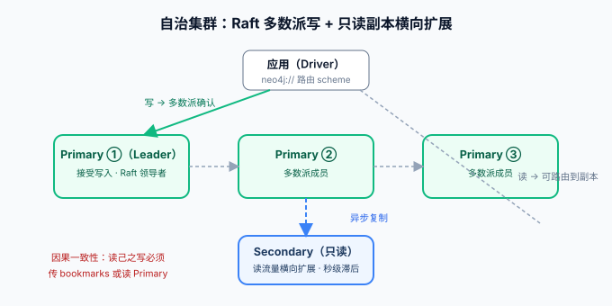

# 架构与集群

本页回答三个工程问题：**单机为什么快**（记录级存储 + 无缝指针）、**集群怎么组**（5.x 的自治集群：Raft 多数派写 + 秒级只读副本）、**一致性怎么理解**（因果一致性——读自己的写是保证的，读别人的写有时差）。内容以 5.26 LTS 为基线，与 4.4 的 causal cluster 概念差异会单独标注。

## 单机存储：为什么图遍历不需要 join

Neo4j 是**原生图库**：节点、关系、属性分文件存，**每个关系记录里直接存着起止节点的物理地址（记录 ID）**。遍历「A 的所有关注」不是 join 两个表，而是从 A 的记录里取关系链、沿指针直接跳到下一条记录——**一次指针解引用，不经过任何查找结构**。这解释了[概述页](../Overview/index.md)的结论：图的优势是模型层面的，不是索引调出来的。

写入路径同样值得知道：图不是 B+ 树，**追加写 + 记录定长**是常态，但**高度数节点的写放大**是真实瓶颈（一个被万人关注的节点，每加一条边都要维护它的关系链）——超级节点（super node）问题在建模时就要预判。

## 集群形态：自治集群（Autonomous Clustering）

5.x 的集群只有两种角色，**以数据库为单位配置**（不是以服务器为单位）：

| 角色 | 数量 | 职责 | 一致性行为 |
| --- | --- | --- | --- |
| **Primary** | 通常 3 个（奇数） | 接受写入，**Raft 多数派提交**后才确认 | 强一致（多数派） |
| **Secondary** | 0~N 个 | 从主库拉数据，**只读**，服务横向扩展的读流量 | 异步复制，秒级滞后 |

关键机制：

- **Raft 多数派写**：写请求由 primary 组内领导者复制到多数成员（3 节点集群容忍 1 个故障），确认后返回客户端——**没有「可能丢」的窗口**，代价是写延迟 = 最慢的多数派成员；
- **读路由**：驱动带 `neo4j://` 路由 scheme 时，读请求可被路由到 secondary 分担压力；
- **库级拓扑**：`CREATE DATABASE foo TOPOLOGY 3 PRIMARIES 2 SECONDARIES`——不同库可以不同副本策略（Community 版无集群能力，集群是 Enterprise 特性）。

::: info 与 4.4 的概念对应
4.4 的 **core / read replica** 在 5.x 改名 **primary / secondary**，机制从 causal clustering 演进为自治集群（自动发现、自动重选主）；「core 只写、replica 只读」的心智模型不变，迁移时主要是配置键与拓扑声明的改写。
:::

## 一致性：因果一致性（Causal Consistency）

集群对外提供的是**因果一致性**而非线性一致：你的**写**提交后，**你自己的后续读**保证能看到（会话令牌 `bookmarks` 串起来）；但**别的会话刚写的数据**，经由 secondary 读可能短暂看不到。

| 场景 | 表现 | 工程对策 |
| --- | --- | --- |
| 写后自己读（改完资料刷新页面） | 保证可见（bookmark 传递） | 驱动默认在会话内传递 bookmarks |
| A 写、B 立刻读（经 secondary） | 可能读到旧值 | 关键读显式 `ACCESS_MODE: READ` 到 primary，或用 bookmarks 把 A 的会话令牌传给 B 的会话 |
| 统计报表 / 推荐计算 | 容忍秒级滞后 | 正常走 secondary，把「读己之写」留给个人数据 |

::: danger 易错点
「用户发了评论 → 列表页立刻要看到自己评论」这类链路，如果列表走了 secondary 而写入了 primary，会偶发「刚发的评论刷新不出来」——不是 bug，是读路由设计使然。**判定标准：这条读链路的作者和读者是不是同一个人**；是，则必须保证 bookmarks 传递或读 primary。
:::

## 备份与升级要点

- **备份**：`neo4j admin database dump`（离线）或 Enterprise 的 `neo4j-admin database backup`（在线、增量链）；Community 只能停机 dump——这也是生产上选 Enterprise 的常见理由；
- **升级策略**：先落 **5.26 LTS**（支持至 2028-06），从 4.4 必须先到 5.x 再滚动；日历版之间可在集群上**滚动升级**不停机；
- **容量预判**：High_limit 存储格式已在 5.23 弃用，**下一个 LTS 是最后的迁移窗口**，新库一律用默认 Block 格式，别再创建 High_limit 库。

## 验证

1. 单机：`CALL dbms.components()` 确认版本 `5.26.31`；`CALL dbms.listConfig()` 查 `dbms.mode` 为 `SINGLE`；
2. 集群（Enterprise）：`SHOW DATABASES` 查看 topology 列的 primaries/secondaries 数；`CALL dbms.cluster.overview()` 看三个成员的 Raft 角色；
3. 一致性实验：两个 Browser 会话分别执行写与读，观察 secondary 读的滞后；再对比携带 bookmark 的会话——亲手复现一次「因果一致 vs 最终一致」的差异。

## 参考资料

- [Neo4j Operations Manual: Clustering](https://neo4j.com/docs/operations-manual/current/clustering/)
- [Causal clustering & bookmarks](https://neo4j.com/docs/operations-manual/current/clustering/causal-clustering/)
- [Backup and restore](https://neo4j.com/docs/operations-manual/current/backup-restore/)
