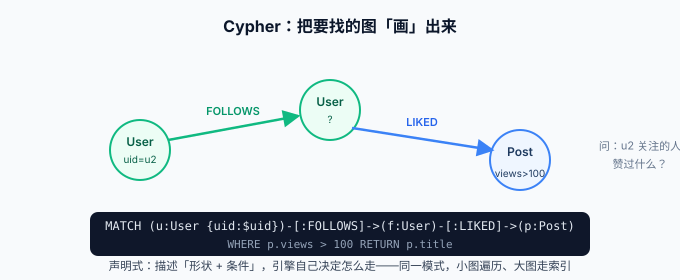

# Cypher 查询语言

Cypher 是 Neo4j 的声明式图查询语言：**用 ASCII 字符画出你要找的图模式**，`(a)-[:FOLLOWS]->(b)` 画出来就是「a 指向 b 的一条关注边」。本页按「读 → 写 → 改删 → 参数化 → 新方言」的顺序把日常够用的 Cypher 讲透，语法基线为 **Cypher 5 与 Cypher 25 双方言**（见文末对照）。



## 读懂一条查询的四段结构

```cypher
MATCH (u:User {uid: $uid})-[:FOLLOWS]->(f:User)-[:LIKED]->(p:Post)   // ① 模式：找到这个形状
WHERE p.views > 100                                                   // ② 过滤：收缩结果
WITH p, count(f) AS likers ORDER BY likers DESC LIMIT 10              // ③ 管道：聚合、排序、截断
RETURN p.title AS 标题, likers                                        // ④ 投影：决定返回什么
```

| 子句 | 作用 | 关系型对照 |
| --- | --- | --- |
| `MATCH` | 匹配图模式（可多段） | FROM + JOIN |
| `WHERE` | 过滤节点/关系属性 | WHERE / ON |
| `WITH` | 把上一段结果当输入开下一段（管道） | 子查询 / CTE |
| `RETURN` | 投影输出 | SELECT |
| `ORDER BY / SKIP / LIMIT` | 排序分页 | 同名 |
| `CALL` | 调用存储过程或子查询 | CALL |

::: tip 读方向
`->` 与 `<-` 是**模式的画法**，不是过滤方向——`MATCH (a)-[:FOLLOWS]->(b)` 与 `(b)<-[:FOLLOWS]-(a)` 是同一个模式。方向写反不会报错，只会查到空结果，这是初学最常见的「查不到还以为自己数据错了」。
:::

## 写入：CREATE 与 MERGE 的幂等差异

```cypher
// CREATE：无条件新建（重复执行会产生重复数据）
CREATE (u:User {uid: 'u3', name: '王五'});

// MERGE：按模式「有则复用，无则创建」——图世界的 upsert
MERGE (u:User {uid: 'u3'})
  ON CREATE SET u.createdAt = datetime(), u.name = '王五'
  ON MATCH SET u.lastSeen   = datetime();
```

**MERGE 的关键纪律**：`MERGE` 括号里只能放**身份属性**（全匹配才命中），其他属性放到 `ON CREATE SET` / `ON MATCH SET`。把非身份属性写进 MERGE 模式，两次数据略有不同的执行会创建出两个「同一个 uid」的节点——这是图库最常见的重复数据来源。

```cypher
// 建关系也用 MERGE：重复执行不会叠加同一条边
MATCH (a:User {uid: 'u1'}), (b:User {uid: 'u2'})
MERGE (a)-[r:FOLLOWS]->(b)
  ON CREATE SET r.since = date();
```

::: danger 易错点
1. `MERGE (u:User {uid:'u3', name:'王五'})` 之后再执行 `MERGE (u:User {uid:'u3', name:'王五2'})` ——**会出现两个 uid 相同的节点**。正确写法是身份属性进 MERGE、其余进 `ON CREATE SET`。
2. 忘写 `DETACH` 直接 `DELETE` 还有关系的节点会报错 `Cannot delete node, because it still has relationships`——这是保护机制，不是 bug。清节点用 `DETACH DELETE`。
:::

## 改与删

```cypher
// SET：增改属性；REMOVE：删属性
MATCH (u:User {uid: 'u1'}) SET u.vip = true, u.level = coalesce(u.level, 0) + 1;
MATCH (u:User {uid: 'u1'}) REMOVE u.vip;

// 删关系（保留节点）
MATCH (:User {uid:'u1'})-[r:FOLLOWS]->() DELETE r;

// 删节点及其全部关系
MATCH (u:User {uid: 'u1'}) DETACH DELETE u;

// 条件批量删：先 count 再删
MATCH (p:Post) WHERE p.views < 10 DETACH DELETE p;
```

## 聚合与多跳

```cypher
// 统计：每个分类下有多少文章
MATCH (p:Post)-[:BELONGS_TO]->(c:Category)
RETURN c.name AS 分类, count(p) AS 文章数 ORDER BY 文章数 DESC;

// 变长路径：1~3 跳内的关注链（Cypher 5 语法）
MATCH (u:User {uid:'u1'})-[:FOLLOWS*1..3]->(f:User)
RETURN DISTINCT f.name;

// 最短路径
MATCH p = shortestPath((a:User {uid:'u1'})-[:FOLLOWS*]-(b:User {uid:'u9'}))
RETURN length(p) AS 最短距离;
```

::: warning 说明
无界变长路径 `*` 在大图上是**性能炸弹**——六度人脉的中间态可能是全图。必须给上界（`*1..3`）或改用 [GDS 的路径算法](../GDS/index.md)。
:::

## 参数化：应用层的唯一正确姿势

Driver 里一律用参数（`$uid`），**不要字符串拼接**——既是注入防护，也让查询计划缓存生效：

```cypher
MATCH (u:User {uid: $uid})-[:FOLLOWS]->(f:User)
RETURN f.name LIMIT $limit;
```

Browser 里用 `:param uid => 'u1'` 预设参数后再执行含 `$uid` 的语句，方便调试。

## Cypher 25：新方言的四个变化

自 2025.06 起，每个数据库可以选择语言版本：**Cypher 5（兼容方言，存量查询原样跑）** 或 **Cypher 25（新方言，新语法在此落地）**。日常最相关的四个变化：

| 变化 | Cypher 5（存量写法） | Cypher 25 |
| --- | --- | --- |
| 变长路径 | `-[:FOLLOWS*1..3]->` | 仍可用；新代码建议**量词路径模式 QPP**：`(()-[:FOLLOWS]->()){1,3}` |
| 存在性判断 | `WHERE (u)-[:LIKED]->()` 模式谓词 | 统一用 `WHERE EXISTS { (u)-[:LIKED]->() }` |
| 默认行为 | 老语义全保留 | 移除一批弃用写法（如裸 `exists()` 函数） |
| 新能力 | — | 动态属性访问 `p[$key]`、`ANY`/`ALL` 量词增强等 |

版本策略：**新项目直接 Cypher 25**；存量项目保持 Cypher 5，把「重放查询日志、清理弃用告警」当作切换前的验收动作——这与首页版本状态表的「先 5.26 LTS 再滚动升级」是同一个思路：**兼容方言就是你的迁移缓冲区**。

## 验证

1. 依次执行本页全部示例（先跑 Install 页建的小图），每条无报错；
2. 故意重复执行两次「MERGE 关系」那条，再 `MATCH (:User {uid:'u1'})-[r:FOLLOWS]->(:User {uid:'u2'}) RETURN count(r)`，预期 `1`（幂等成立）；
3. 把 MERGE 示例改成「身份属性混入」的错误版执行两次，`count(n)` 变 2——亲手制造一次重复数据，比背十条纪律记得牢；
4. `EXPLAIN` 变长路径查询，确认计划里出现 `VarLengthExpand`，并试一下无界 `*` 在小图上的耗时差异。

## 参考资料

- [Cypher Manual](https://neo4j.com/docs/cypher-manual/current/)
- [Cypher 25 与 GQL](https://neo4j.com/docs/cypher-manual/current/cypher-25/)
- [MERGE 语义官方说明](https://neo4j.com/docs/cypher-manual/current/clauses/merge/)
