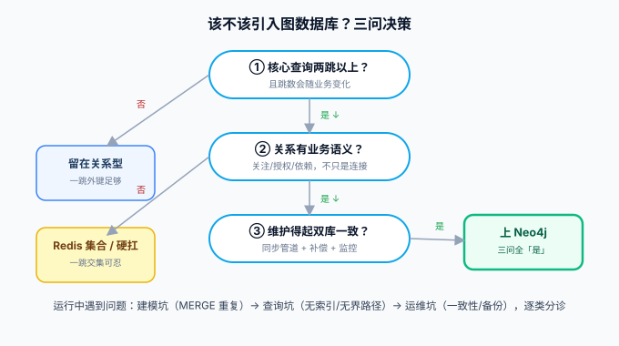

# 常见问题与最佳实践

本页是 Neo4j 日常使用的排错手册与纪律清单：先给一张「什么时候该不该用图」的决策图，再把实践中最常见的坑按「建模 → 查询 → 运维」分诊，最后是升级路径。



## 我到底需不需要图数据库？

三问自检，全部「是」才值得引入：

1. 核心查询是否**两跳以上**、且跳数会随业务变化？（一跳外键关联，关系型完全够用）
2. 关系本身是否**有业务语义**（关注、授权、依赖），而不只是「表的连接方式」？
3. 是否**做得起双库一致性**（同步管道 + 补偿 + 监控）？做不到就先用 Redis 集合或关系型硬扛，同时承认它的上限。

## 建模与查询六类坑

| # | 症状 | 根因 | 正确做法 |
| --- | --- | --- | --- |
| 1 | 同一 `uid` 出现多个节点 | MERGE 模式里混入非身份属性 | 身份属性进 MERGE，其余进 `ON CREATE SET`；唯一性约束兜底 |
| 2 | 查询很慢，`EXPLAIN` 是 `LabelScan` | 没建索引或属性类型不匹配 | 按[索引页](../IndexConstraint/index.md)三步排查（建了？用了？代价？） |
| 3 | 变长路径把库打挂 | 无界 `*` 在大图上中间态爆炸 | 上界 `*1..3`；全图算法交给 GDS |
| 4 | 删节点报 `still has relationships` | 未先删关系 | `DETACH DELETE` |
| 5 | 「刚写的读不到」 | secondary 读的因果一致性窗口 | 读己之写传 bookmarks 或读 primary（[集群页](../Cluster/index.md)） |
| 6 | 图越用越「胖」但查询没变快 | 把账本属性也复制进了图 | 图只放 ID + 遍历必需属性，账本留主库 |

## 运维三问

**内存怎么配？** 堆内存（`server.heap.initial/max.size`）服务查询执行与事务状态；页缓存（`server.memory.pagecache.size`）决定热点图数据是否在内存——**页缓存能装下常用子图是图查询快的前提**，两者加起来留够 OS 缓存。粗略起点：页缓存 ≈ 图文件大小，堆 8~16 GB 起步再按 `PROFILE` 调。

**备份怎么做？** Community 只能停机 `dump`；生产用 Enterprise 的在线 `backup`（增量链）+ 定期演练恢复——[备份与容灾](../../../Ops/BackupDR/index.md)的 RTO/RPO 方法论完全适用。

**监控看什么？** 页缓存命中率（`neo4j.page_cache.hits`）、事务延迟、Raft 提交延迟（集群）、检查点时长。接 Prometheus 的方法见[监控告警专题](../../../Ops/Monitoring/index.md)。

## 升级路径（2026-10 口径）

```text
4.4（已 EOL）──→ 5.26 LTS（当前落点，支持至 2028-06）──→ 日历版（可选滚动）
                    ↑ 必经中转：4.4 不能直跳日历版           ↑ 集群滚动升级不停机
```

升级前必做三件事：**重放查询日志**清掉 Cypher 弃用告警（决定 Cypher 5 / Cypher 25 方言）、确认 BTREE 索引已重建为 RANGE/TEXT/POINT/VECTOR、High_limit 库在下一个 LTS 前迁移到 Block 格式（见首页版本表的预告）。这些判据与[数据库版本状态标注的统一约定](../../TimeSeries/index.md)一致：主线 + 维护中 + 仅存量，逐条可核对。

## 上线前自查表

- [ ] 每个「身份属性」有唯一性约束，且 `EXPLAIN` 起点走 `IndexSeek`；
- [ ] 应用层全部 Cypher 参数化，无字符串拼接；
- [ ] Driver 全局单例 + `verifyConnectivity` fail fast；
- [ ] 变长路径全部有上界；全图算法只跑在 GDS 投影且用完 `drop`；
- [ ] 「读己之写」链路验证过 bookmark 传递或读 primary；
- [ ] 同步管道（双写/CDC/对账）有对账监控与补偿手段；
- [ ] 备份可恢复（演练过一次真恢复，不是只看过备份文件存在）；
- [ ] 版本落在 5.26 LTS 或明确跟得动日历版节奏；
- [ ] 图库挂了主业务仍可用（图查询是增强不是单点依赖）。

## 参考资料

- [Neo4j Knowledge Base](https://support.neo4j.com/s/)
- [Operations Manual: Performance](https://neo4j.com/docs/operations-manual/current/performance/)
- [Upgrading Neo4j](https://neo4j.com/docs/operations-manual/current/upgrade/)
