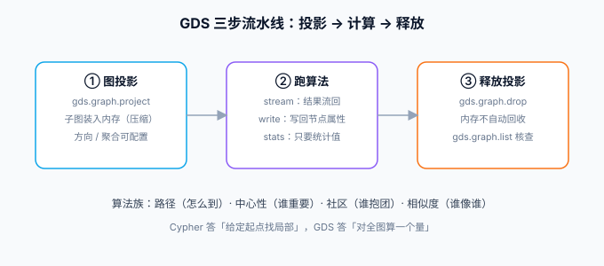

# 图算法与 GDS

Cypher 擅长「找局部模式」，**图算法回答的是全局问题**：谁是全网影响力最大的人、哪些用户天然抱团、两个节点之间除了最短路还有几条可靠路径。这些算法在 **Graph Data Science（GDS）库**里，以存储过程（`CALL gds.*`）的形式提供。本页讲 GDS 的工作模型（图投影）、按任务选算法的方法，以及 Community 与 Enterprise 的边界。



## 核心概念：图投影

GDS 算法不直接在库上跑，而是先**把图（或其子图）以压缩格式投影到内存**，在投影上计算——这与 ClickHouse 物化视图「预计算换查询」是同一种思想：

```cypher
// ① 投影：把 User-FOLLOWS-User 子图装进内存
CALL gds.graph.project('social', 'User', 'FOLLOWS');

// ② 在投影上跑算法（stream 模式：结果以行流回）
CALL gds.pageRank.stream('social')
YIELD nodeId, score
RETURN gds.util.asNode(nodeId).name AS 用户, round(score, 3) AS 影响力
ORDER BY 影响力 DESC LIMIT 10;

// ③ 用完释放（内存不自动回收）
CALL gds.graph.drop('social');
```

投影有三种写法：`stream`（结果流回，适合取 TopN）、`stats`（只要统计值）、`write`（把结果写回节点属性，如 `pagerank` 字段）。**写回属性要慎重**——它是某一时刻的快照，图变了它就旧了，除非配合定时任务刷新。

## 按问题选算法

| 你的问题 | 算法族 | 代表算法 | 典型场景 |
| --- | --- | --- | --- |
| 「从 A 怎么到 B / 最短几步」 | 路径 | Dijkstra、A*、BFS、Delta-Stepping | 导航、依赖链路、人脉距离 |
| 「谁最重要」 | 中心性 | PageRank、Betweenness、Degree | 影响力排序、关键节点识别（挂了最伤的节点） |
| 「谁和谁是一伙的」 | 社区检测 | Louvain、Label Propagation、WCC | 用户分群、团伙识别（风控） |
| 「和它相似的有哪些」 | 相似度 | Node Similarity、kNN | 修改「看了又看」类推荐 |
| 「怎么把图切成几堆」 | 图划分 | Louvain + Leiden | 大图分区、并行计算预处理 |

::: tip 判断是否需要 GDS
Cypher 能答的是「**给定起点找局部**」（两跳好友、同分类文章）；GDS 答的是「**对全图算一个量**」（所有人的影响力、全网社区划分）。如果你的查询每次都对全量数据做 Cypher 聚合，那就是该用 GDS 的信号。
:::

## 完整小例：二度人脉推荐

```cypher
// 目标：给 u1 推荐人——他的关注者关注了、但他还没关注的人（共同好友数排序）
CALL gds.graph.project('social', 'User', {FOLLOWS: {orientation: 'NATURAL'}});

CALL gds.nodeSimilarity.stream('social')
YIELD node1, node2, similarity
WHERE gds.util.asNode(node1).uid = 'u1'
  AND NOT EXISTS { MATCH (:User {uid:'u1'})-[:FOLLOWS]->(x) WHERE x = gds.util.asNode(node2) }
RETURN gds.util.asNode(node2).name AS 推荐人, round(similarity, 3) AS 相似度
ORDER BY 相似度 DESC LIMIT 5;

CALL gds.graph.drop('social');
```

同一条业务在[实战页](../Practice/index.md)里还有纯 Cypher 版本——**小图纯 Cypher 就够，GDS 的价值在图变大之后**（百万级节点起）。

## 版本与许可边界

| 事项 | 口径（2026-10 核对） |
| --- | --- |
| GDS 版本节奏 | 与数据库日历版配套（如 GDS 2026.07.0 配 Neo4j 2026.07.x），版本号对齐方便选型 |
| Community 版 | 包含常用算法（路径、中心性、社区检测、相似度），**投影必须装进有限堆内存** |
| Enterprise 版 | 额外获得：溢出到磁盘的投影、并发算法执行、模型目录等 |
| Docker 获取 | 镜像自带（`/products` 目录），Community 直接可用；GDS Enterprise 需 license |

::: warning 说明
「装了 GDS 却查不到过程」先查两件事：镜像版本是否带 GDS（官方 community 镜像 5.x 起自带）、`CALL gds.debug.listInstalledProcedures()` 的输出；报 `Unknown procedure` 多半是其中之一。
:::

## 验证

1. 在 Docker 实例里执行 `RETURN gds.version()`，确认输出 `2026.x`；
2. 按上文三步（投影 → pageRank.stream → drop）跑通，`CALL gds.graph.list()` 确认投影已释放；
3. 把 Install 页的小图扩到 10 个用户后对比：同一推荐问题，纯 Cypher 与 GDS 版各跑一次 `PROFILE`，观察各自代价——建立「什么时候才需要 GDS」的手感。

## 参考资料

- [Graph Data Science Library 文档](https://neo4j.com/docs/graph-data-science/current/)
- [算法列表与参数](https://neo4j.com/docs/graph-data-science/current/algorithms/)
- [Graph projections](https://neo4j.com/docs/graph-data-science/current/graphs-python/graph-project/)
