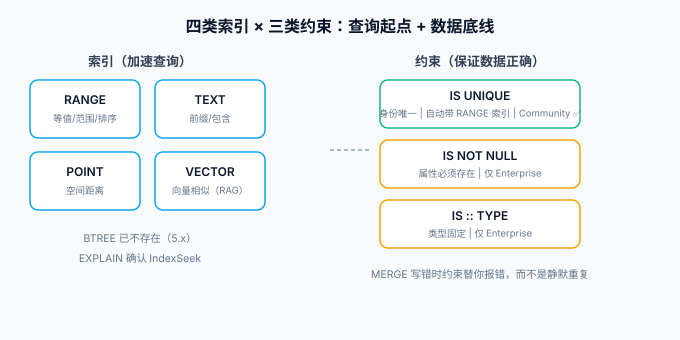

# 索引与约束

Neo4j 默认**没有自动索引**——没有约束的 `MATCH (u:User {uid: 'u1'})` 走的是全标签扫描（`NodeByLabelScan`）。图数据库快的是「遍历」，但**遍历的起点必须能快速定位**，这个起点就是索引；**数据完整性则靠约束**保证。本页讲 5.x 的四类索引、三类约束，以及怎么看执行计划确认它们真的生效。



## 四类索引

5.x 起 BTREE 索引不存在了，全部拆成按用途命名的四类：

| 类型 | 语法关键字 | 适用查询 | 示例 |
| --- | --- | --- | --- |
| **RANGE**（默认） | `CREATE INDEX ... FOR (n:Label) ON (n.prop)` | 等值 + 范围 + 排序 | 按 `uid` 定位、按 `createdAt` 范围查 |
| **TEXT** | `... AS IS TEXT` | `STARTS WITH` / `ENDS WITH` / `CONTAINS` | 标题模糊前缀匹配 |
| **POINT** | `AS IS POINT` | 空间距离查询 | 「附近的门店」 |
| **VECTOR** | `... AS IS VECTOR`（5.13+） | 向量相似检索 | RAG 场景的嵌入向量 |

```cypher
// RANGE（缺省类型）：等值/范围的主力
CREATE INDEX user_uid IF NOT EXISTS FOR (u:User) ON (u.uid);

// TEXT：只服务字符串前缀/包含匹配
CREATE INDEX post_title_text IF NOT EXISTS
FOR (p:Post) ON (p.title) OPTIONS {indexProvider: 'text-1.0'};

// VECTOR：RAG 场景，向量维度与相似度函数必须与嵌入模型一致
CREATE VECTOR INDEX post_embedding IF NOT EXISTS
FOR (p:Post) ON (p.embedding)
OPTIONS {indexConfig: {
  `vector.dimensions`: 1024,
  `vector.similarity_function`: 'cosine'
}};

// 复合索引：最左前缀原则与关系型一致
CREATE INDEX user_level_created FOR (u:User) ON (u.level, u.createdAt);
```

::: info 关系型经验照搬的部分
最左前缀、覆盖场景优先窄索引、「索引不是越多越好」（每个索引都拖慢写入）——这些**全部适用**。不适用的是：图里没有「外键索引」概念，关系的遍历性能取决于**关系的存储方向与度数**（见 [架构与集群](../Cluster/index.md)），不是索引。
:::

## 三类约束

```cypher
// ① 唯一性约束：业务身份的唯一防线（自动附带一个 RANGE 索引）
CREATE CONSTRAINT user_uid_unique IF NOT EXISTS
FOR (u:User) REQUIRE u.uid IS UNIQUE;

// ② 存在性约束：Enterprise 版功能，Community 无
CREATE CONSTRAINT user_name_exists IF NOT EXISTS
FOR (u:User) REQUIRE u.name IS NOT NULL;

// ③ 属性类型约束：把「类型脏数据」挡在库外
CREATE CONSTRAINT user_level_type IF NOT EXISTS
FOR (u:User) REQUIRE u.level IS :: INTEGER;
```

| 约束 | 作用 | Community 可用 |
| --- | --- | --- |
| `IS UNIQUE` | 属性值全库唯一，冲突写入直接报错 | ✅ |
| `IS NOT NULL` | 属性必须存在 | ❌（仅 Enterprise） |
| `IS :: TYPE` | 属性类型固定（Cypher 25 语法） | ❌（仅 Enterprise） |
| `IS NODE KEY` | 存在 + 唯一（Enterprise） | ❌ |

::: tip 建模约定
**每个「身份属性」都配唯一性约束**（`uid`、`pid`、`slug`），这是把 Cypher 页里「MERGE 产生重复节点」的问题在数据库层面焊死——应用层的 MERGE 写错了，约束会替你报错而不是静默重复。
:::

## 执行计划：确认索引真的被用上

```cypher
EXPLAIN MATCH (u:User {uid: 'u1'}) RETURN u.name;
// 看计划：NodeByIndexSeek = 走索引 ✅
//         NodeByLabelScan = 全标签扫描 ❌ 索引没建/没命中

PROFILE MATCH (u:User {uid: 'u1'})-[:FOLLOWS]->(f) RETURN f;
// PROFILE 实际执行并显示每步行数与 db hits，定位慢在哪一步
```

排查顺序固定三步：**建了没有**（`SHOW INDEXES`）→ **用上没有**（`EXPLAIN`）→ **代价多大**（`PROFILE` 的 `db hits`）。跳过前两步直接看 `PROFILE` 是最常见的弯路。

## 验证

1. 执行本页全部 DDL 后 `SHOW INDEXES` 与 `SHOW CONSTRAINTS` 各能看到对应条目；
2. `EXPLAIN MATCH (u:User {uid:'u1'}) RETURN u` 出现 `NodeByIndexSeek`；
3. 向 `uid: 'u1'` 再插入一个 User，预期报 `ConstraintValidationFailed`——约束生效的直接证据；
4. `CALL db.indexes()` 查看各索引的 provider 与状态为 `ONLINE`。

## 参考资料

- [Indexes for search performance](https://neo4j.com/docs/cypher-manual/current/indexes-for-search-performance/)
- [Administration: Constraints](https://neo4j.com/docs/cypher-manual/current/constraints/)
- [Vector indexes](https://neo4j.com/docs/cypher-manual/current/indexes-for-search-performance/vector-indexes/)
