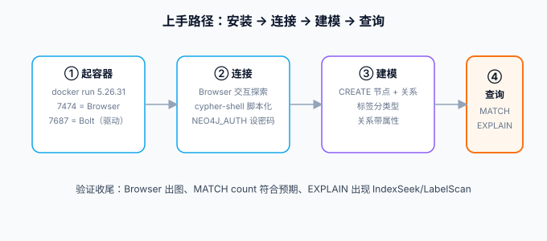

# 安装与快速上手

本页把 Neo4j 跑起来并完成第一次建模查询：Docker 起一个 5.26 LTS 实例 → 用 Browser 与 cypher-shell 连接 → 建一个「用户-文章-分类」小图 → 学会用 `EXPLAIN` 看查询。全程以 **2026-10 核对的 5.26 LTS（5.26.31）** 为基线。



## 安装方式选型

| 方式 | 适用 | 命令要点 |
| --- | --- | --- |
| **Docker**（推荐） | 本地开发、CI、单机部署 | `docker run` 一个容器搞定，版本好控 |
| 官方 tar 包 | 裸机 / 虚机，无 Docker 环境 | 下载 `neo4j-community-5.26.31-unix.tar.gz`，需自备 JDK 21 |
| apt / yum 仓库 | Linux 长期运维 | 官方仓库 `deb https://debian.neo4j.com stable latest` |
| Neo4j Desktop | Windows / Mac 桌面开发 | 图形界面管理多实例，适合纯本地练手 |
| AuraDB | 云上托管 | 免运维，免费层可练手；生产按需 |

::: info 版本说明
5.x 要求 **JDK 21**（tar 包方式需自行安装；Docker 镜像已内置）。日历版（2026.09 等）每月更新、支持窗口约一个月，生产落地建议 5.26 LTS，理由见[专题首页版本状态表](../index.md)。
:::

## 用 Docker 起一个实例

```shell
docker run -d --name neo4j \
  -p 7474:7474 -p 7687:7687 \
  -e NEO4J_AUTH=neo4j/test12345 \
  -v neo4j-data:/data \
  neo4j:5.26.31-community
```

两个端口各司其职：**7474** 是 HTTP（Browser 网页控制台），**7687** 是 Bolt 协议（驱动连接用）。`NEO4J_AUTH` 设置初始密码——**首次登录会强制改密码的旧规则在 5.x 中不存在**，环境变量给什么就用什么，但至少 8 位，否则容器起不来。

启动后访问 `http://localhost:7474/`，用 `neo4j / test12345` 登录，确认能看到工作台界面、无报错，即部署成功。

::: danger 注意
`NEO4J_AUTH=none` 可以关掉认证，但**只允许在容器网络内部且未暴露端口时使用**；把无认证实例的 7687 暴露到宿主机等于把数据库裸奔到内网，安全加固专题里的「默认拒绝」原则在这里同样适用。
:::

## 两种客户端：Browser 与 cypher-shell

**Browser**（网页）适合交互探索：结果默认渲染成图，节点可以拖动、点开看属性，是学 Cypher 阶段最有反馈感的工具。注意它默认只渲染 300 个节点（可视化限制，不是查询限制）。

**cypher-shell**（命令行）适合脚本化与生产运维：

```shell
docker exec -it neo4j cypher-shell -u neo4j -p test12345
```

```text
neo4j@neo4j> RETURN 1 AS one;
one
---
1

Query returned 1 row in 12 ms.
```

## 第一个图模型：用户-文章-分类

在 Browser 或 cypher-shell 里依次执行（完整可复制）：

```cypher
// 1. 建节点
CREATE (:User {uid: 'u1', name: '张三'}),
       (:User {uid: 'u2', name: '李四'}),
       (:Post {pid: 'p1', title: '图数据库入门', views: 100}),
       (:Post {pid: 'p2', title: 'Cypher 速查', views: 50}),
       (:Category {name: '数据库'});

// 2. 建关系（分类、关注、点赞）
MATCH (c:Category {name: '数据库'}), (p1:Post {pid: 'p1'}), (p2:Post {pid: 'p2'})
CREATE (p1)-[:BELONGS_TO]->(c), (p2)-[:BELONGS_TO]->(c);

MATCH (u1:User {uid: 'u1'}), (u2:User {uid: 'u2'}),
      (p1:Post {pid: 'p1'}), (p2:Post {pid: 'p2'})
CREATE (u2)-[:FOLLOWS]->(u1),
       (u1)-[:LIKED]->(p1),
       (u1)-[:LIKED]->(p2);

// 3. 问一个问题：李四关注的人点赞过哪些文章？
MATCH (u:User {uid: 'u2'})-[:FOLLOWS]->(:User)-[:LIKED]->(p:Post)
RETURN p.title AS 标题, p.views AS 浏览量;
```

预期输出（顺序可能不同）：

```text
标题          | 浏览量
-------------+-------
图数据库入门  | 100
Cypher 速查   | 50
```

一次两跳遍历就拿到了答案——同样的查询放到关系型数据库是三层 join。这就是本专题要反复验证的模型优势。

## 清空与重来

练习阶段会反复重建数据，记住这对命令：

```cypher
MATCH (n) DETACH DELETE n;   // 删掉所有节点及其关系（DETACH 先删关系再删节点）
```

::: warning 说明
`MATCH (n) DETACH DELETE n` 不带条件会清空**当前数据库全部数据**，生产库上执行前先 `MATCH (n) RETURN count(n)` 确认连的是哪个库；多库用 `:use <db>` 切换后再动。
:::

## 验证

1. `docker ps` 确认容器 `Up`、`docker logs neo4j` 无 ERROR；
2. Browser 登录后执行 `MATCH (n) RETURN count(n)`，按上文建的数据预期返回 `5`（2 个 User + 2 个 Post + 1 个 Category）；
3. 执行上文第 3 步查询，能返回两篇文章标题；
4. `EXPLAIN MATCH (u:User {uid:'u2'})-[:FOLLOWS]->() RETURN u` 的计划里出现 `NodeByLabelScan` 或 `NodeIndexSeek`，说明统计信息正常。

## 下一步

会跑、会建、会问了，接下来系统学 Cypher——[Cypher 查询语言](../Cypher/index.md)讲模式匹配、MERGE 的幂等语义与 Cypher 25 新方言。
