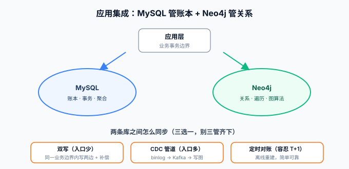

# 应用集成

图库很少单独存在——典型的架构是 **MySQL 管账本 + Neo4j 管关系**，两者之间需要一条同步管道。本页讲三件事：Driver 6.x 的会话与事务模型、Spring Boot 的 Spring Data Neo4j 接入、以及双库共存时的同步策略选型。语言示例以 Java 与 Python 为主。



## Driver：会话与事务模型

版本基线：**Java Driver 6.x**（原生 Vector 类型要求 6.x，5.x 线驱动仍可用但新特性停在 6）。核心对象只有三层：`Driver`（连接池，全局单例）→ `Session`（会话，绑定 causality bookmark，随用随建）→ `Transaction`（事务）。

```java
// build.gradle: implementation 'org.neo4j.driver:neo4j-java-driver:6.x'
try (Driver driver = GraphDatabase.driver("neo4j://localhost:7687",
        AuthTokens.basic("neo4j", System.getenv("NEO4J_PASSWORD")))) {
    driver.verifyConnectivity();   // 启动即验连接，fail fast

    try (Session session = driver.session(SessionConfig.builder()
            .withDatabase("blog").build())) {

        Result result = session.executeRead(tx ->
            tx.run("MATCH (u:User {uid:$uid})-[:FOLLOWS]->(f) RETURN f.name AS name",
                   Map.of("uid", "u1")));           // 读走 executeRead
        result.forEachRemaining(r -> System.out.println(r.get("name").asString()));
    }
}
```

```python
# pip install neo4j
from neo4j import GraphDatabase

with GraphDatabase.driver("neo4j://localhost:7687",
                          auth=("neo4j", password)) as driver:
    driver.verify_connectivity()
    records, _, _ = driver.execute_query(
        "MATCH (u:User {uid:$uid})-[:FOLLOWS]->(f) RETURN f.name AS name",
        uid="u1", database_="blog")     # execute_query 自动管会话与重试
```

事务规则一句话：**写用 `executeWrite`，读用 `executeRead`**；两者都带自动重试（可重试异常下重新开事务），所以**事务函数必须写成可重跑的**——不要在事务里发 HTTP、写本地文件这类有副作用的事。

::: danger 易错点
1. `Driver` 用完不关（连接池泄漏）或每次请求新建 Driver（握手风暴）——它必须是应用生命周期的单例；
2. 把 Cypher 语句当字符串拼接用户输入——**图查询注入与 SQL 注入同级**，一律参数化（`$uid`）；
3. 需要「读己之写」的链路不传 bookmark——跨会话读旧值，见[集群页](../Cluster/index.md)的因果一致性。
:::

## Spring Boot：Spring Data Neo4j（SDN）

Java 团队首选 SDN 6+（`spring-boot-starter-data-neo4j`）：接口式仓储 + `@Node` 映射，与 Spring Data JPA 用法对齐。

```java
@Node("User")
public class UserNode {
    @Id private String uid;
    private String name;
    @Relationship(type = "FOLLOWS", direction = Direction.OUTGOING)
    private List<UserNode> follows;   // 关系直接映射为属性
}

public interface UserRepository extends Neo4jRepository<UserNode, String> {
    // 派生查询：方法名即 Cypher
    List<UserNode> findByFollowsUid(String uid);

    @Query("MATCH (u:User {uid:$uid})-[:FOLLOWS*1..2]->(f) " +
           "WHERE NOT EXISTS { (u)-[:FOLLOWS]->(f) } " +
           "RETURN f ORDER BY size((f)<-[:FOLLOWS]-()) DESC LIMIT $limit")
    List<UserNode> recommendFollows(String uid, int limit);  // 复杂模式手写
}
```

**SDN 的取舍要明确**：派生查询与简单遍历很省事；但**深度遍历的对象图映射会把整棵子树加载进内存**——`follows` 链一长，一次查询拉回半个图。纪律是：**复杂图查询手写 `@Query` 返回投影（DTO），不要让 ORM 替你做深遍历**；遍历深、算法重的场景直接退回原生 Driver。

## 与主库共存：三条同步路线

| 路线 | 做法 | 适合 | 代价 |
| --- | --- | --- | --- |
| **双写** | 应用层在同一业务事务边界内分别写 MySQL 与 Neo4j | 图数据只在少数入口产生 | 无中间件，但要处理两边失败的一致性（补偿任务） |
| **CDC 管道** | MySQL binlog → Kafka → 消费端写图 | 图数据由主库多张表派生、更新入口多 | 引入消息链路；[数据同步与 CDC](../../DataModeling/index.md) 是后续专题 |
| **定时对账** | 低频全量/增量重建图 | 图是分析产物（离线推荐、报表），容忍 T+1 | 简单可靠，实时性差 |

选型判据一句话：**图的更新入口越少越选双写，越分散越选 CDC，越能容忍延迟越选对账**。不要在「双写 + CDC + 对账」三管齐下——三条管道三套时序 bug。

## 验证

1. Java/Python 示例连上 Install 页的 Docker 实例，`verifyConnectivity` 通过后查出李四关注的人赞过的文章；
2. 把 `uid` 换成不存在的值再查，确认返回空集而非报错（空图是正常业务态）；
3. SDN：写一个 `@Query` 版推荐查询，`EXPLAIN` 确认起点走了索引；
4. 故意把 `executeWrite` 的事务函数里塞一个必抛异常，观察自动重试三次后返回错误——验证重试语义存在，并理解为什么事务函数不能有外部副作用。

## 参考资料

- [Java Driver Manual](https://neo4j.com/docs/java-manual/current/)
- [Spring Data Neo4j 参考文档](https://docs.spring.io/spring-data/neo4j/reference/)
- [Python Driver](https://neo4j.com/docs/python-manual/current/)
