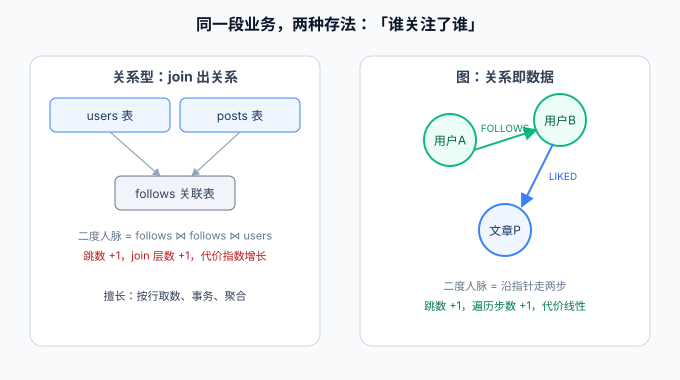

# 图模型与 Neo4j 概述

Neo4j 是目前应用最广的**原生图数据库**（Native Graph Database，2007 年首发、Java 编写）：数据以**属性图**（Property Graph）模型组织——节点存实体、关系存连接、两者都能挂属性。它的核心价值是**把「关系遍历」从 join 的代价问题变成沿指针走几步的问题**，因此天生适合社交、推荐、权限、知识图谱这类「连接本身有业务含义」的场景。



## 一句话定位

「找这个人的一条记录」用任何库都一样快；「找这个人的朋友的朋友买过什么」——在关系型数据库里是**多表 join、代价随跳数指数增长**的查询，在 Neo4j 里是**从节点出发沿关系走两步**的遍历。判断要不要引入 Neo4j，就看你的核心查询是不是长这样。

## 属性图模型：三个构件

| 构件 | 英文 | 说明 | 类比关系型 |
| --- | --- | --- | --- |
| 节点 | Node | 实体，用**标签**（Label）分类，如 `(:Person)`、`(:Post)`；一个节点可有多个标签 | 一行记录 + 表名（但多标签更灵活） |
| 关系 | Relationship | **有向、有类型**的连接，如 `[:FOLLOWS]`、`[:LIKED]`；关系必须有起止节点，不能悬空 | 外键 + 关联表（但关系本身可以有属性） |
| 属性 | Property | 节点和关系上的键值对，类型有限（见下），无 schema 强约束 | 列 |

```cypher
// 一个最小的图：两个人 + 一条「关注」关系，关系上还带时间属性
CREATE (a:Person {name: '张三', uid: 'u1'})-[:FOLLOWS {since: date('2026-01-15')}]->(b:Person {name: '李四', uid: 'u2'})
```

属性类型支持：`String`、`Long/Integer/Double`、`Boolean`、`Date/Time/DateTime`、`Duration`、`Point`（空间）、5.x 起还有**原生 Vector 类型**（配合向量索引做相似检索）。没有数组之外的嵌套结构——需要嵌套就用关系表达，这是图模型的纪律。

## 图 vs 关系型 vs 文档型：同一份数据三种存法

以「用户关注文章、文章属于分类」为例：

| 维度 | 关系型（MySQL） | 文档型（MongoDB） | 图（Neo4j） |
| --- | --- | --- | --- |
| 关注关系存哪 | `follows` 关联表 | 内嵌数组或单独集合 | `(:User)-[:FOLLOWS]->(:Post)` 关系 |
| 「我关注的文章列表」 | JOIN 一次，快 | 内嵌数组，快 | 一跳遍历，快 |
| 「我关注的人关注的文章」 | JOIN 三次或子查询，开始疼 | `$lookup` 两层，很疼 | 两跳遍历，仍是一条模式 |
| 「和我关注重合度最高的人」 | 多层自 JOIN，索引也救不了 | 聚合管道写不动 | 一条模式 + `ORDER BY` 计数 |
| 单行事务与报表聚合 | 最强 | 中 | 弱（事务有，但聚合不是主场） |

::: tip 判断标准
关系数据的**跳数**决定体验：一跳（外键关联）关系型最顺手；两跳以上、且跳数会随业务变化（今天二度、明天三度），就该考虑图。**不要用「数据量小所以无所谓」安慰自己——图的价值不在量，在模型的贴合度**。
:::

## 什么时候该用，什么时候不该用

**典型适用场景**：

- **社交与推荐**：共同关注、二度人脉、好友推荐、「买过 A 的人还买了 B」；
- **权限与访问控制**：组织树 + 角色继承 + 资源授权，「这个人能不能访问这个资源」沿边走一遍即得答案；
- **知识图谱 / GraphRAG**：实体与实体关系入图，给 LLM 提供多跳事实（配合 5.x 的向量索引可做图 + 向量混合检索）；
- **反欺诈与风控**：设备、账号、银行卡之间的环与团伙发现（环检测是 join 的地狱、遍历的日常）；
- **影响面分析**：微服务依赖图、网络拓扑，「这个节点挂了影响谁」。

**不该用的场景**：

- 主要负载是**按主键/条件取行、按列聚合报表**——这是 MySQL/ClickHouse 的主场；
- 数据之间**几乎没有关系**或关系永远只有一跳——文档库甚至关系库更简单；
- 需要**海量追加写 + 实时分析**（日志、指标）——时序库与列存的领地；
- 团队没有能力维护**双库一致性**时强行「MySQL 主库 + 图库副本」——同步管道的复杂度会吃掉图查询省下的时间。

## 与存量判断的衔接

[数据建模 · 核心概念](../../DataModeling/CoreConcepts/index.md)里说过：「共同关注、二度人脉这类查询在关系型库里代价很高，不建议硬扛，必要时引入图数据库」——本专题就是那句「必要时」的落地手册。[Redis 的集合](../../NoRelational/Redis/ListSetZSet/index.md)用 `SINTER` 一跳也能算共同关注，但它**只擅长一跳**；一旦要「关注的人的关注」，Redis 与关系型一起出局。

## 参考资料

- [Neo4j 官方文档：Getting Started](https://neo4j.com/docs/get-started/)
- [Graph Database Concepts](https://neo4j.com/docs/graph-database-concepts/)
- [属性图模型与 GQL 标准](https://neo4j.com/blog/developer/property-graph-model/)
