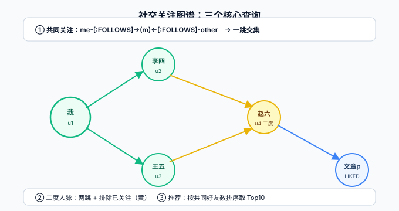

# 实战：社交关注图谱

本页把前七页的能力串成一个完整可运行的场景：**给一个博客/社区产品建关注图谱，实现「共同关注、二度人脉、关注推荐」三个接口级的查询**。所有 Cypher 与 Java 代码完整可复制，数据量小到本地 Docker 实例即可跑通；验收清单在文末，逐条可核对。



## 场景与数据模型

业务只有三类节点、三类关系——**建模纪律：白话里的名词做节点，动词做关系**：

| 元素 | 类型 | 属性 | 说明 |
| --- | --- | --- | --- |
| 用户 | `(:User)` | `uid`（唯一）、`name` | 与主库用户表同 ID，不复制全量属性 |
| 文章 | `(:Post)` | `pid`（唯一）、`title` | 同上，图里只放遍历需要的属性 |
| 关注 | `[:FOLLOWS]` | `since` | 用户 → 用户 |
| 点赞 | `[:LIKED]` | `at` | 用户 → 文章 |
| 发布 | `[:AUTHORED]` | `at` | 用户 → 文章 |

::: tip 与主库的分工
用户资料、文章正文这些「账本数据」留在 MySQL；图里只放 **ID + 遍历必需的属性**。图越瘦，同步管道越简单，投影内存越省——这是[集成页](../Integration/index.md)双写路线的前提。
:::

## 建库：约束先行

```cypher
CREATE CONSTRAINT user_uid_unique IF NOT EXISTS FOR (u:User) REQUIRE u.uid IS UNIQUE;
CREATE CONSTRAINT post_pid_unique  IF NOT EXISTS FOR (p:Post) REQUIRE p.pid IS UNIQUE;
```

## 种子数据（MERGE 幂等，可重复执行）

```cypher
UNWIND [
  {uid:'u1', name:'张三'}, {uid:'u2', name:'李四'},
  {uid:'u3', name:'王五'}, {uid:'u4', name:'赵六'},
  {uid:'u5', name:'钱七'}
] AS row
MERGE (u:User {uid: row.uid}) SET u.name = row.name;

UNWIND [
  {pid:'p1', title:'图数据库入门'}, {pid:'p2', title:'Cypher 速查'},
  {pid:'p3', title:'Spring Boot 实战'}
] AS row
MERGE (p:Post {pid: row.pid}) SET p.title = row.title;

UNWIND [
  {f:'u2', t:'u1'}, {f:'u3', t:'u1'}, {f:'u4', t:'u1'},
  {f:'u5', t:'u3'}, {f:'u1', t:'u3'}
] AS row
MATCH (a:User {uid: row.f}), (b:User {uid: row.t})
MERGE (a)-[:FOLLOWS]->(b);

MATCH (u1:User {uid:'u1'}), (u2:User {uid:'u2'})
MATCH (p1:Post {pid:'p1'}), (p2:Post {pid:'p2'}), (p3:Post {pid:'p3'})
MERGE (u1)-[:AUTHORED]->(p1)
MERGE (u2)-[:AUTHORED]->(p2)
MERGE (u1)-[:LIKED]->(p2)
MERGE (u2)-[:LIKED]->(p3)
MERGE (u3:User {uid:'u3'}) MERGE (u3)-[:LIKED]->(p1);
```

## 三个核心查询

### ① 共同关注：我和张三都关注了谁

```cypher
MATCH (me:User {uid:$uid})-[:FOLLOWS]->(mutual:User)<-[:FOLLOWS]-(other:User {uid:$other})
RETURN mutual.name AS 共同关注;
```

### ② 二度人脉：我关注的人关注的人（还没被我关注）

```cypher
MATCH (me:User {uid:$uid})-[:FOLLOWS]->(:User)-[:FOLLOWS]->(fof:User)
WHERE NOT EXISTS { (me)-[:FOLLOWS]->(fof) } AND me <> fof
RETURN fof.name AS 二度人脉, count(*) AS 路径数
ORDER BY 路径数 DESC, 二度人脉;
```

`count(*)` 是「通过几条路径到达」，即共同好友数——它天然就是推荐理由（「通过李四、王五可认识赵六」）。

### ③ 关注推荐：按被关注度排序的候选

```cypher
MATCH (me:User {uid:$uid})-[:FOLLOWS]->(:User)-[:FOLLOWS]->(cand:User)
WHERE NOT EXISTS { (me)-[:FOLLOWS]->(cand) } AND me <> cand
WITH cand, count(*) AS mutualCount
RETURN cand.name AS 候选人, mutualCount AS 共同好友
ORDER BY mutualCount DESC LIMIT 10;
```

## 应用层：一个接口的完整落法

```java
// service/FollowGraphService.java —— 复用 BackendTemplate 的统一响应与参数校验约定
public Result<List<RecommendItem>> recommend(String uid) {
    try (Session session = driver.session(SessionConfig.forDatabase("social"))) {
        var records = session.executeRead(tx -> tx.run("""
            MATCH (me:User {uid:$uid})-[:FOLLOWS]->(:User)-[:FOLLOWS]->(cand:User)
            WHERE NOT EXISTS { (me)-[:FOLLOWS]->(cand) } AND me <> cand
            WITH cand, count(*) AS mutual
            RETURN cand.uid AS uid, cand.name AS name, mutual AS mutualCount
            ORDER BY mutual DESC LIMIT 10
            """, Map.of("uid", uid)).list());
        var items = records.stream()
            .map(r -> new RecommendItem(r.get("uid").asString(),
                                        r.get("name").asString(),
                                        r.get("mutualCount").asInt()))
            .toList();
        return Result.ok(items);   // 统一响应 Result<T>
    }
}
```

接口约定（对齐[博客平台的契约风格](../../../project/Complete/BlogPlatform/Contract/index.md)）：`GET /api/v1/users/{uid}/recommendations`，200 返回 `Result<List<RecommendItem>>`，用户不存在返回 `Result.fail(USER_NOT_FOUND)`——**空列表与不存在是两个语义**，别合并成 200 空数组糊弄调用方。

## 验收清单

| # | 断言 | 验证方法 |
| --- | --- | --- |
| 1 | 约束生效：重复 uid 插入报 `ConstraintValidationFailed` | `CREATE (u:User {uid:'u1'})` 应报错 |
| 2 | 种子脚本幂等：连续执行两次，节点/关系统计不变 | `MATCH (n) RETURN count(n)` 两次一致 |
| 3 | 共同关注正确：u2 与 u3 的共同关注 = 张三 | 查询 ① 传 `uid=u2, other=u3` |
| 4 | 二度人脉正确：u5 的二度人脉含张三，且不含 u5 已关注的人 | 查询 ② 传 `uid=u5` |
| 5 | 不自我推荐：任何查询结果都不含 `$uid` 本人 | 断言结果列表无本人 |
| 6 | 推荐排序：共同好友多者在前 | 查询 ③ 目测 `mutualCount` 单调递减 |
| 7 | 不存在用户：返回 `USER_NOT_FOUND` 而非空列表 | 接口传 `uid=ghost` |
| 8 | 性能起点：`EXPLAIN` 显示起点走 `NodeByIndexSeek` | 见[IndexConstraint 页](../IndexConstraint/index.md)三步排查 |

::: tip 扩展方向
数据上到十万节点级后：推荐查询改走 [GDS 的 nodeSimilarity](../GDS/index.md)；点赞与浏览行为进图后可做「同好推荐」；权限图谱（组织-角色-资源）是同一套模型的另一个实例——节点换了，方法没换。
:::

## 参考资料

- [Neo4j 社交推荐官方示例](https://neo4j.com/docs/get-started/)
- [EXISTS 子查询](https://neo4j.com/docs/cypher-manual/current/subqueries/exists-subqueries/)
- [本项目接口契约风格](../../../project/Complete/BlogPlatform/Contract/index.md)
