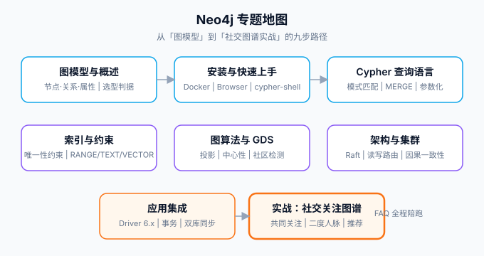

# Neo4j

Neo4j 是**原生图数据库**：数据不是一行行的表，而是「节点 + 关系」组成的图——关系是一等公民，查询「朋友的朋友 who 点赞过什么」不需要 join，沿着关系指针直接走。社交网络、推荐、权限图谱、知识图谱、反欺诈这类「关系本身就是业务」的场景，是它的主场；反之，主要工作是按行增删改查、按列聚合的账本型业务，硬搬进图库只会自找麻烦。

本专题从「图模型长什么样」讲到 Cypher 查询语言、索引与约束、图算法（GDS）、集群架构与应用集成，最后用一套社交关注图谱把「共同关注、二度人脉、好友推荐」的完整链路走一遍。

## 目录

- [图模型与 Neo4j 概述](Overview/index.md) - 属性图模型、图 vs 关系/文档、适用与反适用场景
- [安装与快速上手](Install/index.md) - Docker 部署、Browser 与 cypher-shell、第一个图模型
- [Cypher 查询语言](Cypher/index.md) - 模式匹配、CREATE/MERGE/DELETE、参数化、Cypher 25 新方言
- [索引与约束](IndexConstraint/index.md) - RANGE/TEXT/VECTOR 索引、唯一性与存在性约束、执行计划
- [图算法与 GDS](GDS/index.md) - 图投影、路径搜索、中心性、社区检测、相似度
- [架构与集群](Cluster/index.md) - 记录级存储、Raft 自治集群、读写路由与因果一致性
- [应用集成](Integration/index.md) - Driver 6.x、事务边界、Spring Data Neo4j、与主库共存的同步策略
- [实战：社交关注图谱](Practice/index.md) - 建模、写入、二度人脉与推荐、验收清单
- [常见问题与最佳实践](FAQ/index.md) - 什么时候不该用图、六类反模式、排错路径、升级策略

## 一句话理解

::: tip 一句话理解
MySQL 回答「**这个人的记录是什么**」，Neo4j 回答「**这个人跟谁、隔着几层、以什么关系连着**」。关系查询在关系型数据库里是 join 的代价随深度指数增长的问题，在图数据库里是沿指针走几步的问题——**这不是性能调优能弥补的差异，是数据模型本身的差异**。
:::

## 版本状态速览（2026-10 核对）

Neo4j 自 2025 年 1 月起改用**日历版本号**（`YYYY.MM.补丁`），每月一个 minor；**5.26 是 5.x 线的最后一版，也是当前 LTS**，支持至 **2028-06-06**。从 2025.06 起，每个数据库可以选择 **Cypher 5（兼容方言）** 或 **Cypher 25（新方言）** 两种语言版本。

| 状态 | 版本 | 说明 |
| --- | --- | --- |
| 当前 LTS（推荐生产落点） | **5.26.x**（最新 5.26.31，2026-09-21） | 支持至 2028-06-06；BTREE 索引已不存在，为 RANGE/TEXT/POINT/VECTOR |
| 最新日历版 | 2026.09.0（2026-09-21 发布） | 每月一个 minor，非 LTS 线支持窗口很短（约 1 个月），只适合能跟上滚动节奏的团队 |
| 维护中 | 2026.08.x、2026.07.x | 月度线按官方策略滚动收补丁 |
| 仅存量（已结束支持） | 4.4 及更早（4.4 已于 2025-11-30 结束支持） | 不再收安全补丁；4.4 → 2026.x 无直接升级路径，必须先到 5.26 |

::: danger 注意
生产环境**先落 5.26 LTS 再评估滚动到日历版**——月度线的支持窗口只有约一个月，除非团队能承诺每月升级，否则「最新」不等于「能落生产」。另外官方已预告：**High_limit 存储格式将在下一个 LTS 之后移除**，还在用该格式的库必须在下一个 LTS 的升级窗口内迁移到 Block 格式，届时没有回退选项。
:::

## 与库内其他专题的关系

| 专题 | 关系 |
| --- | --- |
| [MySQL / PostgreSQL](../Relational/MySQL/index.md) | 业务主库：账本、事务、按行聚合在这边；图查询是「按关系走多跳」，两者是互补不是替代 |
| [Redis](../NoRelational/Redis/index.md) | 一跳交集用 `SINTER` 就够；**多跳（朋友的朋友的朋友）才是图库的领地**，边界在跳数 |
| [Elasticsearch](../NoRelational/Elasticsearch/index.md) | 全文检索用 ES；Neo4j 的全文索引只服务图内节点定位，不承担站内搜索 |
| [RAG 检索增强](../../AI/RAG/index.md) | 向量检索用向量库或 Neo4j 5.x 的原生向量索引；知识图谱（GraphRAG）用图关系补足多跳推理 |
| [数据建模](../DataModeling/index.md) | 关系建模讲范式与 join；图建模讲「白话里的名词是节点、动词是关系」，方法论不同 |

## 参考资料

- [Neo4j 官方文档](https://neo4j.com/docs/)
- [Cypher 查询语言文档](https://neo4j.com/docs/cypher-manual/current/)
- [Graph Data Science 库](https://neo4j.com/docs/graph-data-science/current/)
- [Neo4j Operations Manual（版本与升级）](https://neo4j.com/docs/operations-manual/current/)
- [endoflife.date/neo4j（版本时间线）](https://endoflife.date/neo4j)
