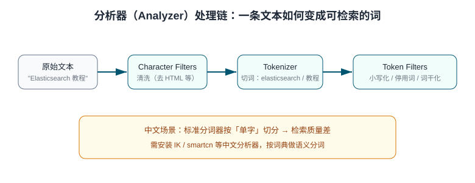

# 中文分词与 IK 分析器

中文没有空格分词，ES 自带的 `standard` 分析器对中文按**单字**切分，导致「蓝牙耳机」会被切成「蓝 / 牙 / 耳 / 机」——匹配精度差、相关性乱。中文场景必须引入专用分析器，其中 **IK Analysis** 是最广泛使用的开源插件。本页覆盖分析器三段结构、IK 安装与使用、ik_max_word 与 ik_smart 的选择、自定义词典与拼音检索。

## 分析器结构回顾



| 组成 | 内置可选 | 作用 |
| --- | --- | --- |
| Character Filters | `html_strip` 等 | 前置清洗（去标签、字符替换） |
| Tokenizer | `standard` / `ik_max_word` / `ik_smart` / `pinyin` | 切词核心 |
| Token Filters | `lowercase` / `stop` / `synonym` | 小写化、停用词、同义词 |

## IK 插件安装

### Docker 安装（推荐）

```shell
# 官方镜像内置 elasticsearch-plugin 命令，版本必须与 ES 完全一致
docker exec -it es9 bin/elasticsearch-plugin install \
  https://get.infini.cloud/elasticsearch/analysis-ik/9.5.3

docker restart es9
# 验证
curl "http://localhost:9200/_cat/plugins"
# 输出应包含 analysis-ik 9.5.3
```

:::danger 插件版本必须严格一致
ES 9.5.3 只能装 `analysis-ik/9.5.3`，版本不一致启动直接失败。ES 启动日志报 `Plugin [analysis-ik] was built for Elasticsearch version X but version Y is running` 即为此问题——升级 ES 时同步升级 IK，先卸载再重装。
:::

### 压缩包方式（Linux 自装）

```shell
su es
cd /opt/elasticsearch-9.5.3
bin/elasticsearch-plugin install https://get.infini.cloud/elasticsearch/analysis-ik/9.5.3
```

## ik_max_word vs ik_smart

| 分析器 | 切分策略 | 适用 |
| --- | --- | --- |
| `ik_max_word` | 最细粒度，尽量多切（「中华人民共和国」→ 全部组合词） | **索引时**：提高召回 |
| `ik_smart` | 粗粒度，无重叠词（→「中华人民共和国」一个词） | **搜索时**：提高精度 |

惯用搭配「**索引用 max_word、搜索用 smart**」：

```shell
curl -X PUT http://localhost:9200/products -H 'Content-Type: application/json' -d '{
  "mappings": {
    "properties": {
      "title": {
        "type": "text",
        "analyzer": "ik_max_word",
        "search_analyzer": "ik_smart"
      }
    }
  }
}'
```

验证切分效果：

```shell
curl -X POST "http://localhost:9200/products/_analyze" -H 'Content-Type: application/json' -d '{
  "analyzer": "ik_max_word", "text": "中华人民共和国国歌"
}'
```

## 自定义词典

IK 支持扩展词（新词、人名、产品名）与停用词。配置文件在插件目录 `config/` 下：

```properties [analysis-ik/config/IKAnalyzer.cfg.xml 片段]
<entry key="ext_dict">custom/ext.dic</entry>
<entry key="ext_stopwords">custom/stop.dic</entry>
<entry key="remote_ext_dict">http://127.0.0.1:8080/hotwords</entry>
```

```text [custom/ext.dic 示例]
蓝牙耳机
无线充电
以旧换新
```

:::tip 热更新
`remote_ext_dict` 指向 HTTP 地址，IK 每分钟（`polling` 间隔）拉取一次，响应头 `Last-Modified` 或 `ETag` 变化即热加载——适合运营每日新增热搜词，不必重启集群。本地 `ext.dic` 修改后需**重启节点**生效。
:::

### 自定义词的验证

```shell
# 未加词典：无线充电 → 无 / 线 / 充 / 电 或错误切分
# 加入 ext.dic 重启后：无线充电 → 无线充电（整词）
curl -X POST "http://localhost:9200/products/_analyze" -H 'Content-Type: application/json' \
  -d '{ "analyzer": "ik_max_word", "text": "支持无线充电的蓝牙耳机" }'
```

## 同义词

同义词在 Token Filter 层配置，需要自定义分析器：

```json
PUT products
{
  "settings": {
    "analysis": {
      "filter": {
        "my_synonym": {
          "type": "synonym",
          "synonyms": ["手机,移动电话,smartphone", "笔记本,笔记本电脑"]
        }
      },
      "analyzer": {
        "ik_synonym": {
          "tokenizer": "ik_smart",
          "filter": ["my_synonym"]
        }
      }
    }
  }
}
```

`synonym` 在索引侧生效（写入时展开同义词）；`synonym_graph` 用于搜索侧（支持多词同义词），两者常配合使用。

## 拼音与搜索联想

拼音检索（输入「lj」联想「蓝牙耳机」）用 pinyin 分析器插件，安装方式同 IK：

```shell
docker exec -it es9 bin/elasticsearch-plugin install \
  https://get.infini.cloud/elasticsearch/analysis-pinyin/9.5.3
docker restart es9
```

```json
"properties": {
  "title_pinyin": {
    "type": "text",
    "analyzer": "pinyin",
    "search_analyzer": "ik_smart"
  }
}
```

配合 `multi_match` 同时查中文字段与拼音字段，即可实现「中文 / 全拼 / 首字母」三合一搜索框。

## 易错点

:::danger 中文分词高频坑
1. **版本不匹配**：见上文 `:::danger`，ES 与 IK 小版本必须一致。
2. **改了映射不生效**：分析器变更只影响**新写入**文档——正确做法是重建索引 + `_reindex`。
3. **索引用 smart、搜素用 max_word 反了**：召回与精度颠倒——记住「索引要全、搜索要准」。
4. **热词加了没反应**：本地词典没放对目录 / 未重启；远程词典检查响应头与轮询间隔。
5. **停用词一刀切**：把「不」设为停用词，「不包邮」类查询全错——电商场景停用词表要谨慎。
:::

## 验证方式

1. `_cat/plugins` 确认插件加载；
2. `_analyze` 分别用 `standard` 与 `ik_max_word` 分析同一句中文，对比 tokens 数量与内容；
3. 写入含自定义词的文档并 `match` 搜索，验证扩展词典生效。

## 参考资料

- [Analysis 官方文档](https://www.elastic.co/docs/manage-data/data-store/text-analysis)
- [analysis-ik（infinilabs）](https://github.com/infinilabs/analysis-ik)
- [analysis-pinyin](https://github.com/infinilabs/analysis-pinyin)
