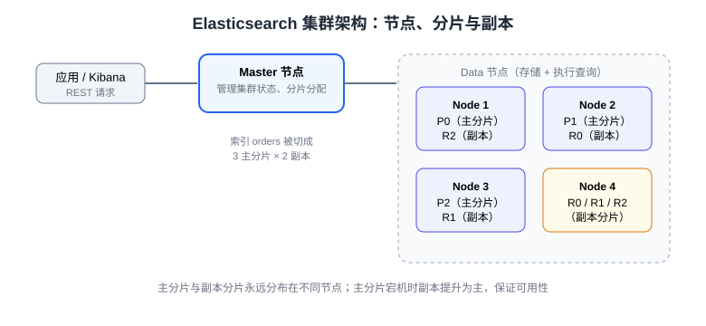

# 集群架构与高可用

ES 的分布式特性来自三个机制：**分片**（水平扩展）、**副本**（容灾）、**选举**（Master 高可用）。本页讲清节点角色、分片分配与脑裂防护、健康状态含义、扩容流程与快照备份，帮助你在生产上搭建并运维一个 3 节点集群。

## 节点角色

| 角色 | 参数 | 职责 | 建议 |
| --- | --- | --- | --- |
| Master | `master: true` | 管理集群状态（建删索引、分片分配），不处理数据请求 | 专用小内存节点 ×3（奇数） |
| Data | `data: true` | 存储分片、执行索引与查询 | 大内存大 SSD，可水平扩展 |
| Coordinating | 默认所有节点 | 请求路由与结果归并（负载均衡入口） | 大集群可专用 |
| Ingest | `ingest: true` | 写入前文档预处理（enrich、grok） | 与 data 合用即可 |

:::tip 一句话理解
Master 是「管理员」（知道集群的全貌但不搬数据），Data 是「工人」（存数据和干活），Coordinating 是「前台」（把你的请求分发给工人再汇总）。
:::

## 分片与副本



- **主分片（primary shard）**：数据水平切分单位，**数量在索引创建后固定**；
- **副本分片（replica shard）**：主分片的完整拷贝，可随时调整 `number_of_replicas`；
- 主分片与其副本**永不同节点**；单节点副本数应为 0（`unassigned` 副本不影响数据安全，只是浪费）。

容量规划经验值：**单分片 10~50GB**，按「总数据量 ÷ 30GB ≈ 主分片数」估算，并预留增长空间。

## 搭建 3 节点集群

以 Docker Compose 为例（生产可换 Kubernetes）：

```yaml [docker-compose.yml]
services:
  es01:
    image: docker.elastic.co/elasticsearch/elasticsearch:9.5.3
    environment:
      - node.name=es01
      - cluster.name=my-es
      - discovery.seed_hosts=es01,es02,es03
      - cluster.initial_master_nodes=es01,es02,es03
      - xpack.security.enabled=false
      - ES_JAVA_OPTS=-Xms1g -Xmx1g
    volumes: [ "es01-data:/usr/share/elasticsearch/data" ]
    ports: [ "9200:9200" ]
  es02:
    image: docker.elastic.co/elasticsearch/elasticsearch:9.5.3
    environment:
      - node.name=es02
      - cluster.name=my-es
      - discovery.seed_hosts=es01,es02,es03
      - cluster.initial_master_nodes=es01,es02,es03
      - xpack.security.enabled=false
      - ES_JAVA_OPTS=-Xms1g -Xmx1g
    volumes: [ "es02-data:/usr/share/elasticsearch/data" ]
  es03:
    image: docker.elastic.co/elasticsearch/elasticsearch:9.5.3
    environment:
      - node.name=es03
      - cluster.name=my-es
      - discovery.seed_hosts=es01,es02,es03
      - cluster.initial_master_nodes=es01,es02,es03
      - xpack.security.enabled=false
      - ES_JAVA_OPTS=-Xms1g -Xmx1g
    volumes: [ "es03-data:/usr/share/elasticsearch/data" ]
volumes:
  es01-data: {}
  es02-data: {}
  es03-data: {}
```

`cluster.initial_master_nodes` **只在全新集群首次启动时需要**（选举种子），之后新增节点只需 `discovery.seed_hosts`。

## 集群健康与运维命令

```shell
curl "http://localhost:9200/_cluster/health?pretty"
# green：所有主分片与副本都就绪（目标状态）
# yellow：副本未分配（单节点集群的常态）
# red：至少一个主分片不可用，数据有丢失风险

curl "http://localhost:9200/_cat/nodes?v"       # 节点列表与角色
curl "http://localhost:9200/_cat/shards?v"      # 分片分布与状态
curl "http://localhost:9200/_cat/allocation?v"  # 各节点磁盘占用
curl "http://localhost:9200/_cat/indices?v"     # 索引大小与文档数
curl "http://localhost:9200/_cluster/allocation/explain?pretty"  # 分片未分配原因排查
```

| 命令 | 排查场景 |
| --- | --- |
| `_cat/allocation` | 磁盘水位触发分片迁移（默认 85% 停止分配） |
| `_cluster/allocation/explain` | red 索引定位根因 |
| `_cat/pending_tasks` | Master 任务堆积 |

## 选举与脑裂防护

- 7.x 起 ES 使用**基于 quorum（多数派）的选主**：只有获得 `master eligible` 节点中超过半数投票的节点才能成为 Master——**旧时代的 `discovery.zen.minimum_master_nodes` 参数已废弃**，无需配置，天然防脑裂；
- 因此 Master eligible 节点必须**奇数**（推荐 3 个）：3 个中允许宕 1 个，2 个中宕 1 个就选不出 Master；
- 主分片所在节点失联时，Master 把对应副本**提升为主分片**（正常秒级完成），这就是「副本数 ≥ 1」保证写入不中断的原因。

## 扩容与数据迁移

```shell
# 新节点加入后，ES 自动把部分分片迁过去（rebalancing），无需手动干预
# 索引分片数不够时（数据涨到单分片过大），用 split 扩展
curl -X POST "http://localhost:9200/products/_split/products_v2" -H 'Content-Type: application/json' -d '{
  "settings": { "index.number_of_shards": 6 }
}'
# 迁移完成别名切换（见 IndexMapping 页的别名方案）
```

滚动重启（升级/换配置）流程：禁分片分配 → flush → 逐节点重启 → 解禁恢复。

## 快照备份

```shell
# 1. 注册共享文件系统仓库（elasticsearch.yml 配 path.repo）
curl -X PUT "http://localhost:9200/_snapshot/backup" -H 'Content-Type: application/json' \
  -d '{ "type": "fs", "settings": { "location": "/mnt/es_backup" } }'

# 2. 创建快照（增量）
curl -X PUT "http://localhost:9200/_snapshot/backup/snap_20260913?wait_for_completion=true"

# 3. 恢复到新索引
curl -X POST "http://localhost:9200/_snapshot/backup/snap_20260913/_restore" \
  -H 'Content-Type: application/json' \
  -d '{ "indices": "products", "rename_pattern": "(.+)", "rename_replacement": "restored_$1" }'
```

## 易错点

:::danger 集群运维高频坑
1. **Master eligible 用偶数或复用大节点**：2 个选不出 Master、混合部署互相拖累——3 个专用小节点。
2. **单节点集群看到 yellow 就慌**：副本无处分配，属正常——单节点把副本数设 0。
3. **磁盘写满**：超过 95%（默认）分片变只读，写入报 `FORBIDDEN/cluster block`——清理空间后执行 `PUT 索引/_settings` 取消 `index.blocks.read_only_allow_delete`。
4. **堆内存占机器 70%+**：GC 压力大导致 Master 失联告警——堆 ≤ 机器内存 50%，且 ≤ 31GB（压缩指针上限）。
5. **快照仓库建在本地盘**：节点挂了快照也没了——必须指向共享存储或对象存储（S3/HDFS 插件）。
6. **扩索引用 delete + 重建**：删索引即删数据——用 split/shrink 或别名重建方案。
:::

## 验证方式

1. `docker compose up -d` 后 `GET _cluster/health` 应为 `green`（3 节点）且 `number_of_nodes: 3`；
2. 杀掉任一 data 节点，索引仍可写可查，`_cat/shards` 中对应副本已提升为主；
3. `_cluster/health` 恢复 `green` 后重启该节点，确认分片自动迁回、集群再平衡。

## 参考资料

- [Discovery and cluster formation](https://www.elastic.co/docs/deploy-manage/distributed-architecture/discovery-cluster-formation)
- [Shard allocation awareness](https://www.elastic.co/docs/deploy-manage/distributed-architecture/shards-allocation)
- [Snapshot and restore](https://www.elastic.co/docs/deploy-manage/tools/snapshot-and-restore)
