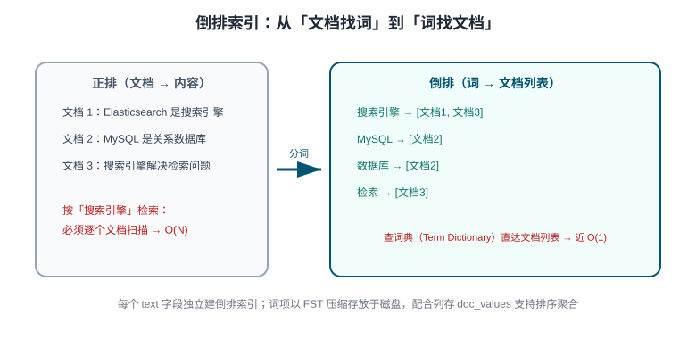
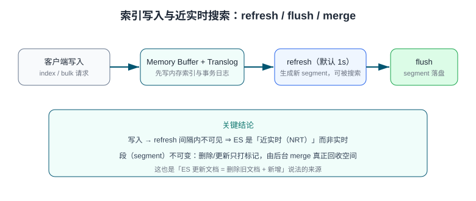

# 索引与映射（Index & Mapping）

索引（Index）是 ES 存储文档的逻辑容器，映射（Mapping）定义每个字段的类型与索引方式——它相当于 MySQL 的 `CREATE TABLE`。本页覆盖索引/文档的增删改、全部核心字段类型、动态映射的利弊、分析器与倒排索引原理。

## 索引基本操作

```shell
# 创建索引并定义映射
curl -X PUT http://localhost:9200/products -H 'Content-Type: application/json' -d '{
  "settings": {
    "number_of_shards": 3,
    "number_of_replicas": 1
  },
  "mappings": {
    "properties": {
      "title":   { "type": "text", "analyzer": "ik_max_word" },
      "brand":   { "type": "keyword" },
      "price":   { "type": "scaled_float", "scaling_factor": 100 },
      "tags":    { "type": "keyword" },
      "created": { "type": "date" }
    }
  }
}'

# 查看映射 / 设置
curl http://localhost:9200/products/_mapping
curl http://localhost:9200/products/_settings

# 删除索引（危险操作，不可恢复）
curl -X DELETE http://localhost:9200/products
```

## 文档 CRUD

```shell
# 新增（自动生成 _id）
curl -X POST http://localhost:9200/products/_doc -H 'Content-Type: application/json' \
  -d '{ "title": "无线蓝牙耳机", "brand": "X", "price": 299 }'

# 新增/全量替换（指定 _id，存在即整体覆盖）
curl -X PUT http://localhost:9200/products/_doc/1 -H 'Content-Type: application/json' \
  -d '{ "title": "无线蓝牙耳机", "brand": "X", "price": 299 }'

# 局部更新（不影响未提交字段）
curl -X POST http://localhost:9200/products/_update/1 -H 'Content-Type: application/json' \
  -d '{ "doc": { "price": 279 } }'

# 删除
curl -X DELETE http://localhost:9200/products/_doc/1

# 批量写入（_bulk，行间必须有换行）
curl -X POST http://localhost:9200/products/_bulk -H 'Content-Type: application/json' -d '
{ "index": { "_id": "2" } }
{ "title": "有线耳机", "brand": "Y", "price": 99 }
{ "index": { "_id": "3" } }
{ "title": "蓝牙音箱", "brand": "X", "price": 199 }
'
```

## 字段类型

| 类型 | 关键字 | 说明 |
| --- | --- | --- |
| 文本（会分词） | `text` | 全文检索用，配合分析器；默认不聚合排序 |
| 精确值（不分词） | `keyword` | 状态、品牌、标签等；支持 term 查询、聚合、排序 |
| 数值 | `long` / `integer` / `double` / `scaled_float` | 金额常用 `scaled_float`（放大存整数） |
| 日期 | `date` | 支持 ISO8601 字符串、毫秒时间戳与自定义 `format` |
| 布尔 | `boolean` | `true` / `false` |
| 对象 | `object` | JSON 嵌套对象，字段扁平化存储 |
| 嵌套 | `nested` | 对象数组保持内部独立性，避免跨对象匹配错误 |
| IP | `ip` | IPv4/IPv6，支持 CIDR 查询 |
| 自动补全 | `search_as_you_type` / `completion` | 输入联想场景 |

:::tip object 与 nested 的区别
`object` 类型的数组会被扁平化：`{"a": [{"k": "x"}, {"k": "y"}]}` 查 `a.k == "x" AND a.k == "y"` 会**错误命中**（两个字段被合并）。需要「数组内对象字段匹配彼此」时必须用 `nested`。
:::

## 动态映射与显式映射

写入文档时若索引不存在或字段未定义，ES 会**自动推断类型**建映射（动态映射 Dynamic Mapping）：

```json
// 第一次写入 {"count": "10"} 后 ES 的推断结果
{
  "properties": {
    "count": { "type": "text", "fields": { "keyword": { "type": "keyword" } } }
  }
}
```

数字字符串被推断成 `text`，聚合、排序都会踩坑。生产环境一律**显式定义映射**，并用模板控制：

```json
// 关闭自动添加新字段（严格模式）
PUT products
{
  "mappings": {
    "dynamic": "strict",
    "properties": { "title": { "type": "text" } }
  }
}
```

| `dynamic` 值 | 行为 |
| --- | --- |
| `true` | 新字段自动加映射（默认） |
| `runtime` | 新字段仅作为运行时字段，不落索引 |
| `false` | 新字段被忽略（可存不可搜） |
| `strict` | 写入未知字段直接报错 |

:::danger 映射不可随意修改
已有字段的类型**不能直接改**（改了就要重建索引）：正确流程是新建索引 `products_v2` → `_reindex` 拷贝数据 → 用别名 `products` 切换指向。因此设计映射时一次想清楚字段类型，并预留别名切换能力。
:::

## 倒排索引与分析器



`text` 字段写入时会经过**分析器（Analyzer）**切词并建立倒排索引；`keyword` 字段整体作为一个词条。分析器由三段组成（详见[中文分词](../ChineseAnalyzer/index.md)）：

```shell
# 测试某个分析器的切分结果
curl -X POST "http://localhost:9200/products/_analyze" -H 'Content-Type: application/json' -d '{
  "analyzer": "standard",
  "text": "Elasticsearch 教程"
}'
# 输出 tokens: ["elasticsearch", "教", "程"]（standard 对中文按单字切）
```

## 写入与近实时原理



要点：文档先写内存 Buffer 与 Translog，**refresh（默认 1 秒）后生成新 segment 才可被搜索**，flush 才真正落盘。段不可变，删除/更新只是打标记，由后台 merge 回收——所以「更新」成本高于新增，批量场景用 `_bulk`。

## 易错点

:::danger 映射设计高频坑
1. **金额用 `double`**：浮点精度问题影响过滤聚合——用 `scaled_float`（缩放因子 100 存分）或 `integer`。
2. **`_id` 用默认随机值**：无业务含义的随机 `_id` 与自定义有序 id 混用时写入顺序无法保证按 id 版本覆盖——业务去重场景用业务主键作 `_id`。
3. **text 字段做聚合**：`terms` 聚合默认要求 `keyword`——text 字段聚合需开启 `fielddata`（耗内存），规范做法是 `title: text` + `title.keyword` 多字段。
4. **索引名 / 字段名不规范**：字段名避开 `_` 开头（元字段保留），索引名全小写。
5. **分片数创建后不可改**：`number_of_shards` 建索引后固定（`split`/`shrink` 除外）——规划按单分片 10~50GB 估算。
:::

## 验证方式

1. `_bulk` 批量写入 3 条后执行 `GET products/_count`，预期 `count: 3`；
2. `GET products/_mapping` 确认 `price` 类型为你显式声明的类型而非 `float`；
3. `POST products/_analyze` 观察中文切分结果，确认分析器生效。

## 参考资料

- [Mapping 官方文档](https://www.elastic.co/docs/manage-data/data-store/mapping)
- [Field data types](https://www.elastic.co/docs/reference/elasticsearch/mapping-reference/field-data-types)
- [Bulk API](https://www.elastic.co/docs/reference/elasticsearch/rest-apis/bulk-indexing)
