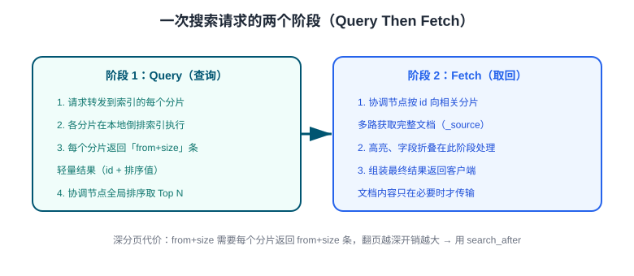

# 查询 DSL（Query DSL）

Query DSL 是 ES 的 JSON 查询语言，分两大体系：**全文查询**（会打分，按相关性排序）与**词项查询**（不打分，精确过滤）。本页覆盖 DSL 结构、match/term 的本质区别、布尔组合、高亮、排序分页与深分页方案。

## DSL 基本结构

```shell
curl -X POST http://localhost:9200/products/_search -H 'Content-Type: application/json' -d '{
  "query": { ... },
  "from": 0, "size": 10,
  "sort": [ ... ],
  "_source": ["title", "price"],
  "highlight": { ... }
}'
```

一次搜索请求的两个阶段（Query Then Fetch）：



## match vs term：最核心的区别

| | `match` | `term` |
| --- | --- | --- |
| 是否分析输入 | 会用字段分析器切词 | 原样作为词条 |
| 适用字段 | `text` | `keyword` / 数值 / 日期 |
| 是否打分 | 是（BM25） | filter 上下文不打分 |
| 典型场景 | 「蓝牙耳机」搜商品名 | `status: "PAID"` 精确过滤 |

```json
// match：输入先分词，各词 OR 匹配，按相关性排序
{ "query": { "match": { "title": "蓝牙耳机" } } }

// match 的 AND 语义（所有词都命中）
{ "query": { "match": { "title": { "query": "蓝牙耳机", "operator": "and" } } } }

// term：keyword 字段精确匹配（不分词）
{ "query": { "term": { "brand": "X" } } }

// terms：命中任一值即可（等价 SQL 的 IN）
{ "query": { "terms": { "brand": ["X", "Y"] } } }

// range：范围过滤（等价 SQL 的 BETWEEN / 比较）
{ "query": { "range": { "price": { "gte": 100, "lt": 300 } } } }
```

:::danger text 字段用 term 查不到数据
`term` 查询不分析输入，而 `text` 字段存储的是**切词后的小写词条**。`{"term": {"title": "蓝牙耳机"}}` 几乎必然匹配不到整串（title 被切成多个单字/词）。text 字段全文搜用 `match`；精确匹配需求请查它的 `title.keyword` 子字段。
:::

## bool：组合查询

```json
{
  "query": {
    "bool": {
      "must":     [ { "match": { "title": "耳机" } } ],          // AND，参与打分
      "filter":   [ { "term": { "brand": "X" } },
                    { "range": { "price": { "lte": 500 } } } ],   // AND，不打分、可缓存
      "should":   [ { "term": { "tags": "wireless" } } ],         // OR，提升相关性分
      "must_not": [ { "term": { "tags": "refurbished" } } ]       // NOT
    }
  }
}
```

:::tip filter 优先
只做「过滤」不关心排序贡献的条件放进 `filter`：跳过打分计算，且结果可被查询缓存复用，性能显著优于 `must`。搜索类查询的惯用结构是「`must` 放全文关键词 + `filter` 放状态/分类/价格」。
:::

## 全文查询进阶

```json
// match_phrase：短语匹配，保证词序相邻
{ "query": { "match_phrase": { "title": "无线蓝牙" } } }

// multi_match：多字段搜索，title 权重 ×3
{
  "query": {
    "multi_match": {
      "query": "蓝牙耳机",
      "fields": ["title^3", "description", "brand"]
    }
  }
}

// query_string：简单语法组合（输入可信时使用）
{ "query": { "query_string": { "default_field": "title", "query": "蓝牙 AND 耳机" } } }
```

## 分页与深分页

| 方式 | 语法 | 适用 |
| --- | --- | --- |
| from + size | `"from": 100, "size": 10` | 常规分页，`from + size ≤ 10000`（默认上限） |
| search_after | 排序值游标 `"search_after": [171234, "id"]` | 深分页 / 无限滚动（推荐） |
| scroll | `?scroll=1m` + `_scroll_id` | 全量导出（新代码推荐用 `search_after` + PIT） |

深分页的本质代价：每个分片都要返回 `from + size` 条候选，协调节点汇总 `(from + size) × 分片数` 条再截取。`search_after` 用上一页末尾的排序值作游标，各分片只取 size 条，代价恒定：

```json
{
  "size": 10,
  "sort": [{ "price": "asc" }, { "_id": "asc" }],
  "search_after": [199, "3"]
}
```

排序值必须全局唯一可比较——最后追加 `_id` 作为 tiebreaker，避免同价商品翻页丢失。

## 高亮与结果控制

```json
{
  "query": { "match": { "title": "耳机" } },
  "_source": ["title", "price"],                       // 只返回需要的字段
  "highlight": {
    "fields": { "title": {} },
    "pre_tags": ["<em>"], "post_tags": ["</em>"]
  },
  "track_total_hits": true                              // 精确统计总数（默认 10000 内）
}
```

## 易错点

:::danger 查询 DSL 高频坑
1. **text 用 term 查**：见上文，全文搜用 match，精确搜用 keyword 子字段。
2. **from + size 翻到几千页**：报 `Result window is too large` 或性能崩塌——改 `search_after`。
3. **`must` 里塞大量过滤条件**：白白做 BM25 打分——过滤条件进 `filter`。
4. **排序时字段是 text**：text 不能排序/聚合（除非 fielddata）——用 keyword 子字段。
5. **should 不生效**：bool 中存在 `must`/`filter` 时，`should` 默认只是「加分项」；需要「至少满足 N 个」时设 `"minimum_should_match": 1`。
6. **忘记 `_source` 过滤**：大文档全字段返回，带宽浪费——返回列裁剪。
:::

## 验证方式

1. 分别执行 `match` 与 `term` 查询同一中文关键词，观察返回差异，验证分词行为；
2. 把 `from` 设为 10000 制造深分页报错，再改用 `search_after` 复现同样的「第 10001 条」；
3. 用 `profile: true` 查看查询在各分片上的执行细节。

## 参考资料

- [Query DSL 官方文档](https://www.elastic.co/docs/reference/query-languages/query-dsl)
- [search_after / PIT](https://www.elastic.co/docs/reference/elasticsearch/rest-apis/paginate-search-results)
- [相关性打分（BM25）](https://www.elastic.co/docs/reference/elasticsearch/rest-apis/sort-search-results)
