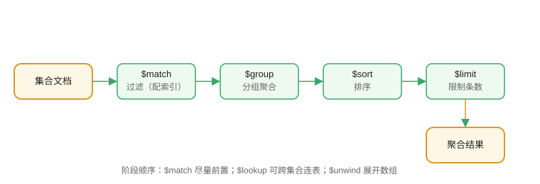

# 聚合管道

聚合管道（Aggregation Pipeline）在数据库内完成**过滤、分组、转换、连表**，避免把大量数据拉到应用层处理，是 MongoDB 最强大的查询能力。



## 管道阶段

| 阶段 | 作用 |
| --- | --- |
| `$match` | 过滤文档（尽量放最前，配合索引） |
| `$project` | 选择/计算字段 |
| `$group` | 分组聚合 |
| `$sort` | 排序 |
| `$skip` / `$limit` | 分页 |
| `$unwind` | 展开数组 |
| `$lookup` | 跨集合连表（左外连接） |
| `$addFields` | 新增字段 |
| `$count` | 计数 |

## 基础示例

数据：

```javascript [mongosh]
db.orders.insertMany([
  { product: "笔记本", category: "数码", price: 5999, qty: 2 },
  { product: "鼠标", category: "数码", price: 99, qty: 10 },
  { product: "键盘", category: "数码", price: 299, qty: 5 },
  { product: "水杯", category: "家居", price: 39, qty: 20 }
])
```

按分类统计销售额：

```javascript [mongosh]
db.orders.aggregate([
  { $match: { qty: { $gte: 1 } } },
  { $group: {
      _id: "$category",
      total: { $sum: { $multiply: ["$price", "$qty"] } },
      avgPrice: { $avg: "$price" },
      count: { $sum: 1 }
  }},
  { $sort: { total: -1 } }
])
```

输出：

```text
[ { _id: '数码', total: 12573, avgPrice: 2132.33, count: 3 },
  { _id: '家居', total: 780, avgPrice: 39, count: 1 } ]
```

## 展开数组 $unwind

```javascript [mongosh]
db.students.insertOne({ name: "张三", courses: ["数学", "英语"] })

db.students.aggregate([
  { $unwind: "$courses" }
])
```

把数组拆成多条，便于分组统计。

## 连表 $lookup

```javascript [mongosh]
db.orders.aggregate([
  { $lookup: {
      from: "products",
      localField: "product",
      foreignField: "name",
      as: "productInfo"
  }},
  { $unwind: { path: "$productInfo", preserveNullAndEmptyArrays: true } }
])
```

类似 SQL 的 LEFT JOIN。

## 实战：分页 + 汇总

```javascript [mongosh]
db.orders.aggregate([
  { $match: { category: "数码" } },
  { $sort: { price: -1 } },
  { $skip: 0 },
  { $limit: 10 },
  { $project: { _id: 0, product: 1, price: 1 } }
])
```

## 易错点

::: danger 常见错误
1. `$match` 不放最前：全量进入管道，浪费性能；`$match` 应尽早过滤。
2. `$group._id` 忘写：所有文档被分成一组。
3. 字段引用忘了 `$`：`"price"` 是字面量，`"$price"` 才是字段。
4. `$lookup` 结果字段是数组：需要 `$unwind` 或索引访问。
5. 管道内排序不加索引：`$sort` 大集合内存/磁盘排序很慢。
6. `$unwind` 对空数组直接丢弃该文档：需要 `preserveNullAndEmptyArrays: true`。
:::

## 验证方式

1. 执行分类统计示例，对照输出。
2. 给 `$match` 的字段建索引，对比 `explain` 的 stage。
3. 用 `db.orders.aggregate(...).itcount()` 快速验证管道正确性。

## 参考资料

- 聚合管道：https://www.mongodb.com/docs/manual/core/aggregation-pipeline/
- 聚合操作符：https://www.mongodb.com/docs/manual/reference/operator/aggregation/
- $lookup：https://www.mongodb.com/docs/manual/reference/operator/aggregation/lookup/
