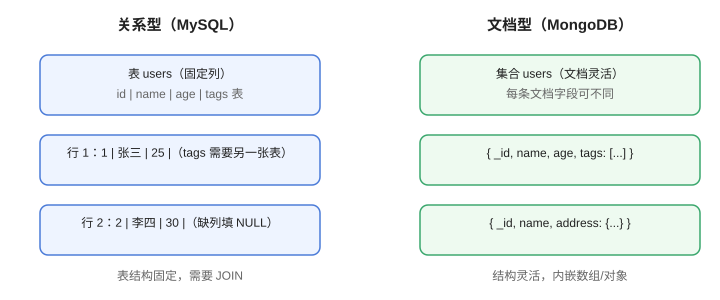

# MongoDB 概述

MongoDB 是开源的**文档型（Document）NoSQL 数据库**，把数据存成 BSON（JSON 的二进制扩展）文档，天然贴近对象模型，支持水平扩展，是内容管理、日志、物联网等场景的常见选择。

::: info 版本现状（2026-08 核对）
MongoDB 当前稳定线为 **8.x，最新版本 8.3**（2026-05 发布，最新补丁 8.3.8）；8.x 系列持续获得快速发布与安全更新，9.0 尚未 GA。
:::

## 文档模型

一条记录就是一个文档（Document），对应 JSON 对象：

```json [示例文档]
{
  "_id": ObjectId("66f1c2a0b3e2c9f6e1d2a001"),
  "name": "张三",
  "age": 25,
  "tags": ["java", "mongo"],
  "address": {
    "city": "上海",
    "zip": "200000"
  }
}
```

特点：

1. **schema 灵活**：同集合的文档字段可以不同。
2. **内嵌结构**：对象、数组直接存储，避免大量 JOIN。
3. **类型丰富**：ObjectId、日期、Decimal128、地理坐标等。



## 与关系型数据库对比

| 关系型（MySQL） | MongoDB |
| --- | --- |
| 数据库 Database | 数据库 Database |
| 表 Table | 集合 Collection |
| 行 Row | 文档 Document |
| 列 Column | 字段 Field |
| 主键 Primary Key | `_id`（默认 ObjectId） |
| JOIN | 内嵌文档 / $lookup |

## 核心特性

| 特性 | 说明 |
| --- | --- |
| 灵活 Schema | 无需迁移即可加字段 |
| 丰富索引 | 单字段、复合、TTL、文本、地理索引 |
| 聚合管道 | 分组、转换、连表（$lookup） |
| 副本集 | 主从复制 + 自动故障转移 |
| 分片 | 按分片键水平扩展 |
| 事务 | 4.0+ 支持多文档事务 |

## 适用场景

- 内容管理、CMS、用户画像（结构多变）
- 日志与事件存储
- 物联网、实时分析
- 快速原型与迭代（无需建表）

不适用：强事务、复杂多表 JOIN、严格 Schema 的金融核心系统。

## 易错点

::: danger 常见错误
1. 把 MongoDB 当“免费的关系型数据库”用：大量 JOIN 与严格约束是反模式。
2. 不加索引全表扫：文档多后查询变慢，先 explain。
3. 嵌套太深：文档不宜无限嵌套，一般建议 2~3 层。
4. 用 4.0 以下版本做多文档事务：事务需要 4.0+ 与副本集。
5. 生产用单机：默认建议副本集，至少 3 节点。
6. 忽略 `_id` 设计：无分片键意识的 `_id` 会影响分片效率。
:::

## 验证方式

1. `mongod --version` 确认版本为 8.x。
2. 用 mongosh 执行 `db.version()`。
3. 插入一条文档并查询，确认基本读写链路正常。

## 相关专题

- [数据库客户端](../../../../Tools/DatabaseClients/index.md)：Navicat/DBeaver 连接 MongoDB 的可视化管理

## 参考资料

- 关系型对照：[PostgreSQL](../../../Relational/PostgreSQL/index.md)（JSONB 与文档能力的对比）

- MongoDB 官方文档：https://www.mongodb.com/docs/
- MongoDB 版本发布：https://www.mongodb.com/docs/manual/release-notes/
- 数据模型设计：https://www.mongodb.com/docs/manual/core/data-model-design/
