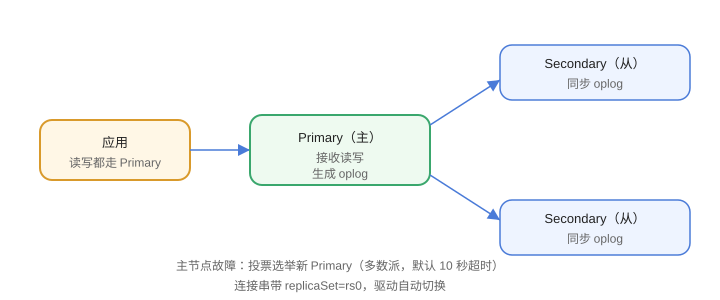

# 副本集

副本集（Replica Set）是 MongoDB 的**高可用方案**：一个主节点（Primary）负责读写，多个从节点（Secondary）同步数据；主节点故障时自动选举新的主节点。



## 节点角色

| 角色 | 职责 |
| --- | --- |
| Primary | 接收读写，产生 oplog |
| Secondary | 同步 oplog，可配置只读 |
| Arbiter | 只参与选举，不存数据 |

生产建议 **3 节点副本集**（Primary + Secondary + Secondary），避免 Arbiter 带来的脑裂风险。

## 初始化副本集

### 1. 配置每个节点

```yaml [mongod.conf]
replication:
  replSetName: rs0
```

### 2. 启动并初始化

```javascript [mongosh]
rs.initiate({
  _id: "rs0",
  members: [
    { _id: 0, host: "mongo1:27017" },
    { _id: 1, host: "mongo2:27017" },
    { _id: 2, host: "mongo3:27017" }
  ]
})
```

### 3. 查看状态

```javascript [mongosh]
rs.status()
rs.conf()
```

## 选举机制

1. Primary 失联（心跳超时，默认 10 秒）。
2. 可投票节点发起选举，多数派同意后选出新 Primary。
3. 网络分区时，少于半数节点无法选举 → 只读保护（防止脑裂）。

## 读写分离

```javascript [mongosh]
// 从节点默认不允许读，开启后可以读（可能读到旧数据）
db.getMongo().setReadPref("secondaryPreferred")
```

驱动侧配置 `readPreference=secondaryPreferred` 即可。

## 连接串

```text
mongodb://mongo1:27017,mongo2:27017,mongo3:27017/?replicaSet=rs0
```

驱动会自动发现节点并处理主从切换。

## 故障转移验证

```shell
# 停掉当前 Primary（模拟故障）
docker stop mongo1

# 观察选举
mongosh --eval "rs.status()"
```

几秒后集群选出新 Primary，应用连接不中断。

## 易错点

::: danger 常见错误
1. 只部署一个节点就上生产：副本集至少 3 节点（含数据节点）。
2. 用 Arbiter 当数据节点用：Arbiter 不存数据，只有选举票。
3. 节点 host 写 localhost：其他节点连不上，必须用可解析的主机名/IP。
4. 从节点直接读：默认 `secondaryOk=false`，需要显式开启。
5. 多数派原则：两个节点的集群，一个挂掉就无法选举。
6. 忘记定期备份：副本集不等于备份，误删会同步删除。
:::

## 验证方式

1. `rs.status()` 看到 1 个 PRIMARY、2 个 SECONDARY。
2. 停掉主节点，确认新主节点选出。
3. 用连接串从驱动连接，验证自动故障转移。

## 参考资料

- 副本集：https://www.mongodb.com/docs/manual/replication/
- 副本集部署：https://www.mongodb.com/docs/manual/tutorial/deploy-replica-set/
- 选举机制：https://www.mongodb.com/docs/manual/core/replica-set-elections/
